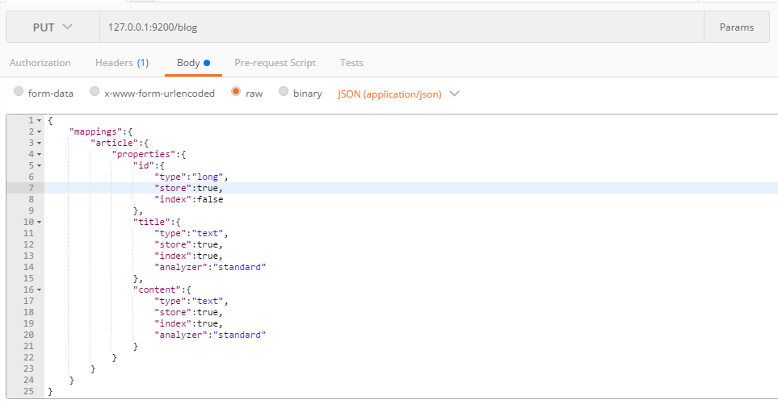
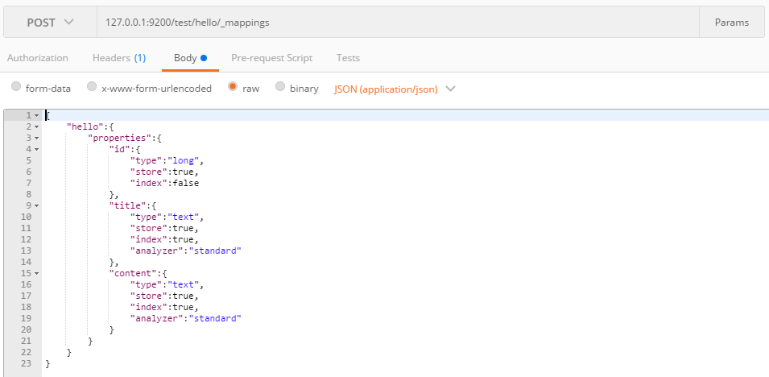
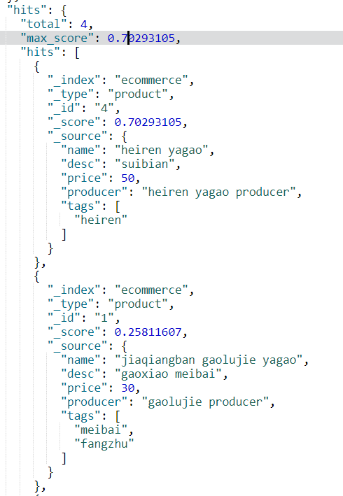
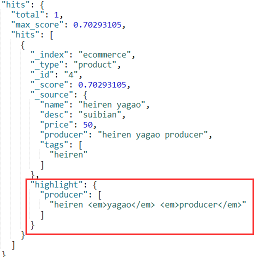
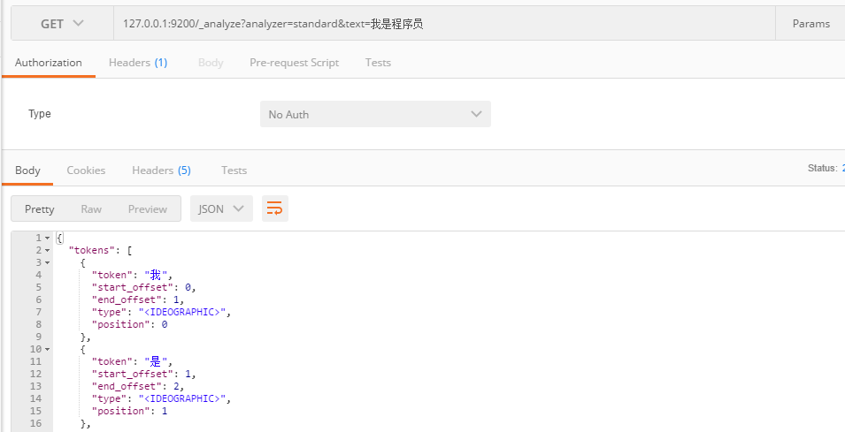
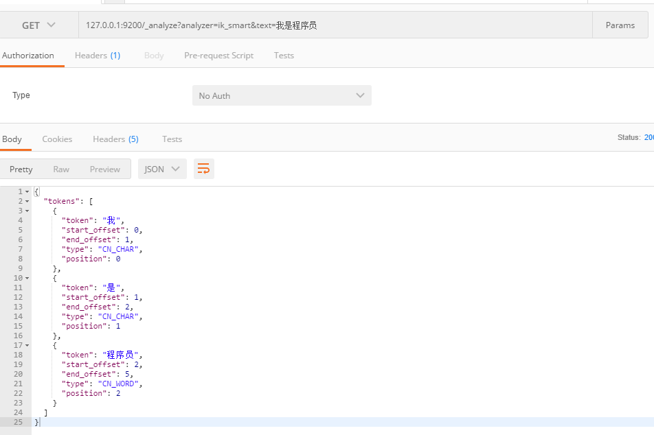
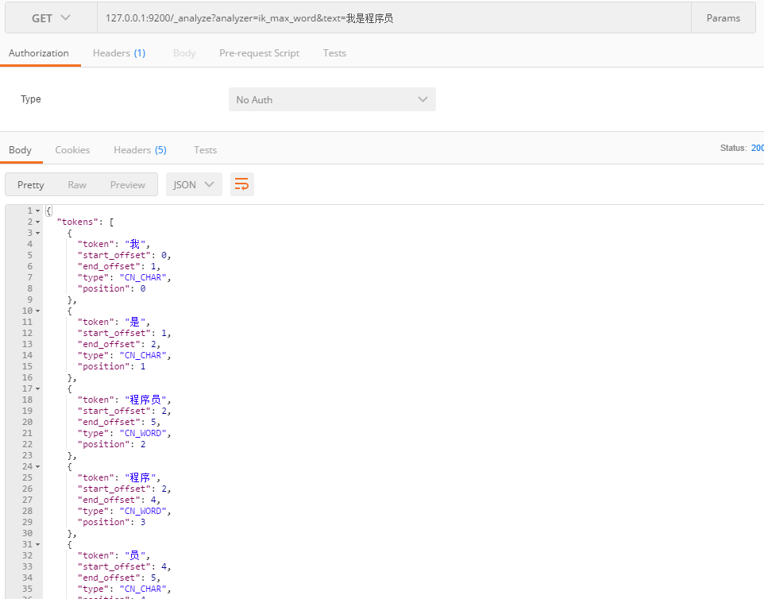
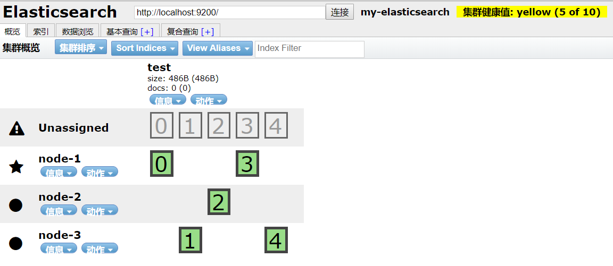
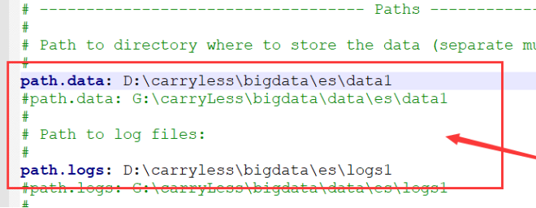
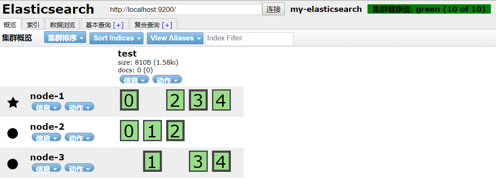

## 一、ElasticSearch介绍

### 1.1.什么是ES

ElasticSearch简称es，是基于Lucene的一款**分布式全文检索服务器**，实时存储，检索数据，分布式处理PB级别数据，自动分片并维护冗余副本，数据安全，扩展性好是它的几大特点。es也使用Java开发，底层为Lucene来实现索引搜索功能，但是它使用**RESTful风格API**来简化Lucene复杂的操作，从而使得全文检索更简单。

### 1.2.ES的使用场景

所有用到搜索的地方都有ES的影子，如：

github的搜索功能，github自2013年起使用ES来作为搜索引擎，来处理PB级别的数据。

维基百科：启动以elasticsearch为基础的核心搜索架构

SoundCloud：“SoundCloud使用ElasticSearch为1.8亿用户提供即时而精准的音乐搜索服务”

百度：百度目前广泛使用ElasticSearch作为文本数据分析，采集百度所有服务器上的各类指标数据及用户自
定义数据，通过对各种数据进行多维分析展示，辅助定位分析实例异常或业务层面异常。目前覆盖百度内部
20多个业务线（包括casio、云分析、网盟、预测、文库、直达号、钱包、风控等），单集群最大100台机
器，200个ES节点，每天导入30TB+数据

新浪使用ES 分析处理32亿条实时日志

阿里使用ES 构建挖财自己的日志采集和分析体系 

### 1.3.ES的功能与特点

- 分布式搜索引擎和数据分析
- 对海量数据进行近实时处理（也是基于分布式的）
- 全文检索，结构化检索，数据分析
- 开箱即用，部署配置非常简单

## 二、ElasticSearch概念

ES是面向文档操作，指存储整个文档且对其索引，使之快速搜索文档内容，ES对比关系型数据库：

MYSQL		 ‐> Databases ‐> Tables ‐> Rows	     ‐> Columns
Elasticsearch  ‐> Indices	  ‐> Types  ‐> Documents ‐> Fields 

### 2.1.索引 index

ES中的索引指索引库，类似关系型数据库中的一个数据库Database，ES服务器可以有多个索引，保存不同特征的文档集合，例如用户的文档，产品的文档，订单的文档等。

### 2.2.类型 type

ES中的类型就好比MYSQL中的表，一个索引用有多个类型，比如一个索引存储游戏数据，而其中又有lol数据，dota数据，这样就定义lol数据为一个类型，dota数据为另一个类型。

### 2.3.文档 document

ES中的文档就好比MYSQL中的一条记录，是索引的基础信息单元，文档由json形式保存，每个type可以存储多个文档。

### 2.4.字段 field

ES中的字段也对应MYSQL中的字段，根据文档数据的不同属性来区分的分类标识。如文档名称，内容，路径，大小等。

### 2.5.映射 mapping

映射类似于MYSQL中的表结构的定义，用来限制数据方式规则，如某个字段的数据类型，默认值，分词器，是否索引等。好的映射关系可以提高数据处理的性能。

### 2.6.集群 cluster

集群就是由多个ES服务器节点组成的，共同拥有数据，索引，一起提高搜索功能。一个集群只有一个名字，如“elasticSearch”，每个节点设置相同的集群名字标识他们在一个集群里。

### 2.7. 节点 node

一个节点对应一个服务器，在一个集群大家庭里，参与搜索与索引功能。每个节点有不同的名字，这个名字一般是随机的。

### 2.8.分片和复制

**分片**：是ES数据存储的文件块，是**数据的最小单元块**，对于一个10亿数据的文档而言，如果仅仅有一个节点来存储，那样是无法实现的，而且就算实现了对其操作也会极其缓慢，所以ES提供了分片机制，将大数据量存储在多台服务器上，每台服务器保存一些shard，即横向扩展，搜索分析操作分不到多台服务器上执行，效率更高。

**复制**：是为了防止服务器故障而导致数据丢失，对于5个主分片会进行拷贝，形成5个从分片提供数据的冗余，当主shard故障时，会使用replica提供服务，防止数据丢失。

索引默认创建5个分片和一组从分片，**只有ES形成集群时，从分片才会被启用**，因为主从在一个ES节点上是没有意义的，ES故障会导致主从都损坏。

## 三、ElasticSearch的安装

安装就不详细说了，百度一大把，而且很简单，windows平台下：

官网下载ES压缩包，解压缩运行/bin/elasticsearch.bat即可，localhost:9200即可查询是否启动成功

图形化界面使用elasticsearch-head，基于nodejs，需要安装nodejs以及npm安装grunt，安装好后在head-master目录下`npm install`，再运行`grunt server`即可，输入localhost:9100即可查看

需要注意es跨域问题，在es的conf/elasticsearch.yml中配置：

```yml
http.cors.enabled: true
http.cors.allow‐origin: "*" 
```

## 四、ElasticSearch客户端操作

这里我们使用Postman工具来对ES索引进行操作

因为ES是RESTful风格，所以PUT—增加，POST—修改，DELETE—删除，GET—查询

### 4.1.创建索引与mappings

在我们创建索引的时候，可以直接创建一个没有mappings的索引，也可以带着mappings一起创建

1）只创建索引


这里我们在请求参数json中没有添加任何数据，即创建一个空的索引test

2）创建索引与mappings



这次我们在请求体中添加了mappings，下一层的article是type类型，即数据库中的表名，在下一层properties又包含了字段类型，type为长整型long或text文本，store表示是否存储，index是否建立索引，analyzer使用哪种解析器。

### 4.2.单独设置mappings

当然我们创建空的没有结构索引后，也可以后期为其添加结构映射mappings



URL为`IP:端口/索引名/类型/_mappings`，请求体中就是其字段类型

### 4.3.删除索引


因为是RESTful风格，所以DELETE请求即可

### 4.4.创建Document


创建document时，URL为`IP:端口/索引名/类型/文档主键ID`，请求体为设置的mapping映射字段。

这里会发现字段id和主键id是一样的1，其实这是两个不同的东西，一个是es文档主键id，一个是文档字段id，即可以不存在id这个字段，但是不能少了主键ID，如果请求URL上不设置ID，ES会自动赋予随机的ID，一般来说主键ID和字段ID设置成一致的。

### 4.5.删除Document


URL：`IP:端口/索引名/类型/主键ID`，注意这里的ID是主键ID而不是字段ID

### 4.6.修改Document

#### 4.6.1.全量修改


URL：`IP:端口/索引名/类型/主键ID`，请求体为文档内容。这里ES基于Lucene，所以底层也是先删除再新增的操作。

#### 4.6.2.partial update

对于全量修改，每次都要获取全量数据进行修改，不然结构就会改变，这里使用partial update可以只修改指定的field


可以看到指定content字段修改，其他的字段保持不变。

这里es底层其实还是进行了删除修改操作，先将数据转json保存，然后对修改的字段进行修改，再重新新增数据

### 4.7.查询索引

#### 4.7.1.query string search

query string search的由来，因为search参数都是以http请求的query string来附带的

搜索商品名称中包含yagao的商品，而且按照售价降序排序：

`GET /ecommerce/product/_search?q=name:yagao&sort=price:desc`

适用于临时的在命令行使用一些工具，比如curl，快速的发出请求，来检索想要的信息；但是如果查询请求很复杂，是很难去构建的

在生产环境中，几乎很少使用query string search

#### 4.7.2.query DSL

DSL：Domain Specified Language，特定领域的语言

http request body：请求体，可以用json的格式来构建查询语法，比较方便，可以构建各种复杂的语法，比query string search肯定强大多了，更加适合生产环境的使用，可以构建复杂的查询

1）查询所有的商品

```json
GET /ecommerce/product/_search
{
  "query": { "match_all": {} }
}
```

2）查询名称包含yagao的商品，同时按照价格降序排序

```elm
GET /ecommerce/product/_search
{
    "query" : {
        "match" : {
            "name" : "yagao"
        }
    },
    "sort": [
        { "price": "desc" }
    ]
}
```

3）分页查询商品，总共3条商品，假设每页就显示1条商品，现在显示第2页，所以就查出来第2个商品

```elm
GET /ecommerce/product/_search
{
  "query": { "match_all": {} },
  "from": 1,
  "size": 1
}
```

4）指定要查询出来商品的名称和价格就可以

```elm
GET /ecommerce/product/_search
{
  "query": { "match_all": {} },
  "_source": ["name", "price"]
}
```

#### 4.7.3.query filter

过滤器，例如搜索商品名称包含yagao，而且售价大于25元的商品

```elm
GET /ecommerce/product/_search
{
  "query":{
    "bool": {
      "must": {
        "match":{"name":"yagao"}
      },
      "filter": {
        "range":{
          "price":{"gt":25}
        }
      }
    }
  }
}
```

#### 4.7.4.full-text search（全文检索）

这个搜索方式便是全文检索的精髓了，我们拿案例说话

查询producer是yagao producer的数据

```elm
GET /ecommerce/product/_search
{
  "query":{
    "match": {
      "producer": "yagao producer"
    }
  }
}
```

结果：



这里只拿两个结果看，可以看到黑人牙膏的匹配分数高于高露洁牙膏，这就是全文检索的特点

我们查询的是producer为yagao producer的数据，es会将其拆分为yagao和producer，像库里数据进行匹配

**倒排索引**：

```
heiren - 4 (id)
yagao - 4
producer - 1,4
gaolujie -1
```

通过索引匹配，可以发下producer命中了1和4的数据，yagao命中了4的数据，所以id为4的数据匹配分数高，id为1的数据匹配分数低！这也是倒排索引的优点~

#### 4.7.5.phrase search（短语搜索）

跟全文检索相对应，相反，全文检索会将输入的搜索串拆解开来，去倒排索引里面去一一匹配，只要能匹配上任意一个拆解后的单词，就可以作为结果返回
phrase search，要求输入的搜索串，**必须在指定的字段文本中，完全包含一模一样的，才可以算匹配**，才能作为结果返回

```elm
GET /ecommerce/product/_search
{
    "query" : {
        "match_phrase" : {
            "producer" : "yagao producer"
        }
    }
}
```

#### 4.7.6.highlight search

高亮搜索，对于搜索结果拼接上一些特殊代码，比如：

```elm
GET /ecommerce/product/_search
{
  "query":{
    "match_phrase": {
      "producer": "yagao producer"
    }
  },
  "highlight": {
    "fields": {
      "producer":{}
    }
  }
}
```



yagao与producer添加上了em标签，这样在浏览器上显示就会像百度搜索一样标红

### 4.8.聚合查询

1）计算每个tag下的商品数量

```elm
GET /ecommerce/product/_search
{
    "size":0,
    "aggs":{
        "by_tags":{
          "terms": {
            "field":"tags"
          }
        }
    }
}
```

2）对名称中包含yagao的商品，计算每个tag下的商品数量

```elm
GET /ecommerce/product/_search
{
    "size":0,
    "query":{
        "match":{
            "name":"yagao"
        }
    },
    "aggs":{
        "by_tags":{
          "terms": {
            "field":"tags"
          }
        }
    }
}
```

3）先分组，再算每组的平均值，计算每个tag下的商品的平均价格

```elm
GET /ecommerce/product/_search
{
    "size":0,
    "aggs":{
        "by_tags":{
          "terms": {
            "field":"tags"
          },
          "aggs":{
              "avg_price":{
                  "avg":{
                      "field":"price"
                  }
              }
          }
        }
    }
}
```

4）计算每个tag下的商品的平均价格，并且按照平均价格降序排序

```elm
GET /ecommerce/product/_search
{
    "size":0,
    "aggs":{
        "by_tags":{
            "terms":{
                "field":"tags",
                "order":{
                    "avg_price":"desc"
                }
            },
            "aggs":{
             	"avg_price":{
                    "avg":{
                        "field":"price"
                    }
             	}   
            }
        }
    }
}
```

5）按照指定的价格范围区间进行分组，然后在每组内再按照tag进行分组，最后再计算每组的平均价格

```elm
GET /ecommerce/product/_search
{
  "size": 0,
  "aggs": {
    "range_price": {
      "range": {
        "field": "price",
        "ranges": [
          {
            "from": 20,
            "to": 30
          },
          {
            "from": 30,
            "to": 50
          }
        ]
      },
      "aggs": {
        "by_tags": {
          "terms": {
            "field": "tags",
            "order": {
              "avg_price": "desc"
            }
          },
          "aggs":{
            "avg_price":{
              "avg": {
                "field": "price"
              }
            }
          }
        }
      }
    }
  }
}
```

### 4.9.批量查询

批量查询使用mget

比如在相同type下，需要查询id为1和2的数据：

```elm
GET blog/article/_mget
{
  "ids":["1","2"]
}
```

或者如果在不同的type下：

```elm
GET blog/_mget
{
  "docs":[
    {
      "_type":"book",
      "_id":"1"
    },
    {
      "_type":"article",
      "_id":"2"
    }
  ]
}
```

当然对于不同索引库的在加一个`"_index":"xxx"`即可。

mget还是很重要的，可以提升性能减小网络开销

### 4.10.批量操作

es提供了\_bulk来进行批量操作，即一次性进行增删改操作而不是一条条的请求

有哪些类型的操作可以执行呢？
（1）delete：删除一个文档，只要1个json串就可以了
（2）create：PUT /index/type/id/_create，强制创建
（3）index：普通的put操作，可以是创建文档，也可以是全量替换文档
（4）update：执行的partial update操作

每一个操作要两个json串，语法如下：

{"action": {"metadata"}}  --操作名称以及对应的索引名或type或id，类似请求URL
{"data"} -- 请求体数据

举例，比如你现在要创建一个文档，放bulk里面，看起来会是这样子的：

```elm
{"index": {"_index": "test_index", "_type", "test_type", "_id": "1"}}
{"test_field1": "test1", "test_field2": "test2"}
```

全部的请求示例如下：

```elm
POST /_bulk
{ "delete": { "_index": "test_index", "_type": "test_type", "_id": "3" }} 
{ "create": { "_index": "test_index", "_type": "test_type", "_id": "12" }}
{ "test_field":    "test12" }
{ "index":  { "_index": "test_index", "_type": "test_type", "_id": "2" }}
{ "test_field":    "replaced test2" }
{ "update": { "_index": "test_index", "_type": "test_type", "_id": "1", "_retry_on_conflict" : 3} }
{ "doc" : {"test_field2" : "bulk test1"} }
```

对于bulk api对语法有硬性要求，每个json串必须在一行，不能换行，串与串之间需要换行。

bulk api如果有某个操作执行失败，不会影响其他操作，在返回的结果里会显示


## 五、ElasticSearch的分析器

### 5.1.传统Standard分析器

和Lucene一样，ES的分析器默认使用Standard，只对英文友好，对中文没有分析效果



URL为`IP:端口/_analyzer?analyzer=分析器名称&text=分析内容`

可以看到对中文是一个字一个字分析。所以还是需要使用IK分析器。

### 5.2.IK分析器

只需到ik github上下载相同版本压缩包后，解压缩放到es的plugins文件夹下，然后重启服务即可。

ik分析器又分为两种，一是`ik_smart`指最少划分，一是`ik_max_word`指最细粒度划分，下图可以看到区别：





## 六、ElasticSearch集群

ES集群的概念件见第二节，就不过多介绍了，概念了解即可，对于更深层的ES集群的底层实现后面在进行学习。

这里我们主要学习下ES集群的搭建与测试。

三节点集群搭建：

ES文件夹复制三份，配置config/elasticsearch.yml配置文件，添加：

```yml
#节点3配置：
#集群名称，唯一
cluster.name: my-elasticsearch
#节点名称，必须不一样
node.name: node-3
#本机ip
network.host: 127.0.0.1
#服务端口
http.port: 9203
#集群通信端口
transport.tcp.port: 9303
#集群自动发现机器ip集合
discovery.zen.ping.unicast.hosts: ["127.0.0.1:9301","127.0.0.1:9302","127.0.0.1:9303"]
```

为三个配置文件配置好，然后顺序启动。在es可视化工具中可以看到，3节点连成集群


### 6.1.集群查看

1）查看集群健康状态

es提供了一套api，叫cat api，用来查看es集群各种状态

`GET /_cat/health?v`


status即集群健康状态：

- yellow：每个索引的主分片都是active状态，副本分片处于不可用状态
- green：主分片与副本分片都处于不可用状态
- red：不是所有的主分片都是active状态的，即部分索引数据丢失

2）快速查看集群中有哪些索引

`GET /_cat/indices?v`

### 6.2.集群健康问题

创建索引：`PUT 127.0.0.1:9200/test`



这时我们发现分片副本没有分配节点，健康值还是像原来的单节点ES一样，网上查了一下，是因为数据保存磁盘默认值为85%，如果磁盘占用量大于85%，便不会自动分配副本，这时我们有两种方法：

1）设置磁盘占用率为90%

URL:`PUT 127.0.0.1:9200/_cluster/settings`

请求体：

```yml
{
	"transient":{
		"cluster.routing.allocation.disk.watermark.low" : "90%"
	}
}
```

2）设置data存放位置

在配置文件elasticsearch.yml中配置



也可以解决此问题



正确的集群节点分片，粗框框的是主分片，细一点的是分片备份