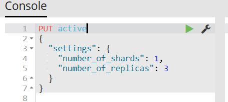
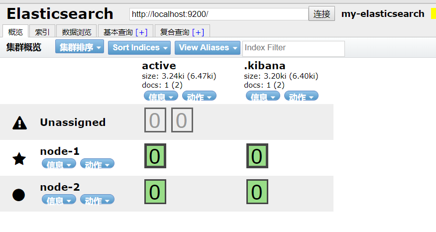
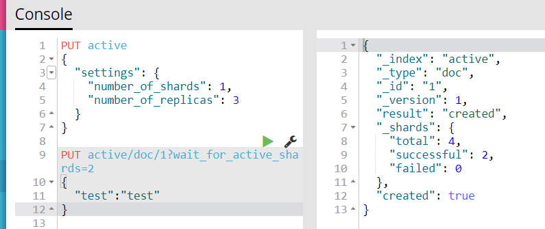
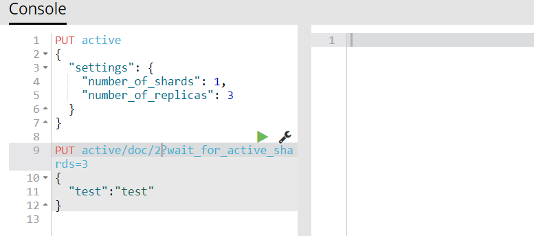
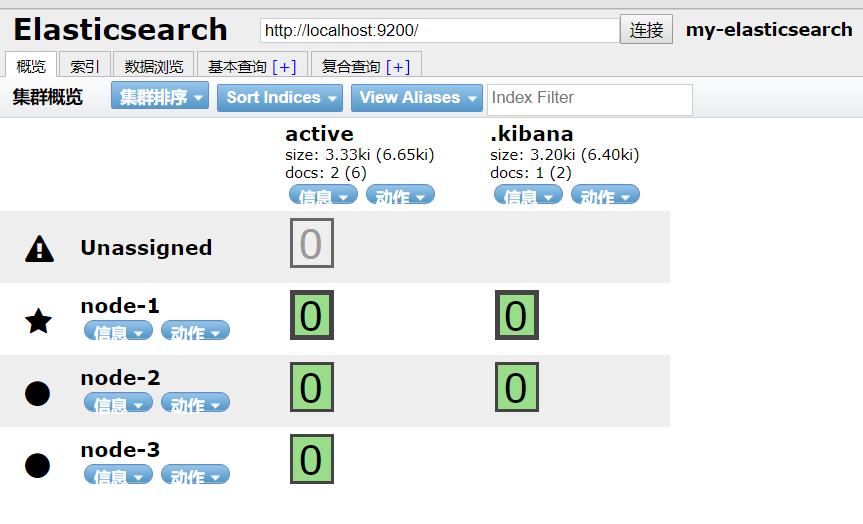
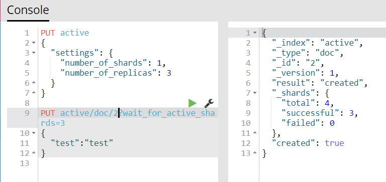

## 一、ElasticSearch的基础分布式架构

### 1.1.ES对复杂分布式机制的透明隐藏特性

ES是一个分布式系统，为了对应大数据量，ES对于复杂的分布式机制隐藏了很多特性

- 分片机制：我们使用时，es自动的就将创建的document存入集群中了，这时就要思考ES是如何分片的？数据存放到哪个shard中了？
- 集群发现机制：当配置分布式节点时，启动第二个节点会发现直接就加入到集群了，ES是怎么做到自动发现集群的？不仅加入集群，还将部分数据存储到自己上
- shard负载均衡：当有3个节点时，9个shard会自动均匀的分配到节点上
- shard副本：副本是如何创建且自动冗余的
- 请求路由
- 集群扩容
- shard重分配：当有新节点加入，shard会重新分配

### 1.2.ES的扩容

ES分为水平扩容和垂直扩容：

例子：公司要存储6T数据，现在有6台服务器，现在需要存8T数据，便要扩容

- 垂直扩容：买两台强大服务器，每台能存2t的，替换旧的2台。这种扩容成本高，会有瓶颈
- 水平扩容：买两台能存1t的服务器加入到集群中，这种常用且成本较低。

### 1.3.节点增减时的rebalance

可以发现，ES对于节点负载均衡处理很厉害。

一般情况下，总有些节点会负载比较重的数据or分片，例如有5台服务器，有6个shard，就会有一台负载2个shard，这时如果添加一台服务器进来，es会自动的把2个shard分1个给新服务器，即ES的rebalance

### 1.4.master节点

es集群会有主节点与普通节点之分，一般来说先启动的节点为主节点。

对于主节点主要进行全局元数据的操作，如索引的创建删除，节点的创建删除，master节点不会如平常集群一样需要对所有请求进行响应，即造成单点瓶颈，而是**对等获取请求**。

### 1.5.节点对等

ES的分布式**节点是对等**的，即每个节点都能接收到所有数据，是由ES来分配的，并且如果请求的数据不在此节点上，该节点会自动转发给具有此数据的节点，即**自动请求路由**，并接收返回数据，最终返回给用户，即**响应收集**。

## 二、分片机制

### 2.1.shard&replica机制再梳理

1. index包含多个shard：ES先将shard分配到对应的节点上，再将索引index分配到多个shard上
2. 每个shard都是最小工作单元，承载部分数据，并且存放一个Lucene实例，具有独立处理请求操作的能力
3. 增减节点，具有负载均衡能力
4. 每个document只能存在唯一的分片与其对应的replica上，不可能存在多个分片上
5. 主shard创建索引时固定，但是replica数量可以再修改
6. shard默认5片，replica默认1
7. shard和replica不能放在同一个节点（故障时主副分片数据都丢失，没有意义）

### 2.2.单node情况创建index

1. 单node创建index，分配5个shard，会有5个replica
2. 集群状态是yellow
3. 5个shard存放在一个node上，而replica未分配处在Unassigned状态
4. 如果node宕机，会造成数据全部丢失，且集群不可用，无法接收请求


### 2.3.多node情况下创建index

1. 多个node创建节点，对于shard和replica会均匀的分配到多个节点上
2. 当有数据存储时，primary shard会自动同步到replica上
3. 当有读请求时，primary shard 和 replica都可以接收请求做出响应


## 三、ES扩容与容错性

两个node对比一个node来说，会有更好的性能，因为每个shard所占用的CPU/IO等资源更多

### 3.1.极限扩容

对于6个shard来说，扩容的极限为6台node，每台一个shard

### 3.2.超出扩容极限

如果想要超出极限，应该怎么做呢？可以添加副本replica数量，多加3个便可以多加三台机器

### 3.3.容错性

当我们有三台node，3个primary shard，3个replica时，根据ES自动分片，状态如下：


1）这时我们如果宕机一台node-1，还存在的shard为：P0，R1，R2，P2.可以发现数据全部还存在，所以此时**可以容错一台机器**。

2）如果我们宕机两台node-1，node-2，还存在的shard为：P2，R1，数据便少了P0的，即少了1/3的数据，便不完整。

**所以3台node，6个shard的容错性是1台机器。如何提高容错性呢？**

我们在基础上添加3个replica试试，根据ES自动分片，结构如下：


这时人如果宕机两台，仅存node-3：R0-2，R1，P2，数据完整，即**可以容错2台机器**！

**所以再实际环境中，我们应该学会如何扩容提高性能，并且对于不同的node与shard状态，我们应该学会怎么提高容错性。**


## 四、ES容错选举

当我们的机器宕机后，ES是如何进行容错选举并恢复的呢？

还是以上面的例子为例，假如node-1为master node并且宕机

1）ES第一步会选择一个node作为新的master node，比如node-2，这时的集群状态为red，因为P1这个primary shard因宕机没有处于actived状态。status = red。

2）第二步会将node-2中的R1-2副本升级为P1即primary shard，这时因为少了一个R1的副本，但是primary shard全部处于active状态，集群状态为yellow。status = yellow。

3）第三步，重启node-1节点，因为缺少R1副本，new master node即node-2会将缺失的副本 copy replica一份给node-1，node-1根据缺失的数据进行同步。status = green。


## 五、ES的并发问题

ES对于常见的并发问题处理使用的是**乐观锁**机制

### 5.1._version元数据

当用户对某个document进行修改或删除时，_version这个元数据都会加一。注意，这里删除也会加一，删除后再次新增那个相同的docment，\_version元数据会在之前的基础上加一，这也反映了删除操作并没有直接物理删除。

例新增再修改：


删除操作再新增：


可以看到新增一次，修改一次，删除一次，再次新增，\_version最后为4，符合预期

### 5.2.版本号同步问题

当document数据修改时，需要同步到replica中，注意！

**ES的同步是多线程异步执行的**，就会出现先同步的数据后到，后同步的数据先到的问题，这里ES对于这种问题的解决是，**根据\_version版本号进行比较，如果不同且版本号较大，进行更新，如果不同单版本号较小，不更新抛弃**。

### 5.3.external version

external version：是es提供的一个feature，就是你可以不用他提供的\_version来进行并发控制，可以基于自己的版本号来维护并发。

举个例子：es中的数据mysql中也有一份，并有自己的一套version机制，所以便不能再用es的来维护，便可以使用es提供的external version来进行并发控制。

external version具有一个条件，所提供的version必须比原本的\_version大

## 六、ES对document操作原理

### 6.1.Document路由

我们知道，创建document时，ES会自动的讲document分配给某一个shard来保存，那么这是如何路由的呢？

#### 6.1.1路由算法

**路由算法：shard = hash(routing) % number_of_primary_shard**

routing默认为主键id，hash()是一个es自带的函数，会产出一个hash值

例如：3个shard的集群保存id为12的document，好比hash(12)=4，这个是随便说的，因为hash(12)我们不知道是多少，那么shard = 4%3=1，即存放到P1 shard上。

#### 6.1.2.routing设置

默认routing是_id，但是也可以手动指定routing，比如说`put /index/type/id?routing=user_id`

#### 6.1.3.primary shard数量不可变

这里我们就可以知道为何primary shard的数量不能变了。

如果改变，用户想查询_id为12的数据，就如上面的例子来说，通过路由算法计算，shard=4%4，得到P0 shard，ES请求P0获取数据，但是没有找到，就会出现问题，因为数据保存在P1上。

### 6.2.ESdocument增删改原理

1. es选择一个节点，作为协调节点
2. 协调节点根据计算找到document存放shard的位置，将请求转发到对应shard存放的node上
3. 实际存放的shard处理请求，并同步到replice副本上
4. 协调节点发现primary shard和replice shard搞定后，返回给es结果

### 6.3.ES的写一致性

在ES5.x版本之前，使用consistency参数来设置写一致性，这里被废弃了就不介绍了，现在使用**wait_for_active_shards**参数来设置写一致性。

`wait_for_active_shards=4`，例如此，设置参数值为4，即primary shard的活跃数量必须大于等于4才可以对document进行写操作，如果小于4会一直处于等待状态，默认为1分钟，我们来测试下。

1）我们启动2个节点，并创建索引，设置其primary shard为1，replica为3





可以看到现在活跃了2个节点，P0和R0-1

2）这时向索引中写入document，设置wait_for_active_shards为2，即只要有2个节点活跃便可以写入



写入成功

3）我们将wait_for_active_shards设置为3试一下



会发现处于等待状态，等待1分钟后，如果没有新的节点插入进来便会报错


4）我们再次请求，但是我们这次再等待时再启动一个节点试一下，即会有3个active状态的shard





启动成功的一瞬间就写入进去了，和我们预想的一样。

我们可以发现超时时间为1分钟，当然我们也可以设置这个超时时间，再参数上加上timeout即可，默认为毫秒，

`PUT active/doc/2?wait_for_active_shards=3&timeout=30s`，在后面加上s即30秒

### 6.4.Document的检索原理

ES对Document的检索，其内部执行顺序为：

1. ES选择一个node为协调节点
2. 协调节点根据document的_id与主分片数量进行计算，找到该document存放的shard
3. 因为shard分为主分片和副本分片，协调节点会使用round-robin轮训算法把，在primaryshard和replica选择一个，达到负载均衡的效果（如：4次请求，2次给primary，2次给replica）
4. document数据返回给协调节点，协调节点返回给客户端

这里会有一种特殊情况：当document刚刚创建还没来得及同步副本，客户查询时发请求给replica，这时会查不到数据，便会转头将请求给主分片，并返回结果。

### 6.5.Document批处理原理

#### 6.5.1.批处理底层实现

当我们使用bulk进行批量请求document时，ES底层是如何做的呢？

```
{"action": {"meta"}}\n
{"data"}\n
{"action": {"meta"}}\n
{"data"}\n
```

1. 根据换行符分割成多个json串
2. 对两个一组的json进行读取meta，路由document
3. 直接将json发送给所在位置的node进行处理
4. 一条条顺序执行，这里如果进行增删改操作，当主分片处理完后会对应同步副本分片，当副本分片完成后才会执行下一个操作。
5. 所有操作执行完后，会返回给客户端

#### 6.5.2.批处理格式问题

这里可以看到，es对于批处理操作有着严格的格式规范，这也是为了**高效率的查询**。

比如我们使用平常的json格式请求：

```
[
    {
      "action": {

      },
      "data": {

      }
    },
    {
      "action": {

      },
      "data": {

      }
    }
]
```

es底层会先将json数组解析成jsonArray，这时内存就会有**2份相同的json拷贝**，问题来了，如果json数量很多，两份json即**占用双倍内存**，性能会大大降低，还有可能会出现oom异常。