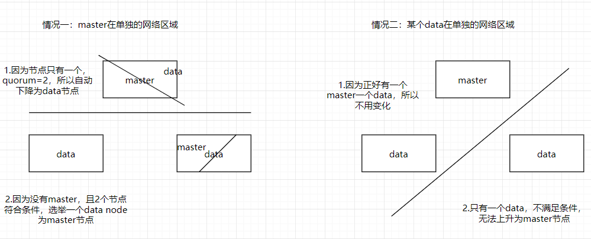
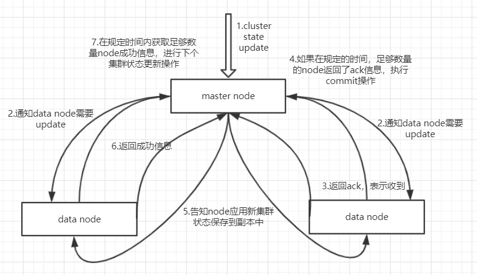

## 一、背景知识

当我们想要搭建集群时，要先了解下ES的集群发现机制`zen discovery`

在默认情况下，es进程会绑定在自己的回环地址上，会去寻找9300-9305端口是否有es node，如果有并且启动，会主动与其通信，组成集群。这样的话如果本地启动多个节点，其搭建集群是非常方便的。但是生产环境不是这样，因为是在不同服务器上进行集群的搭建，需要绑定到非回环的ip地址上，并使用**集群发现机制**进行通信。

集群发现机制常用的有两种：

- unicast：es默认的集群发现机制，通过特殊节点的配置，使之组成一个集群，主要使用网络通信协议，而不是随便什么节点就可以进入集群。
- multicast：这个机制非常简单，所有在启动的节点接收到multicast ping后就自动加入集群，但是非常脆弱，如果有点网络波动，可能会导致集群的不稳定，一般不使用。

## 二、配置

### 2.1.基础配置

```
cluster.name:my-es --集群名称，一个集群的节点需要设置相同名称
node.name:node-1  -- 节点名称
network.host:192.168.25.250 -- 本机ip，保存unicast可以发现，进入非回环
http.port:9200 -- #服务端口号，默认9200
transport.tcp.port:9300 -- #集群间通信端口号， 默认9300
discovery.zen.ping.unicast.hosts: ["es01","es02","es03"] -- 集群自动发现的机器ip集合
```

### 2.2.master node与data node

配置节点时，可以选择哪些node作为master eligible node（备选主节点），这些节点具有争夺master node的权利，但是如果竞选失败还是当做data node使用

配置哪些node作为data node，只用来保存数据，不竞选master node。

```
# 配置为 master eligible node
node.master: true
node.data: false
#配置为 data node
node.master: false
node.data: true
```

### 2.2.master选举

`discovery.zen.ping_timeout`：集群启动时，会通过ping命令，对各个节点选举出一个master node，这里如果网络波动，会导致选举失败，所以设置这个参数可以增加选举时间，比如10s内选举完成，增加稳定性

`discovery.zen.join_timeout`：即选举成功后，如果有node加入集群，会发送join请求，增加join_timeout时长，如果join失败，在时间内会一直重试，也是增加稳定性

`discovery.zen.master_election.ignore_non_master_pings`：如果为true，ping选举master节点时，会强制区分候选节点，如果上面说的配置了`node.master:false`的节点，会被忽略掉。

`discovery.zen.minimum_master_nodes`：**这个配置相当重要，避免脑裂问题**！

#### 2.2.1脑裂

比如两节点集群，一主一从，如果通信中断（网络问题或者无响应），从节点会认为主节点挂掉，自动上升为主节点，这时在它身上的副本分片也会提升为主分片，就会出现两个主节点，导致数据破坏。

#### 2.2.2.配置解决

这个配置即在选举中至少有几个节点保持通信才可以推选master，缺省是1，一般设置为**N/2+1**，N为节点数量

#### 2.2.3.举例说明

##### 2.2.3.1.两个节点

如果集群有2个节点，`discovery.zen.minimum_master_nodes`设为1或2，结果会怎么样？


##### 2.2.3.2.三个节点

三个节点根据公式，`discovery.zen.minimum_master_nodes`设置为2，我们看看是否能避免脑裂：



通过图片分析可知，集群创建三个节点以上更为稳定合理

#### 2.2.4.动态配置

当集群增加或减少节点时，可以动态配置这个参数

```json
PUT /_cluster/settings
{
    "persistent" : {
        "discovery.zen.minimum_master_nodes" : 2
    }
}
```


### 2.3.集群故障检查

es有两种集群故障探查机制，第一种是通过master进行的，master会ping集群中所有的其他node，确保它们是否是存活着的。第二种，每个node都会去ping master node来确保master node是存活的，否则就会发起一个选举过程。

有下面三个参数用来配置集群故障的探查过程：

```
ping_interval：每隔多长时间会ping一次node，默认是1s
ping_timeout：每次ping的timeout等待时长是多长时间，默认是30s
ping_retries：如果一个node被ping多少次都失败了，就会认为node故障，默认是3次
```

### 2.4.集群状态更新

之前说过，ES中只有master node是可以对cluster state进行更新的node，它也是主要干这个事的。



这里会发现第四步和第七步，具有规定时间和足够数量，就是通过配置文件配置的。

```
discovery.zen.commit_timeout:指定时间内获取ack响应，如果没有便不会应用时间（默认30s）
discovery.zen.publish_timeout：指定时间内响应状态更新成功，如果超时便不会进行下一次更新操作（默认30s）
discovery.zen.minimum_master_nodes：即上面配置的至少有多少个节点保持通信
```

### 2.5.宕机阻塞集群操作

如果要让集群正常运转，那么必须有一个master，还有`discovery.zen.minimum_master_nodes`指定数量的master候选node，都在运行。

`discovery.zen.no_master_block`可以控制当master宕机时，什么样的操作应该被拒绝。有下面两个选项：

```
discovery.zen.no_master_block:all -- 一旦master当即，那么所有的操作都会被拒绝
discovery.zen.no_master_block:write -- 这是默认的选项，所有的写操作都会被拒绝，但是读操作是被允许的
```

### 2.6.文件存放位置

es默认存放数据到data目录下，日志存放log目录下，插件存放plugin目录下，如果es升级，会导致文件夹覆盖。所以我们应该更改文件存放位置

一般目录存放在`/var`下：

```
mkdir -p /var/log/elasticsearch
mkdir -p /var/data/elasticsearch
```

修改`elasticsearch.yml`：

```
path.logs: /var/log/elasticsearch
path.data: /var/data/elasticsearch
```

### 2.7.配置日志信息

ES默认的日志配置中没有删除的操作，需要配下日志删除的逻辑，在`log4j2.properties·`中

```
appender.rolling.strategy.type = DefaultRolloverStrategy
appender.rolling.strategy.action.type = Delete
appender.rolling.strategy.action.basepath = ${sys:es.logs.base_path}
appender.rolling.strategy.action.condition.type = IfLastModified
appender.rolling.strategy.action.condition.age = 7D
appender.rolling.strategy.action.PathConditions.type = IfFileName
appender.rolling.strategy.action.PathConditions.glob = ${sys:es.logs.cluster_name}-*

第一行是配置了默认的DefaultRolloverStrategy
第二行是配置了Delete action，在rollover之后，就会删除文件
第三行是配置了es log的基础路径
第四行是配置了rollover发生的条件，是基于IfLastModified
第五行是配置了保留的天数，这里是7天
第六行是配置了删除匹配7天前的文件
第七行是配置了一个删除文件的格式，这样就只是删除过期日志文件，但是不要删除慢查询日志
```

### 2.8.集群重启shard重分配问题

**问题**：好比10个节点，5个primary shard，5个replica shard，一开始均匀的每个节点分配一个shard

这时重启节点，因为某些原因，只先启动了5个节点，还有5个节点没有启动，这时ES会自动恢复shard

1）将启动的5个节点中replica升级为primary shard

2）将每个shard 复制一份 replica，这样每个节点有两个shard，主副各一份

3）此时启动剩余5个节点了

4）根据负载均衡，将先启动节点的shard均匀分配到新启动节点上，这样回到每个节点一个shard的情况

5）删除新启动节点本地shard

所以，根据这种情况，节点多做了很多操作，如：

- 平白无故复制了50%的shard
- 后上线的node删除本地shard
- 50%的shard进行网络传输移动

便会浪费大量资源且启动缓慢

**解决**：

```
gateway.recover_after_nodes: 8
gateway.expected_nodes: 10
gateway.recover_after_time: 5m
搭配使用，启动节点数量大于8个后，如果再过5分钟内没有启动10个节点，开始分配shard
```

这样可以节省大量资源，并且启动速度变快

## 三、系统设置

ES不能用root用户启动，所以必须创建用户分配权限启动才可以

```
adduser es
passwd es
chown -R es /usr/local/elasticsearch
chown -R es /var
su es
```

## 四、启动报错问题

1）ERROR: [2] bootstrap checks failed：max file descriptors [4096] for elasticsearch process is too low, increase to at least [65536][2]: max virtual memory areas vm.max_map_count [65530] is too low, increase to at least [262144]

在`vi /etc/security/limits.conf `

添加如下内容:

```
* - nofile 65536
* soft memlock unlimited
* hard memlock unlimited
```

2）elasticsearch max virtual memory areas vm.max_map_count [65530\] is too low, increase to at least [262144]

在root用户下执行

```
vi /etc/sysctl.conf 
```

添加下面配置：

```
vm.max_map_count=655360
```

并执行命令：

```
sysctl -p
```

## 五、启动与关闭

配置完那些后，在es/bin目录下执行`./elasticsearch -d`

然后查看日志 `cat /var/log/elasticsearch/my-cat.log`


启动成功

关闭需要查看进程号：`ps -ef|grep elasticsearch`

杀死进程：`kill -SIGTERM pid`

## 六、总结

1）创建日志存放目录

```
mkdir -p /var/log/elasticsearch
mkdir -p /var/data/elasticsearch
```

2）修改elasticsearch.yml

```
# 必须配置
cluster.name: my-es
node.name: node-1
network.host: 192.168.25.250
http.port: 9200
transport.tcp.port: 9300
discovery.zen.ping.unicast.hosts: ["es01","es02","es03"]

# 根据情况设置（必须）
discovery.zen.minimum_master_nodes: 1

gateway.recover_after_nodes: 1
gateway.expected_nodes: 2
gateway.recover_after_time: 5m

# 根据情况选择设置
path.logs: /var/log/elasticsearch
path.data: /var/data/elasticsearch

node.master: true
node.data: false

# 没太有必要设置
discovery.zen.commit_timeout: 10s
discovery.zen.publish_timeout：10s

#跨域设置
http.cors.enabled: true
http.cors.allow-origin: "*"
```

3）jvm.options

```
# jvm heap内存，根据需要配置
-Xms2g
-Xmx2g
```

5）配置系统设置

`vi /etc/security/limits.conf `添加

```
* - nofile 65536
* soft memlock unlimited
* hard memlock unlimited
```

`vi /etc/sysctl.conf `添加`vm.max_map_count=655360`，执行`sysctl -p`

4）创建用户

```
adduser es
passwd es
chown -R es /usr/local/elasticsearch
chown -R es /var/log/elasticsearch/
chown -R es /var/data/elasticsearch/
su es
```

5）启动所有节点

再bin目录下：`./elasticsearch -d`

查看日志是否启动成功：`cat /var/log/elasticsaerch/my-cat.log`

6）测试

```
curl -XGET elasticsearch02:9200
curl -XGET elasticsearch02:9200/_cat/nodes?v
```


成功启动三个节点

