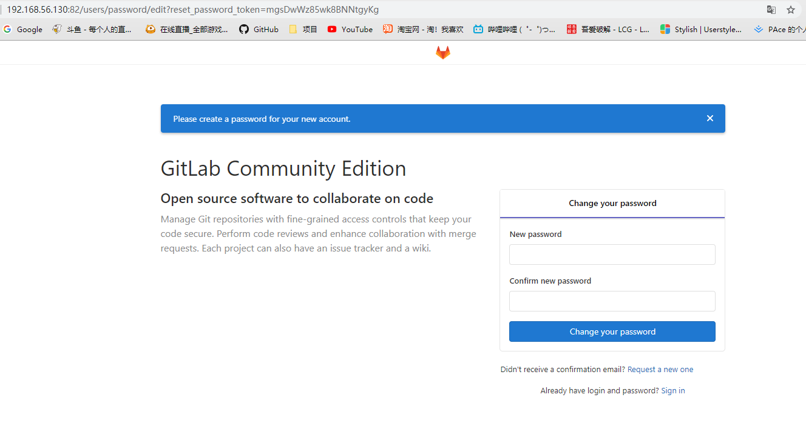
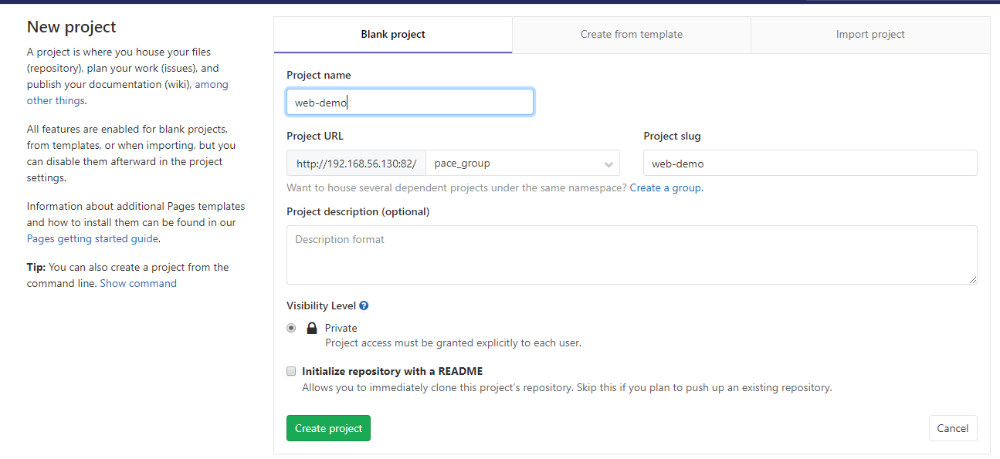
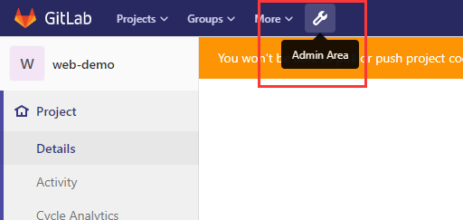
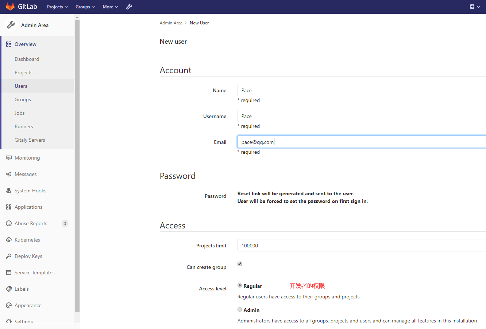
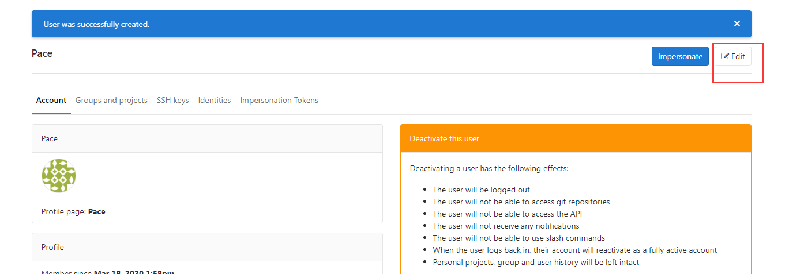
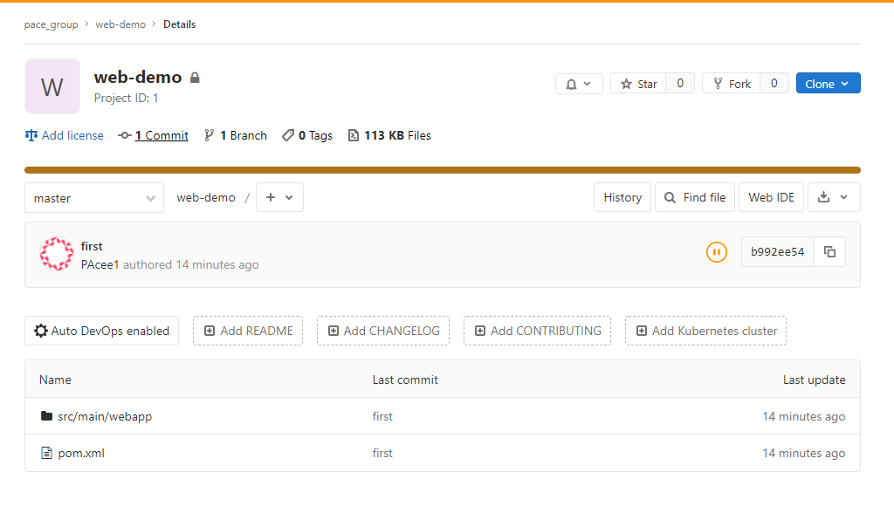

# Jenkins安装和集成环境配置

## 持续集成流程说明


这次学习，我们会创建三台虚拟机，分别用作在上节说的必要组成服务器，为

- 代码托管服务器：Gitlab实现，存放代码
- 持续集成服务器：主要是Jenkins，次要JDK，Git，Maven，拉取代码整合打包
- 测试服务器：Tomcat服务，部署

持续集成流程为：

1. 程序员Commit代码到Gitlab上
2. Jenkins使用Git拉取新的代码，配合JDK Maven进行编译，代码测试，审查，打包工作
3. Jenkins全部完成将Jar或者War分发到测试服务器上，完成整个流程

### 服务器列表

三台Centos7的虚拟机：

| 名称           | IP             | 所需软件                                       |
| -------------- | -------------- | ---------------------------------------------- |
| 代码托管服务器 | 192.168.56.130 | Gitlab-12.4.2 （最好2G以上内存）               |
| 持续集成服务器 | 192.168.56.131 | Jenkins-2.190.3，JDK1.8，Maven3.6.2，Git.Sonar |
| 测试服务器     | 192.168.56.132 | JDK1.8,Tomcat8.5                               |

在环境安装搭建前，需要创建三个虚拟机，这里百度一下就可以


## GitLab服务器安装配置

GitLab的虚拟机最好分配多一点内存，比较吃内存

### GitLab介绍

gitlab和github差不多，都是代码托管的网站，两者区别是：

- github创建私有服务是收费的，免费使用只能将代码存放到他的服务器上
- gitlab可以免费创建私有服务器

### GitLab安装

1.安装相关依赖

> yum -y install policycoreutils openssh-server openssh-clients postfix
>
>  yum install policycoreutils-python -y 

2.启动ssh服务并设置开机启动

> systemctl enable sshd && sudo systemctl start sshd

3.设置postfix开启自启并启动，postfix支持gitlab发信功能

> systemctl enable postfix && systemctl start postfix

4.开放ssh以及http服务，重新加载防火墙

> firewall-cmd --add-service=ssh --permanent
>
> firewall-cmd --add-service=http--permanent
>
> firewall-cmd --reload

如果已经关闭防火墙就不需要操作，关闭防火墙命令：

>  systemctl stop firewalld.service 
>
>  systemctl disable firewalld.service  

5.下载gitlab安装

> yum -y install wget
>
> wget https://mirrors.tuna.tsinghua.edu.cn/gitlab-ce/yum/el6/gitlab-ce-12.4.2-ce.0.el6.x86_64.rpm
>
> 安装：rpm -i gitlab-ce-12.4.2-ce.0.el6.x86_64.rpm

6.修改gitlab配置

> vi /etc/gitlab/gitlab.rb

修改gitlab访问端口，由80改为82

```
external_url 'http://192.168.56.130:82'
nginx['listen_port'=82]
```

7.重载配置并开启gitlab

> gitlab-ctl reconfigure
>
> gitlab-ctl restart

8.把端口添加到防火墙

如果关闭防火墙就不需要了

> firewall-cmd --zone=public --add-port=82/tcp --permanent
>
> firewall-cmd --reload

这样GitLab服务器就安装完毕了，访问 http://192.168.56.130:82/ 测试



这里提示你第一次登陆需要更改密码，gitlab提供了一个root根账号，修改密码后登陆就可以进入主页面

### GitLab创建组、用户、项目

用户和项目就不用介绍了，这里说一下组的概念，一个私有GitLab服务器可以有多个组，每个组可以存放多个项目，不同的组可以表示公司不同的开发项目或者服务模块，比如腾讯公司，可能就有QQ组，微信组等等。

1）创建组


2）创建项目


在组内点击new project按钮



3）创建用户



点击管理区域，在左侧Users列表添加用户





创建完后需要去edit设置一下密码

4）为项目添加成员

进入到项目页面，点击左侧的Members


这里有5个权限：

- Guest：可以创建issue，发表评论，不能读写版本库，访客权限
- Reporter：可以克隆代码，不能提交，项目经理可以设置
- Developer：可以克隆也可以提交，push，普通的开发人员的权限
- Maintainer：Developer的基础上可以创建项目，添加tag，分支管理，编辑项目，添加项目成员，核心开发的权限
- Owner：可以设置项目访问权限，删除项目，迁移项目等等，开发组组长的权限

### GitLab使用

创建完项目后，我们就可以上传代码到上面了，这里就不详细说了，简单说下过程

创建一个项目，这里我创建了一个简单的web项目

```
git add .
git commit -m 'first'
git remote add xxx
git push -u origin master
```



然后再GitLab上就可以看到文件代码已经上传上去了

到此我们的GitLab服务器已经搭建完成


## Jenkins服务器安装配置

## Tomcat服务器安装配置