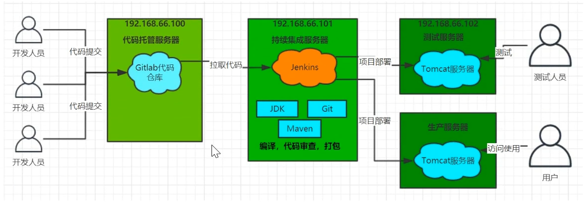
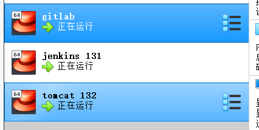

# Jenkins安装和集成环境配置

## 持续集成流程说明



这次学习，我们会创建三台虚拟机，分别用作在上节说的必要组成服务器，为

- 代码托管服务器：Gitlab实现，存放代码
- 持续集成服务器：主要是Jenkins，次要JDK，Git，Maven，拉取代码整合打包
- 测试服务器：Tomcat服务，部署

持续集成流程为：

1. 程序员Commit代码到Gitlab上
2. Jenkins使用Git拉取新的代码，配合JDK Maven进行编译，代码测试，审查，打包工作
3. Jenkins全部完成将Jar或者War分发到测试服务器上，完成整个流程

### 服务器列表

三台Centos7的虚拟机：

| 名称           | IP             | 所需软件                                       |
| -------------- | -------------- | ---------------------------------------------- |
| 代码托管服务器 | 192.168.56.130 | Gitlab-12.4.2                                  |
| 持续集成服务器 | 192.168.56.131 | Jenkins-2.190.3，JDK1.8，Maven3.6.2，Git.Sonar |
| 测试服务器     | 192.168.56.132 | JDK1.8,Tomcat8.5                               |

在环境安装搭建前，需要创建三个虚拟机，这里百度一下就可以



## GitLab服务器安装配置

1.安装相关依赖

> yum -y install policycoreutils openssh-server openssh-clients postfix

2.启动ssh服务并设置开机启动

> systemctl enable sshd && sudo systemctl start sshd

3.设置postfix开启自启并启动，postfix支持gitlab发信功能

> systemctl enable postfix && systemctl start postfix

4.开放ssh以及http服务，重新加载防火墙

如果已经关闭防火墙就不需要操作

> firewall-cmd --add-service=ssh --permanent
>
> firewall-cmd --add-service=http--permanent
>
> firewall-cmd --reload

5.下载gitlab安装

> yum -y install wget
>
> wget https://mirrors.tuna.tsinghua.edu.cn/gitlab-ce/yum/el6/gitlab-ce-12.4.2-ce.0.el6.x86_64.rpm
>
> 安装：rpm -i gitlab-ce-12.4.2-ce.0.el6.x86_64.rpm

6.修改gitlab配置

> vi /etc/gitlab/gitlab.rb

修改gitlab访问端口，由80改为82

```
external_url 'http://192.168.56.130:82'
nginx['listen_port'=82]
```

7.重载配置并开启gitlab

> gitlab-ctl reconfigure
>
> gitlab-ctl restart

8.把端口添加到防火墙

如果关闭防火墙就不需要了

> firewall-cmd --zone=public --add-port=82/tcp --permanent
>
> firewall-cmd --reload

## Jenkins服务器安装配置

## Tomcat服务器安装配置