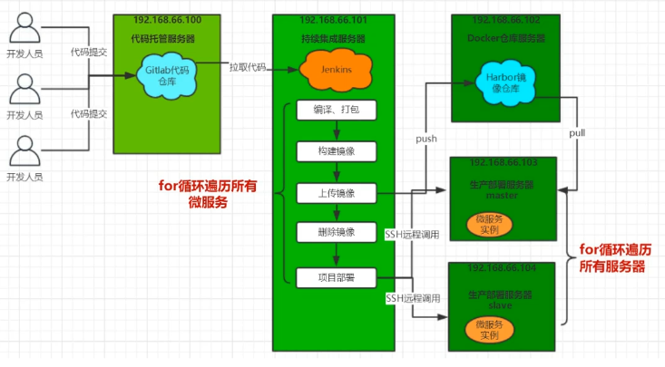
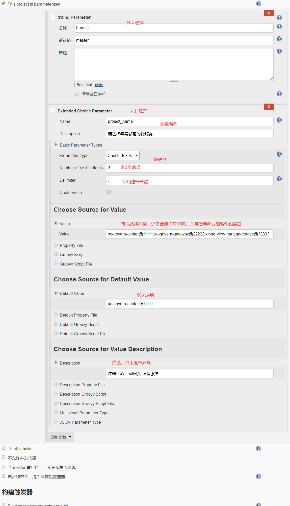
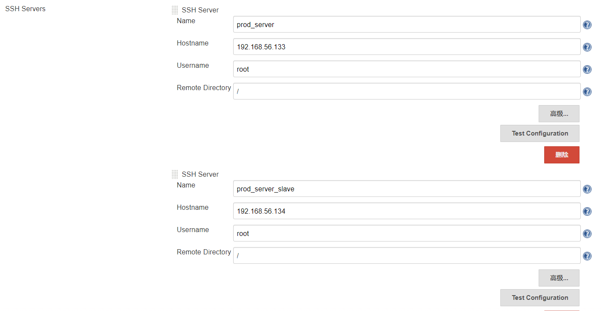
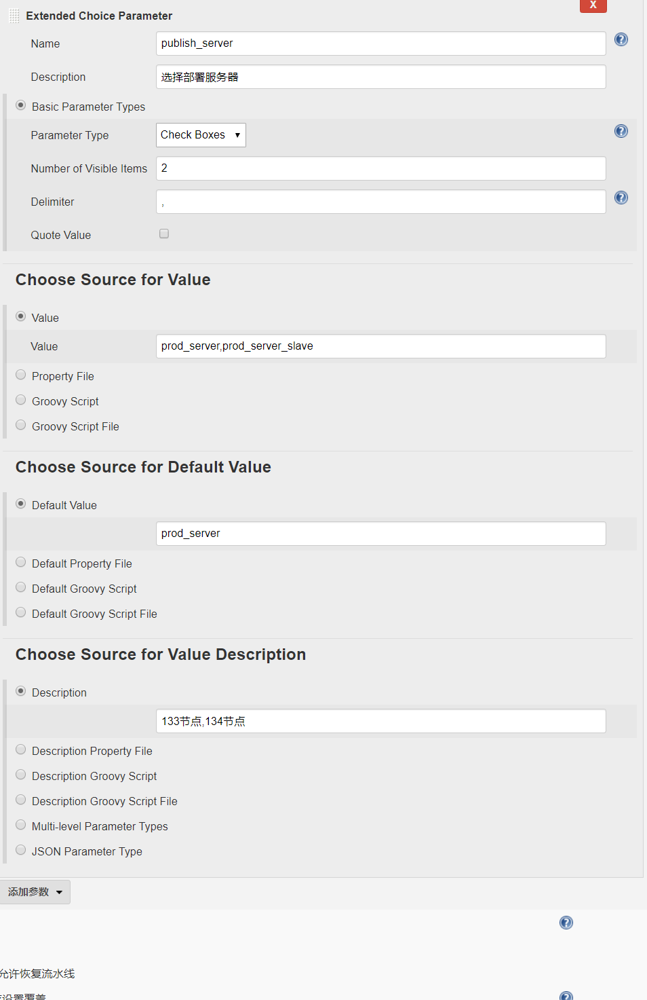
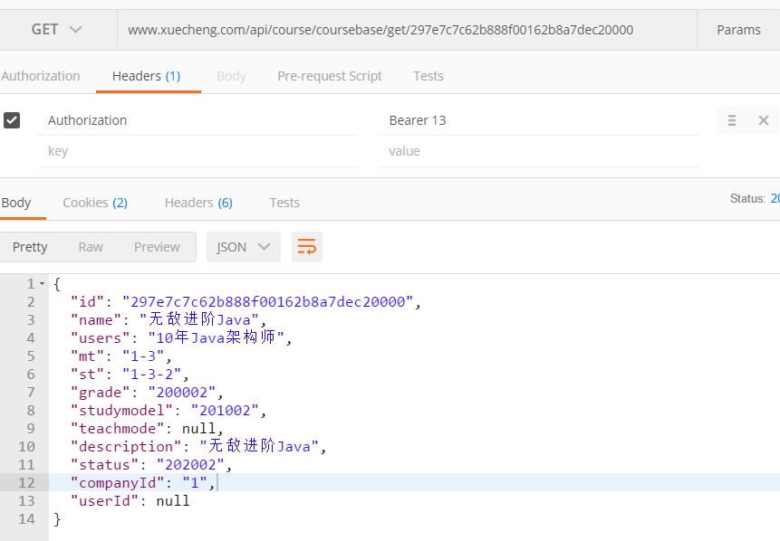

## Jenkins+Docker+SpringCloud部署方案优化

### 具有的问题

在之前单机版部署方案具有的问题：

- 一次只能选择一个为微服务进行部署
- 只有一台生产部署服务器，容错率低
- 每个微服务只有一个实例，容错率低

优化方案：

- 在一个Jenkins工程中可以选择多个微服务同时发布
- 在一个Jenkins工程中可以选择多台服务器同时部署
- 每个微服务都是以集群高可用的形式部署

### 优化流程



有两部分不一样，一是编译打包是会使用for循环，打包多个微服务，二是部署时循环所有服务器进行部署

## 修改微服务配置

在开始优化部署前，我们需要修改微服务配置，因为之前都是使用的单机版

### Eureka

`application.yml`

```yml
server:
  port: 11111
spring:
  application:
    name: eureka-ha
```

`application-eureka01.yml`

```yml
eureka:
  client:
    service-url:
      defaultZone: http://192.168.56.133:11111/eureka/,http://192.168.56.134:11111/eureka/
  instance:
    prefer-ip-address: true
    hostname: eureka01
```

`application-eureka02.yml`

```yml
eureka:
  client:
    service-url:
      defaultZone: http://192.168.56.133:11111/eureka/,http://192.168.56.134:11111/eureka/
  instance:
  	prefer-ip-address: true
    hostname: eureka02
```


### 其他微服务

因为其他微服务只需要修改Eureka的Client：

```yml
eureka:
  client:
    service-url:
      #defaultZone: http://192.168.56.133:11111/eureka/ #,http://localhost:50102/eureka/
      defaultZone: http://192.168.56.133:11111/eureka/,http://192.168.56.134:11111/eureka/
  instance:
    prefer-ip-address: true
```

## Jenkins设置多个微服务参数选择

在之前我们部署微服务时，选择项目使用的是单选框，如果想要部署多个项目，肯定离不开复选框，接着我们来进行复选框的设置

1）安装Extended Choice Parameter插件

支持多选框


2）创建一个新项目，并设置多选参数



保存后可以看到，可以选择三个微服务


## Sonar一次性审查多个项目

准备工作做好后，我们就需要开始修改Jenkins构建脚本了，拉取代码不需要修改，接着修改Sonar审查代码

```groovy
node {
    // 获取参数projectNames
    def projectNames = "${project_name}".split(",")
    stage('拉取代码') {
        checkout([$class: 'GitSCM', branches: [[name: '*/${branch}']],
                  doGenerateSubmoduleConfigurations: false, extensions: [], submoduleCfg: [],
                  userRemoteConfigs: [[credentialsId: "${git_auth}", url: "${git_url}"]]])
    }
    stage('代码审查') {
        // 循环扫描每个微服务
        for(int i=0;i < projectNames.length;i++){
            // xc-govern-center@11111
            def projectInfo = projectNames[i]
            // xc-govern-center
            def currentProjectName = "${projectInfo}".split("@")[0]
            // 11111
            def currentProjectPort = "${projectInfo}".split("@")[1]

            // 引入SonarQube Scanner工具，这里是我们在Jenkins全局工具中配置的名称
            def scannerHome = tool 'sonar-scanner'
            // 引入Sonar服务器环境，这里是我们Jenkins系统配置中Sonar的名称
            withSonarQubeEnv('sonar'){
                sh """
                    cd ${currentProjectName}
                    ${scannerHome}/bin/sonar-scanner
                 """
            }
        }
    }

}
```

这里主要就是把参数获取，然后循环遍历来扫描每个微服务，根据之前定义的逗号进行分隔。

## 编译打包多个项目并上传镜像

这里实现方式和Sonar几乎一样，把for循环复制过去，然后改一下用到项目名称的地方

```groovy
stage('编译打包父工程'){
    sh """
        mvn clean install
        """
}
stage('编译打包微服务，并使用docker插件制作镜像') {
    // 循环扫描每个微服务
    for(int i=0;i < projectNames.length;i++){
        // xc-govern-center@11111
        def projectInfo = projectNames[i]
        // xc-govern-center
        def currentProjectName = "${projectInfo}".split("@")[0]
        // 11111
        def currentProjectPort = "${projectInfo}".split("@")[1]

        sh "mvn -f ${currentProjectName} clean package dockerfile:build"
    }
}
stage('推送镜像到Harbor上') {
    // 循环扫描每个微服务
    for(int i=0;i < projectNames.length;i++){
        // xc-govern-center@11111
        def projectInfo = projectNames[i]
        // xc-govern-center
        def currentProjectName = "${projectInfo}".split("@")[0]
        // 11111
        def currentProjectPort = "${projectInfo}".split("@")[1]
        // 定义镜像名称
        def imageName = "${currentProjectName}:${tag}"

        // 为镜像打标签
        sh "docker tag ${imageName} ${harbor_url}/${harbor_project}/${imageName}"

        // 推送到Harbor上
        withCredentials([usernamePassword(credentialsId: "${harbor_auth}", passwordVariable: 'password', usernameVariable: 'username')]) {
            // 推送前先登录
            sh "docker login -u ${username} -p ${password} ${harbor_url}"

            // 上传镜像
            sh "docker push ${harbor_url}/${harbor_project}/${imageName}"
        }
    }
}
stage('删除Jenkins服务器中的镜像') {
    // 循环扫描每个微服务
    for(int i=0;i < projectNames.length;i++){
        // xc-govern-center@11111
        def projectInfo = projectNames[i]
        // xc-govern-center
        def currentProjectName = "${projectInfo}".split("@")[0]
        // 11111
        def currentProjectPort = "${projectInfo}".split("@")[1]

        // 定义镜像名称
        def imageName = "${currentProjectName}:${tag}"

        def tagName = "${harbor_url}/${harbor_project}/${imageName}"

        // 删除镜像
        sh "docker rmi ${currentProjectName}"
        // 删除标签镜像
        sh "docker rmi ${tagName}"
    }
}
```

## 多项目部署到多服务器

### 服务器环境配置

首先，我们需要把新添加的134机器添加ssh秘钥，并在Jenkins系统配置中配置

> ssh-copy-id 192.168.56.134



### Jenkins设置多服务器参数选择

这里配置方法和之前微服务参数一样



### 修改Jenkins构建脚本文件

```groovy
// 获取服务器名称
def servers = "${publish_server}".split(",")
stage('远程调用生产服务器拉取镜像') {
    // 循环扫描每个微服务
    for(int i=0;i < projectNames.length;i++){
        // xc-govern-center@11111
        def projectInfo = projectNames[i]
        // xc-govern-center
        def currentProjectName = "${projectInfo}".split("@")[0]
        // 11111
        def currentProjectPort = "${projectInfo}".split("@")[1]

        // 循环服务器
        for(int j=0;j < servers.length;j++){
            // 服务器获取
            def currentServer = servers[j]

            // 设置注册中心使用的配置文件
            def activeProfile = "--spring.profile.active="
            // 判断服务器
            if(currentServer=="prod_server"){
                activeProfile = activeProfile + "eureka01"
            }else if(currentServer=="prod_server_slave"){
                activeProfile = activeProfile + "eureka02"
            }

            sshPublisher(publishers: [
                sshPublisherDesc(
                    configName: "${currentServer}",
                    transfers:[
                        sshTransfer(
                            cleanRemote:false,
                            execCommand:"/opt/jenkins_shell/deployCluster.sh $harbor_url $harbor_project $currentProjectName $tag $currentProjectPort $activeProfile"
                        )
                    ]
                )
            ])
        }
    }
}
```


### 修改Shell脚本

这里主要是注册中心微服务，需要判断使用的profile

```shell
#接收外部参数
harbor_url=$1
harbor_project_name=$2
project_name=$3
tag=$4
port=$5
activeProfile=$6

imageName=$harbor_url/$harbor_project_name/$project_name:$tag

echo "$imageName"

# 查询容器是否存在，存在则删除
containerId=`docker ps -a | grep -w ${project_name}:${tag} | awk '{print $1}'`
if [ "$containerId" != "" ] ; then
	# 停掉容器
	docker stop $containerId
	# 删除容器
	docker rm $containerId
	echo "删除容器成功"
fi

# 查询镜像是否存在 存在则删除
imageId=`docker images | grep -w $project_name | awk '{print $3}'`
if [ "$imageId" != "" ] ; then
	# 删除镜像
	docker rmi -f $imageId
	echo "删除镜像成功"
fi

# 登录Harbor
docker login -u pace -p Pace1234 $harbor_url

# 下载镜像
docker pull $imageName

# 启动容器
docker run -di -p $port:$port $imageName $activeProfile

echo "容器启动成功"
```

然后存放到133和134机器上的`/opt/jenkins_shell`目录下

> mkdir /opt/jenkins_shell
>
> vi deploy.sh
>
> chmod +x  /opt/jenkins_shell/deployCluster.sh


## Jenkins部署多个微服务测试


正确执行，并搭建成集群

## Nginx配合Zuul集群实现高可用网关

在之前我们部署了两个网关服务，那么如何实现高可用呢？

这里就需要nginx的配合


我这里是在本机安装了一个nginx，就是windows版本的，然后我的nginx.conf设置如下：

```
worker_processes  1;

events {
    worker_connections  1024;
}

http {
    include       mime.types;
    default_type  application/octet-stream;

    sendfile        on;
    keepalive_timeout  65;


	#cms 页面预览，请求转发
	upstream zuul_server_pool{
		server 192.168.56.133:22222 weight=1;
		server 192.168.56.134:22222 weight=1;
	}
	
	# 主页服务
    server{
		listen       80;
		server_name  www.xuecheng.com;
		ssi on;
		ssi_silent_errors on;
		
		# Zuul网关
		location /api {
			proxy_pass http://zuul_server_pool;
		}
	}

}
```

设置请求www.xuecheng.com/api，会转发到网关，然后网关设置了两个server，轮询算法进行负载均衡，这里还需要将www.xuecheng.com配置到host中，对应127.0.0.1

测试：`www.xuecheng.com/api/course/coursebase/get/297e7c7c62b888f00162b8a7dec20000`



成功返回结果

