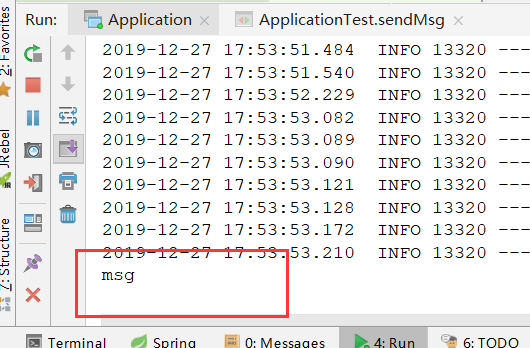

## 快速入门

### 相同配置

这里我们把生产端和消费端分离，为两个不同的模块

但是具有相同的一些配置

#### Maven依赖

添加SpringBoot依赖

```xml
<parent>
    <groupId>org.springframework.boot</groupId>
    <artifactId>spring-boot-starter-parent</artifactId>
    <version>1.5.14.RELEASE</version>
    <relativePath/> <!-- lookup parent from repository -->
</parent>

<properties>
    <project.build.sourceEncoding>UTF-8</project.build.sourceEncoding>
    <project.reporting.outputEncoding>UTF-8</project.reporting.outputEncoding>
    <java.version>1.8</java.version>
</properties>

<dependencies>
    <dependency>
        <groupId>org.springframework.boot</groupId>
        <artifactId>spring-boot-starter</artifactId>
    </dependency>
    <dependency>
        <groupId>org.springframework.boot</groupId>
        <artifactId>spring-boot-starter-test</artifactId>
        <scope>test</scope>
    </dependency>
    <dependency>
        <groupId>org.springframework.boot</groupId>
        <artifactId>spring-boot-starter-amqp</artifactId>
    </dependency>
</dependencies>
```

#### 配置文件

修改application.properties配置文件

```properties
# rabbitmq 连接配置
spring.rabbitmq.addresses=192.168.56.120:5672
spring.rabbitmq.username=guest
spring.rabbitmq.password=guest
spring.rabbitmq.virtual-host=/
```

这里使用配置的方式，也是和Spring一大不同，不用再去配置ConnectionFactory去获取连接了，因为SpringBoot有大量的自动配置类，自动进行初始化并添加到ApplicationContext中

### 生产端快速入门

想要快速的使用RabbitMQ在SpringBoot中非常简单

**1.创建启动器类**

```java
@SpringBootApplication
public class Application {
    public static void main(String[] args) {
        SpringApplication.run(Application.class,args);
    }
}
```

**2.创建一个测试类发送消息**

```java
@RunWith(SpringRunner.class)
@SpringBootTest
public class ApplicationTest {

    @Autowired
    private RabbitTemplate rabbitTemplate;

    @Test
    public void sendMsg(){
        MessageProperties properties = new MessageProperties();
        String str = new String("msg");
        Message msg = new Message(str.getBytes(),properties);

        rabbitTemplate.send("springboot.exchange","springboot.test",msg);
    }
}
```

注：这里的exchange需要自己去创建一个，我这个是直接在控制台创建的

**3.运行测试类**


运行后，可以看到队列中有一条消息等待消费了

### 消费端快速入门

消费端的使用就更简单了，主要就是`@RabbitListener`这个注解

**1.创建启动器类和配置（同生产端）**

**2.创建一个Consumer类**

```java
@Component
public class Consumer {

    @RabbitListener(queues = "springboot.queue")
    public void onMessage(Message message){
        System.out.println(new String(message.getBody()));
    }
}
```

分为两步走：

- 添加@Component注解，将消费者注入到容器中
- 在方法上添加`@RabbitListener`注解，指定队列名，便可以持续监听消费

**3.启动Application测试**



正确消费


**对于SpringBoot使用RabbitMQ就是这么简单**，接下来说一些其他重要使用方式


## 生产端高级使用

## 消费端高级使用