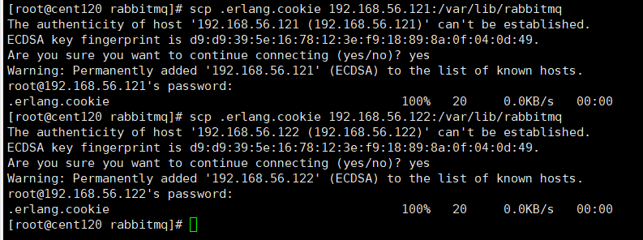
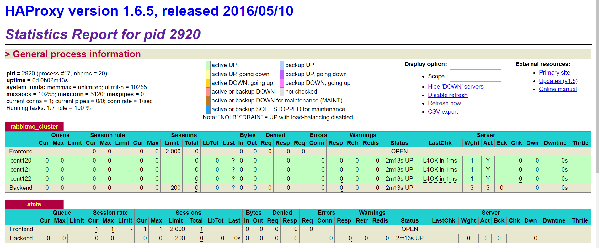

## RabbitMQ高可用集群搭建	

我们接着上一章介绍的架构模式，开始在虚拟机上搭建高可用的RabbitMQ集群，这里使用的是最常用的镜像模式

**这里我使用的CentOS7**

### 集群节点说明

| 服务器IP       | hostname | 节点说明           | 端口 | 管控台地址                                |
| -------------- | -------- | ------------------ | ---- | ----------------------------------------- |
| 192.168.56.120 | cent120  | RabbitMQ master    | 5672 | http://192.168.56.120:15672               |
| 192.168.56.121 | cent121  | rabbitmq slave     | 5672 | http://192.168.56.121:15672               |
| 192.168.56.122 | cent122  | rabbitmq slave     | 5672 | http://192.168.56.122:15672               |
| 192.168.56.123 | cent123  | HaProxy+KeepAlived | 8100 | http://192.168.56.123:8100/rabbitmq-stats |
| 192.168.56.124 | cent124  | HaProxy+KeepAlived | 8100 | http://192.168.56.124:8100/rabbitmq-stats |

### 环境准备

准备5台虚拟机，这里可以先创建一个，然后根据第二章RabbitMQ的安装与启动，配置好后，进行虚拟机的复制，复制出多个后

- 修改其网络设置
- 修改hostname，`hostnamectl set-hostname xxx`，然后重启
- 设置hosts文件，`vi /etc/hosts`，这一步非常关键，如果不加，后面从节点加入机器是就要报错

创建好5个后，将120,121,122的RabbitMQ启动，并访问控制台，看看是否都启动成功


### 文件同步

需要将主节点的cookie文件同步到其他节点上，这里就是将120的同步到121和122上

**同步之前需要将RabbitMQ关闭**

```
$ scp .erlang.cookie 192.168.56.121:/var/lib/rabbitmq
$ scp .erlang.cookie 192.168.56.122:/var/lib/rabbitmq
```



### 组成集群

接着就要搭建集群了

**1.停止MQ服务**

PS:我们首先停止3个节点的服务

```
$ rabbitmqctl stop
```

**2.组成集群操作**

使用以下命令对120,121,122执行，以集群状态启动

```
$ rabbitmq-server -detached
```

启动后可以使用`lsof -i:5672`命令，查看是否启动成功


**3.slave加入集群操作**

对121和122重复以下操作，注意！hosts中需要配置了ip与hostname的映射

```
$ rabbitmqctl stop_app
$ rabbitmqctl join_cluster rabbit@cent120
$ rabbitmqctl start_app

# 移除节点操作
$ rabbitmqctl forget_cluster_node rabbit@cent121
```


出现以下日志，说明启动成功，

**4.修改集群名称**

```
$ rabbitmqctl set_cluster_name rabbitmq_cluster1
```

**5.然后可以看一下集群状态**

```
$ rabbitmqctl cluster_status
```


节点信息，包括集群名称，都有显示，说明集群构建成功

**6.控制台访问**


在Nodes模块，具有三个节点，可以看到，这些节点都有一个`Disc`标识，表示以磁盘形式存储，如果想要使用内存存储，可以在加入集群时添加参数，如下：

```
$ rabbitmqctl join_cluster --ram rabbit@cent120
```

### 配置镜像队列

设置镜像队列策略（在任意一个节点上执行）

```
$ rabbitmqctl set_policy ha-all "^"   '{"ha-mode":"all"}'
```

**将所有队列设置为镜像队列**，即队列会被复制到各个节点，各个节点状态一致，如果有消息发送到某个队列，会自动同步到其他节点的队列中

RabbitMQ高可用集群就已经搭建好了,我们可以重启服务，查看其队列是否在从节点同步。


## 整合HaProxy实现负载均衡

### HaProxy简介

HAProxy是一款提供高可用性、负载均衡以及基于TCP和HTTP应用的代理软件，HAProxy是完全免费的、借助HAProxy可以快速并且可靠的提供基于TCP和HTTP应用的代理解决方案。

HAProxy适用于那些负载较大的web站点，这些站点通常又需要会话保持或七层处理。 

HAProxy可以支持数以万计的并发连接,并且HAProxy的运行模式使得它可以很简单安全的整合进架构中，同时可以保护web服务器不被暴露到网络上。

### HaProxy安装

因为我们之后要实现高可用，所以这里也使用两个节点部署，即123和124，步骤：

```java
//下载依赖包
yum install gcc vim wget

//下载haproxy
wget http://www.haproxy.org/download/1.6/src/haproxy-1.6.5.tar.gz

//解压
tar -zxvf haproxy-1.6.5.tar.gz -C /usr/local

//进入目录、进行编译、安装
cd /usr/local/haproxy-1.6.5
make TARGET=linux31 PREFIX=/usr/local/haproxy
make install PREFIX=/usr/local/haproxy
mkdir /etc/haproxy

//赋权
groupadd -r -g 149 haproxy
useradd -g haproxy -r -s /sbin/nologin -u 149 haproxy

//创建haproxy配置文件
touch /etc/haproxy/haproxy.cfg
```

问题：下载HaProxy时可能下载不了，可以直接浏览器访问下载下来后扔到服务器上进行解压

### Haproxy配置

haproxy 配置文件haproxy.cfg详解，首先进入文件

```
$ vi /etc/haproxy/haproxy.cfg
```

配置：

```properties
#logging options
global
    log 127.0.0.1 local0 info
    maxconn 5120
    #安装地址
    chroot /usr/local/haproxy 
    uid 99
    gid 99
    daemon
    quiet
    nbproc 20
    pidfile /var/run/haproxy.pid

defaults
    log global
    #使用4层代理模式，"mode http"为7层代理模式
    mode tcp
    #if you set mode to tcp,then you nust change tcplog into httplog
    option tcplog
    option dontlognull
    retries 3
    option redispatch
    maxconn 2000
    contimeout 5s
    ##客户端空闲超时时间为 60秒 则HA 发起重连机制
    clitimeout 60s
    ##服务器端链接超时时间为 15秒 则HA 发起重连机制
    srvtimeout 15s	

# 监听rabbitmq集群
listen rabbitmq_cluster
	bind 0.0.0.0:5672
	#配置TCP模式
	mode tcp
	#balance url_param userid
	#balance url_param session_id check_post 64
	#balance hdr(User-Agent)
	#balance hdr(host)
	#balance hdr(Host) use_domain_only
	#balance rdp-cookie
	#balance leastconn
	#balance source //ip
	#简单的轮询
	balance roundrobin
	#rabbitmq集群节点配置 #inter 每隔五秒对mq集群做健康检查， 2次正确证明服务器可用，2次失败证明服务器不可用，并且配置主备机制
        server cent120 192.168.56.120:5672 check inter 5000 rise 2 fall 2
        server cent121 192.168.56.121:5672 check inter 5000 rise 2 fall 2
        server cent122 192.168.56.122:5672 check inter 5000 rise 2 fall 2
        
#配置haproxy web监控，查看统计信息
listen stats
	bind 192.168.56.123:8100
	# http模式，因为要浏览器访问
	mode http
	option httplog
	stats enable
	#设置haproxy监控地址为http://localhost:8100/rabbitmq-stats
	stats uri /rabbitmq-stats
	stats refresh 5s
```

### HaProxy启动

```
$ /usr/local/haproxy/sbin/haproxy -f /etc/haproxy/haproxy.cfg

//查看haproxy进程状态
$ ps -ef | grep haproxy
```

启动后，可以访问<http://192.168.56.123:8100/rabbitmq-stats>，查看是否启动成功



正确启动，并且有我们的三个节点

## 整合KeepAlived实现HaProxy的高可用

### KeepAlived简介

Keepalived，它是一个高性能的服务器高可用或热备解决方案，Keepalived主要来**防止服务器单点故障的发生问题**，可以通过其与Nginx、Haproxy等反向代理的负载均衡服务器配合实现web服务端的高可用。Keepalived以VRRP协议为实现基础，用VRRP协议来实现高可用性（HA）.VRRP（Virtual Router Redundancy Protocol）协议是用于实现路由器冗余的协议，VRRP协议将两台或多台路由器设备虚拟成一个设备，对外提供虚拟路由器IP（一个或多个）。

### KeepAlived重要特性

- 管理LVS负载均衡软件，比如Nginx，HaProxy
- 实现LVS集群中节点健康检查
- 系统网络的高可用，失败转移
  - KeepAlived维护了一个心跳，主节点回向备用节点发送心跳，表示自己还活在，如果心跳停止，备用节点会自动接管程序，成为主节点；当主节点恢复心跳，备用节点会释放资源，恢复备胎身份