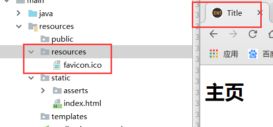
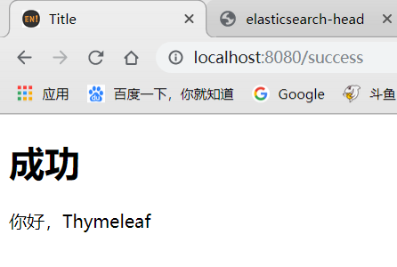

**使用环境Springboot1.5.10，对于Springboot2.x来说，某些源码改动，例如1.3中设置主页的源码变动**

## 一、SpringBoot对静态资源映射

通过前面的学习，对于这种映射我们知道都需要去看底层的自动配置类，而静态资源属于Web数据，所以我们打开`WebMvcAutoConfiguration`查看

```java
@EnableConfigurationProperties({ WebMvcProperties.class, ResourceProperties.class })
@Order(0)
public static class WebMvcAutoConfigurationAdapter implements WebMvcConfigurer {
```

首先往下可以看到导入了一个`ResourceProperties`类，就是我们要找的资源配置类

```java
@ConfigurationProperties(prefix = "spring.resources", ignoreUnknownFields = false)
public class ResourceProperties {

   private static final String[] CLASSPATH_RESOURCE_LOCATIONS = { "classpath:/META-INF/resources/",
         "classpath:/resources/", "classpath:/static/", "classpath:/public/" };
```

可以设置与静态资源有关的参数，参数属性为`spring.resources`开头，然后可以看到我们静态资源存放路径：

```
"classpath:/META-INF/resources/",
"classpath:/resources/",
"classpath:/static/",
"classpath:/public/"
"/"：当前目录根路径
```

### 1.1.webjars

对于静态资源，我们可以使用springboot带的webjars来使用：http://www.webjars.org/

```java
@Override
public void addResourceHandlers(ResourceHandlerRegistry registry) {
   if (!this.resourceProperties.isAddMappings()) {
      logger.debug("Default resource handling disabled");
      return;
   }
   Duration cachePeriod = this.resourceProperties.getCache().getPeriod();
   CacheControl cacheControl = this.resourceProperties.getCache().getCachecontrol().toHttpCacheControl();
    // 对于/webjars/**的请求，会到classpath:/META-INF/resources/webjars/寻找静态文件
   if (!registry.hasMappingForPattern("/webjars/**")) {
      customizeResourceHandlerRegistration(registry.addResourceHandler("/webjars/**")
            .addResourceLocations("classpath:/META-INF/resources/webjars/")
            .setCachePeriod(getSeconds(cachePeriod)).setCacheControl(cacheControl));
   }
   String staticPathPattern = this.mvcProperties.getStaticPathPattern();
   if (!registry.hasMappingForPattern(staticPathPattern)) {
      customizeResourceHandlerRegistration(registry.addResourceHandler(staticPathPattern)
            .addResourceLocations(getResourceLocations(this.resourceProperties.getStaticLocations()))
            .setCachePeriod(getSeconds(cachePeriod)).setCacheControl(cacheControl));
   }
}
```

**使用方法**：

根据文档在pom文件引入需要的组件，比如jquery：

```xml
<dependency>
    <groupId>org.webjars</groupId>
    <artifactId>jquery</artifactId>
    <version>3.3.1</version>
</dependency>
```


可以看到maven库里已经有这个静态文件了，根据源码可知，访问路径为`/webjars/**`的会去`classpath:/META-INF/resources/webjars/`下找，我们测试下访问`jquery.js`


正确访问

### 1.2.任何资源

```java
private String staticPathPattern = "/**";

String staticPathPattern = this.mvcProperties.getStaticPathPattern();
if (!registry.hasMappingForPattern(staticPathPattern)) {
   customizeResourceHandlerRegistration(registry.addResourceHandler(staticPathPattern)
         .addResourceLocations(getResourceLocations(this.resourceProperties.getStaticLocations()))
         .setCachePeriod(getSeconds(cachePeriod)).setCacheControl(cacheControl));
}
```

根据源码可知，对于访问任何资源如"/**"，会去ResourceProperties寻找

```java
getResourceLocations(this.resourceProperties.getStaticLocations())
```


就会发现其实获取的路径是我们上面说的静态资源存放的路径


我们测试一下：访问/asserts/js/Chart.min.js


### 1.3.设置主页

在Springboot1.x时

```java
@Bean
public WelcomePageHandlerMapping welcomePageHandlerMapping(
    ResourceProperties resourceProperties) {
    return new WelcomePageHandlerMapping(resourceProperties.getWelcomePage(),
                                         this.mvcProperties.getStaticPathPattern());
}
```

可以根据源码得知，对于欢迎页面是先请求ResourceProperties的getWelcomePage方法

```java
private String[] getStaticWelcomePageLocations() {
    String[] result = new String[this.staticLocations.length];
    for (int i = 0; i < result.length; i++) {
        String location = this.staticLocations[i];
        if (!location.endsWith("/")) {
            location = location + "/";
        }
        result[i] = location + "index.html";
    }
    return result;
}
```

然后获取静态资源目录下是否存放index.html文件


### 1.4.设置网址icon

```java
@Bean
public SimpleUrlHandlerMapping faviconHandlerMapping() {
   SimpleUrlHandlerMapping mapping = new SimpleUrlHandlerMapping();
   mapping.setOrder(Ordered.HIGHEST_PRECEDENCE + 1);
   mapping.setUrlMap(Collections.singletonMap("**/favicon.ico",
         faviconRequestHandler()));
   return mapping;
}
```

根据源码得知，在静态文件下存放favicon.ico命名的文件便自动配置为网站的icon



## 二、模板引擎

模板引擎有很多，例如JSP，veloctiy，freemark，thymeleaf，主要用来方便html数据绑定的


springboot推荐使用thymeleaf当做html模板引擎

### 2.1.引入Thymeleaf

```xml
<properties>
    <java.version>1.8</java.version>
    <thymeleaf.version>3.0.9.RELEASE</thymeleaf.version>
    <!-- 布局功能的支持程序  thymeleaf3主程序  layout2以上版本 -->
    <!-- thymeleaf2   layout1-->
	<thymeleaf-layout-dialect.version>2.2.2</thymeleaf-layout-dialect.version>
</properties>
    
<!--模板引擎模块-->
<dependency>
    <groupId>org.springframework.boot</groupId>
    <artifactId>spring-boot-starter-thymeleaf</artifactId>
</dependency>
```

需要注意的是，springboot1.5.10版本默认使用thymeleaf2.x版本略低，所以改成了3.0.9版本，并使用layout2.x版本。

### 2.2.Thymeleaf的使用

```java
@ConfigurationProperties(prefix = "spring.thymeleaf")
public class ThymeleafProperties {

   private static final Charset DEFAULT_ENCODING = Charset.forName("UTF-8");

   private static final MimeType DEFAULT_CONTENT_TYPE = MimeType.valueOf("text/html");

   public static final String DEFAULT_PREFIX = "classpath:/templates/";

   public static final String DEFAULT_SUFFIX = ".html";
```

根据前面的学习，底层源码的研究，我们在自动配置类中找到Thymeleaf组件的ThymeleafProperties，会发现使用thymeleaf，只需在静态文件夹templates里放入html文件即可进行映射

1）编写一个html文件，放入到templates文件夹里


2）写一个Controller类

```java
@Controller
public class HelloController {

    @RequestMapping("success")
    public String success(Map<String,Object> map){
        map.put("hello","你好，Thymeleaf");
        return "success";
    }
}
```

注意！要使用@Controller注解，而不是@RestController注解，这样才会返回给`classpath:/templates/success.html`

3）启动服务测试



### 2.3.Thymeleaf的语法

语法可以查看文档第四章和第十章<https://www.thymeleaf.org/doc/tutorials/3.0/usingthymeleaf.pdf>

#### 语法：


#### 表达式

```properties
Simple expressions:（表达式语法）
    Variable Expressions: ${...}：获取变量值；OGNL；
    		1）、获取对象的属性、调用方法
    		2）、使用内置的基本对象：
    			#ctx : the context object.
    			#vars: the context variables.
                #locale : the context locale.
                #request : (only in Web Contexts) the HttpServletRequest object.
                #response : (only in Web Contexts) the HttpServletResponse object.
                #session : (only in Web Contexts) the HttpSession object.
                #servletContext : (only in Web Contexts) the ServletContext object.
                
                ${session.foo}
            3）、内置的一些工具对象：
#execInfo : information about the template being processed.
#messages : methods for obtaining externalized messages inside variables expressions, in the same way as they would be obtained using #{…} syntax.
#uris : methods for escaping parts of URLs/URIs
#conversions : methods for executing the configured conversion service (if any).
#dates : methods for java.util.Date objects: formatting, component extraction, etc.
#calendars : analogous to #dates , but for java.util.Calendar objects.
#numbers : methods for formatting numeric objects.
#strings : methods for String objects: contains, startsWith, prepending/appending, etc.
#objects : methods for objects in general.
#bools : methods for boolean evaluation.
#arrays : methods for arrays.
#lists : methods for lists.
#sets : methods for sets.
#maps : methods for maps.
#aggregates : methods for creating aggregates on arrays or collections.
#ids : methods for dealing with id attributes that might be repeated (for example, as a result of an iteration).

    Selection Variable Expressions: *{...}：选择表达式：和${}在功能上是一样；
    	补充：配合 th:object="${session.user}：
   <div th:object="${session.user}">
    <p>Name: <span th:text="*{firstName}">Sebastian</span>.</p>
    <p>Surname: <span th:text="*{lastName}">Pepper</span>.</p>
    <p>Nationality: <span th:text="*{nationality}">Saturn</span>.</p>
    </div>
    
    Message Expressions: #{...}：获取国际化内容
    Link URL Expressions: @{...}：定义URL；
    		@{/order/process(execId=${execId},execType='FAST')}
    Fragment Expressions: ~{...}：片段引用表达式
    		<div th:insert="~{commons :: main}">...</div>
    		
Literals（字面量）
      Text literals: 'one text' , 'Another one!' ,…
      Number literals: 0 , 34 , 3.0 , 12.3 ,…
      Boolean literals: true , false
      Null literal: null
      Literal tokens: one , sometext , main ,…
Text operations:（文本操作）
    String concatenation: +
    Literal substitutions: |The name is ${name}|
Arithmetic operations:（数学运算）
    Binary operators: + , - , * , / , %
    Minus sign (unary operator): -
Boolean operations:（布尔运算）
    Binary operators: and , or
    Boolean negation (unary operator): ! , not
Comparisons and equality:（比较运算）
    Comparators: > , < , >= , <= ( gt , lt , ge , le )
    Equality operators: == , != ( eq , ne )
Conditional operators:条件运算（三元运算符）
    If-then: (if) ? (then)
    If-then-else: (if) ? (then) : (else)
    Default: (value) ?: (defaultvalue)
Special tokens:
    No-Operation: _ 
```

关于语法，可以简单看看，不需要硬记，使用的时候查询下，用得多了自然就记住了

