**使用环境Springboot1.5.10，对于Springboot2.x来说，某些源码改动，例如1.3中设置主页的源码变动**

## 一、SpringBoot对静态资源映射

通过前面的学习，对于这种映射我们知道都需要去看底层的自动配置类，而静态资源属于Web数据，所以我们打开`WebMvcAutoConfiguration`查看

```java
@EnableConfigurationProperties({ WebMvcProperties.class, ResourceProperties.class })
@Order(0)
public static class WebMvcAutoConfigurationAdapter implements WebMvcConfigurer {
```

首先往下可以看到导入了一个`ResourceProperties`类，就是我们要找的资源配置类

```java
@ConfigurationProperties(prefix = "spring.resources", ignoreUnknownFields = false)
public class ResourceProperties {

   private static final String[] CLASSPATH_RESOURCE_LOCATIONS = { "classpath:/META-INF/resources/",
         "classpath:/resources/", "classpath:/static/", "classpath:/public/" };
```

可以设置与静态资源有关的参数，参数属性为`spring.resources`开头，然后可以看到我们静态资源存放路径：

```
"classpath:/META-INF/resources/",
"classpath:/resources/",
"classpath:/static/",
"classpath:/public/"
"/"：当前目录根路径
```

### 1.1.webjars

对于静态资源，我们可以使用springboot带的webjars来使用：http://www.webjars.org/

```java
@Override
public void addResourceHandlers(ResourceHandlerRegistry registry) {
   if (!this.resourceProperties.isAddMappings()) {
      logger.debug("Default resource handling disabled");
      return;
   }
   Duration cachePeriod = this.resourceProperties.getCache().getPeriod();
   CacheControl cacheControl = this.resourceProperties.getCache().getCachecontrol().toHttpCacheControl();
    // 对于/webjars/**的请求，会到classpath:/META-INF/resources/webjars/寻找静态文件
   if (!registry.hasMappingForPattern("/webjars/**")) {
      customizeResourceHandlerRegistration(registry.addResourceHandler("/webjars/**")
            .addResourceLocations("classpath:/META-INF/resources/webjars/")
            .setCachePeriod(getSeconds(cachePeriod)).setCacheControl(cacheControl));
   }
   String staticPathPattern = this.mvcProperties.getStaticPathPattern();
   if (!registry.hasMappingForPattern(staticPathPattern)) {
      customizeResourceHandlerRegistration(registry.addResourceHandler(staticPathPattern)
            .addResourceLocations(getResourceLocations(this.resourceProperties.getStaticLocations()))
            .setCachePeriod(getSeconds(cachePeriod)).setCacheControl(cacheControl));
   }
}
```

**使用方法**：

根据文档在pom文件引入需要的组件，比如jquery：

```xml
<dependency>
    <groupId>org.webjars</groupId>
    <artifactId>jquery</artifactId>
    <version>3.3.1</version>
</dependency>
```

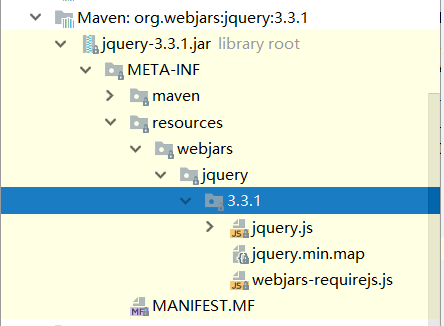

可以看到maven库里已经有这个静态文件了，根据源码可知，访问路径为`/webjars/**`的会去`classpath:/META-INF/resources/webjars/`下找，我们测试下访问`jquery.js`

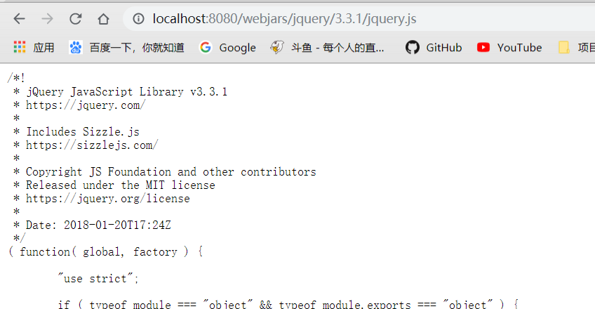

正确访问

### 1.2.任何资源

```java
private String staticPathPattern = "/**";

String staticPathPattern = this.mvcProperties.getStaticPathPattern();
if (!registry.hasMappingForPattern(staticPathPattern)) {
   customizeResourceHandlerRegistration(registry.addResourceHandler(staticPathPattern)
         .addResourceLocations(getResourceLocations(this.resourceProperties.getStaticLocations()))
         .setCachePeriod(getSeconds(cachePeriod)).setCacheControl(cacheControl));
}
```

根据源码可知，对于访问任何资源如"/**"，会去ResourceProperties寻找

```java
getResourceLocations(this.resourceProperties.getStaticLocations())
```


就会发现其实获取的路径是我们上面说的静态资源存放的路径

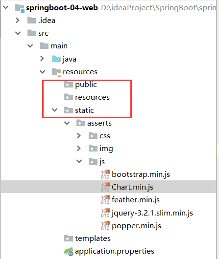

我们测试一下：访问/asserts/js/Chart.min.js

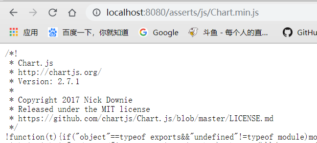

### 1.3.设置主页

在Springboot1.x时

```java
@Bean
public WelcomePageHandlerMapping welcomePageHandlerMapping(
    ResourceProperties resourceProperties) {
    return new WelcomePageHandlerMapping(resourceProperties.getWelcomePage(),
                                         this.mvcProperties.getStaticPathPattern());
}
```

可以根据源码得知，对于欢迎页面是先请求ResourceProperties的getWelcomePage方法

```java
private String[] getStaticWelcomePageLocations() {
    String[] result = new String[this.staticLocations.length];
    for (int i = 0; i < result.length; i++) {
        String location = this.staticLocations[i];
        if (!location.endsWith("/")) {
            location = location + "/";
        }
        result[i] = location + "index.html";
    }
    return result;
}
```

然后获取静态资源目录下是否存放index.html文件


### 1.4.设置网址icon

```java
@Bean
public SimpleUrlHandlerMapping faviconHandlerMapping() {
   SimpleUrlHandlerMapping mapping = new SimpleUrlHandlerMapping();
   mapping.setOrder(Ordered.HIGHEST_PRECEDENCE + 1);
   mapping.setUrlMap(Collections.singletonMap("**/favicon.ico",
         faviconRequestHandler()));
   return mapping;
}
```

根据源码得知，在静态文件下存放favicon.ico命名的文件便自动配置为网站的icon


## 二、模板引擎

模板引擎有很多，例如JSP，veloctiy，freemark，thymeleaf，主要用来方便html数据绑定的

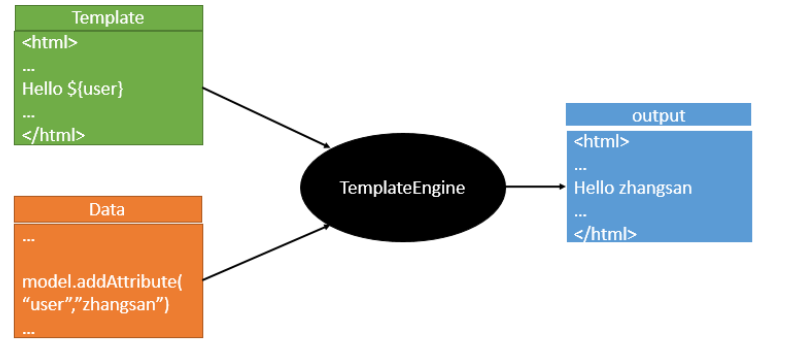

springboot推荐使用thymeleaf当做html模板引擎

### 2.1.引入Thymeleaf

```xml
<properties>
    <java.version>1.8</java.version>
    <thymeleaf.version>3.0.9.RELEASE</thymeleaf.version>
    <!-- 布局功能的支持程序  thymeleaf3主程序  layout2以上版本 -->
    <!-- thymeleaf2   layout1-->
	<thymeleaf-layout-dialect.version>2.2.2</thymeleaf-layout-dialect.version>
</properties>
    
<!--模板引擎模块-->
<dependency>
    <groupId>org.springframework.boot</groupId>
    <artifactId>spring-boot-starter-thymeleaf</artifactId>
</dependency>
```

需要注意的是，springboot1.5.10版本默认使用thymeleaf2.x版本略低，所以改成了3.0.9版本，并使用layout2.x版本。

### 2.2.Thymeleaf的使用

```java
@ConfigurationProperties(prefix = "spring.thymeleaf")
public class ThymeleafProperties {

   private static final Charset DEFAULT_ENCODING = Charset.forName("UTF-8");

   private static final MimeType DEFAULT_CONTENT_TYPE = MimeType.valueOf("text/html");

   public static final String DEFAULT_PREFIX = "classpath:/templates/";

   public static final String DEFAULT_SUFFIX = ".html";
```

根据前面的学习，底层源码的研究，我们在自动配置类中找到Thymeleaf组件的ThymeleafProperties，会发现使用thymeleaf，只需在静态文件夹templates里放入html文件即可进行映射

1）编写一个html文件，放入到templates文件夹里

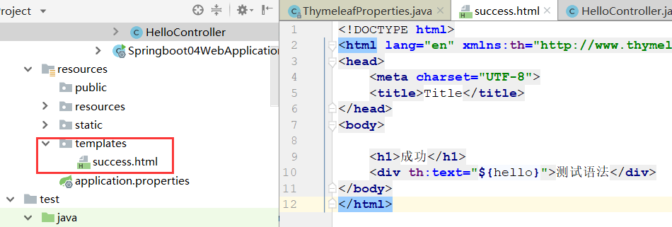

2）写一个Controller类

```java
@Controller
public class HelloController {

    @RequestMapping("success")
    public String success(Map<String,Object> map){
        map.put("hello","你好，Thymeleaf");
        return "success";
    }
}
```

注意！要使用@Controller注解，而不是@RestController注解，这样才会返回给`classpath:/templates/success.html`

3）启动服务测试


### 2.3.Thymeleaf的语法

语法可以查看文档第四章和第十章<https://www.thymeleaf.org/doc/tutorials/3.0/usingthymeleaf.pdf>

#### 语法：


#### 表达式

```properties
Simple expressions:（表达式语法）
    Variable Expressions: ${...}：获取变量值；OGNL；
    		1）、获取对象的属性、调用方法
    		2）、使用内置的基本对象：
    			#ctx : the context object.
    			#vars: the context variables.
                #locale : the context locale.
                #request : (only in Web Contexts) the HttpServletRequest object.
                #response : (only in Web Contexts) the HttpServletResponse object.
                #session : (only in Web Contexts) the HttpSession object.
                #servletContext : (only in Web Contexts) the ServletContext object.
                
                ${session.foo}
            3）、内置的一些工具对象：
#execInfo : information about the template being processed.
#messages : methods for obtaining externalized messages inside variables expressions, in the same way as they would be obtained using #{…} syntax.
#uris : methods for escaping parts of URLs/URIs
#conversions : methods for executing the configured conversion service (if any).
#dates : methods for java.util.Date objects: formatting, component extraction, etc.
#calendars : analogous to #dates , but for java.util.Calendar objects.
#numbers : methods for formatting numeric objects.
#strings : methods for String objects: contains, startsWith, prepending/appending, etc.
#objects : methods for objects in general.
#bools : methods for boolean evaluation.
#arrays : methods for arrays.
#lists : methods for lists.
#sets : methods for sets.
#maps : methods for maps.
#aggregates : methods for creating aggregates on arrays or collections.
#ids : methods for dealing with id attributes that might be repeated (for example, as a result of an iteration).

    Selection Variable Expressions: *{...}：选择表达式：和${}在功能上是一样；
    	补充：配合 th:object="${session.user}：
   <div th:object="${session.user}">
    <p>Name: <span th:text="*{firstName}">Sebastian</span>.</p>
    <p>Surname: <span th:text="*{lastName}">Pepper</span>.</p>
    <p>Nationality: <span th:text="*{nationality}">Saturn</span>.</p>
    </div>
    
    Message Expressions: #{...}：获取国际化内容
    Link URL Expressions: @{...}：定义URL；
    		@{/order/process(execId=${execId},execType='FAST')}
    Fragment Expressions: ~{...}：片段引用表达式
    		<div th:insert="~{commons :: main}">...</div>
    		
Literals（字面量）
      Text literals: 'one text' , 'Another one!' ,…
      Number literals: 0 , 34 , 3.0 , 12.3 ,…
      Boolean literals: true , false
      Null literal: null
      Literal tokens: one , sometext , main ,…
Text operations:（文本操作）
    String concatenation: +
    Literal substitutions: |The name is ${name}|
Arithmetic operations:（数学运算）
    Binary operators: + , - , * , / , %
    Minus sign (unary operator): -
Boolean operations:（布尔运算）
    Binary operators: and , or
    Boolean negation (unary operator): ! , not
Comparisons and equality:（比较运算）
    Comparators: > , < , >= , <= ( gt , lt , ge , le )
    Equality operators: == , != ( eq , ne )
Conditional operators:条件运算（三元运算符）
    If-then: (if) ? (then)
    If-then-else: (if) ? (then) : (else)
    Default: (value) ?: (defaultvalue)
Special tokens:
    No-Operation: _ 
```

关于语法，可以简单看看，不需要硬记，使用的时候查询下，用得多了自然就记住了

## 三、SpringMVC自动配置

<https://docs.spring.io/spring-boot/docs/1.5.10.RELEASE/reference/htmlsingle/#boot-features-developing-web-applications>

查看Spring MVC auto-configuration官方文档

SpringBoot会自动配置SpringMVC：

以下是Springboot对SpringMvc的自动配置：**WebMVCAutoConfiguration**

### 3.1.视图解析器

> Inclusion of `ContentNegotiatingViewResolver` and `BeanNameViewResolver` beans.

自动配置了视图解析器

`ContentNegotiatingViewResolver`:组合所有存在的视图解析器，并选择一个最适合的进行视图的解析转发。通过下面源码可知，视图解析器的组合是从容器中获取所有实现了ViewResolve的类，再进行选择

```java
@Override
public View resolveViewName(String viewName, Locale locale) throws Exception {
  ···
      List<View> candidateViews = getCandidateViews(viewName, locale, requestedMediaTypes);
      View bestView = getBestView(candidateViews, requestedMediaTypes, attrs);
  ···
}

protected void initServletContext(ServletContext servletContext) {
Collection<ViewResolver> matchingBeans =
				BeanFactoryUtils.beansOfTypeIncludingAncestors(getApplicationContext(), ViewResolver.class).values();
}
```

自定义：在容器中添加一个视图解析器，便会自动组合进`ContentNegotiatingViewResolver`

 ```java
  @SpringBootApplication
  public class Springboot04WebApplication {
  
      public static void main(String[] args) {
          SpringApplication.run(Springboot04WebApplication.class, args);
      }
      
      @Bean
      public ViewResolver myViewResolver(){
          return new MyViewResolver();
      }
      
      public static class MyViewResolver implements ViewResolver{
      
          @Override
          public View resolveViewName(String viewName, Locale locale) throws Exception {
              return null;
          }
      }
  }
 ```


成功组合进视图解析器

### 3.2.静态资源

> Support for serving static resources, including support for WebJars (see below).
>
> Static `index.html` support.
>
> Custom `Favicon` support (see below).

会自动配置SpringMVC的webjars index以及favicon，在上面已经详细说过了

### 3.3.格式化转换器

> Automatic registration of `Converter`, `GenericConverter`, `Formatter` beans.
>
> Springboot自动注册了 `Converter`, `GenericConverter`, `Formatter` 这些格式化转换器。

`Converter`，`GenericConverter`：类型转换器，比如将18转成Integer，true转成Boolean类型

```java
@Bean
@ConditionalOnProperty(prefix = "spring.mvc", name = "date-format")
public Formatter<Date> dateFormatter() {
   return new DateFormatter(this.mvcProperties.getDateFormat());
}
```

`Formatter`：格式化器，比如转换日期格式，2019-01-01 =》 date，比如上面的代码可知，可以在配置文件中配置想要的日期格式

```java
@Override
public void addFormatters(FormatterRegistry registry) {
   for (Converter<?, ?> converter : getBeansOfType(Converter.class)) {
      registry.addConverter(converter);
   }
   for (GenericConverter converter : getBeansOfType(GenericConverter.class)) {
      registry.addConverter(converter);
   }
   for (Formatter<?> formatter : getBeansOfType(Formatter.class)) {
      registry.addFormatter(formatter);
   }
}
```

**根据底层源码可知，这些格式化转换器也是从容器中取出的，所以我们也可以模仿视图解析器一样自定义一些格式转换器，通过向容器添加实现了接口的Bean类。**

### 3.4.请求响应转换

> Support for `HttpMessageConverters` (see below).

 `HttpMessageConverters`：这是SpringMVC用来转换请求响应的，比如把map或Bean转成json格式。

这个组件也像上面的一样是从容器中获取的，所以也可以自定义HttpMessageConverter进行自动添加

### 3.5.其他的一些

> Automatic registration of `MessageCodesResolver` (see below).
>
> Automatic use of a `ConfigurableWebBindingInitializer` bean (see below).

官方文档中还提到了错误代码生成规则`MessageCodesResolver` 以及数据绑定器`WebBindingInitializer`

也是一样可以配置一个自定义的来替换默认的

### 3.6.总结

SpringBoot对SpringMVC的一些必要的解析器转换器进行了默认配置，我们根据源码可知，这些组件都是从容器中获取的，所以我们可以自定义一些组件来替换默认的或添加。

1. 创建一个自定义组件，实现某个接口，比如ViewResolver接口，即自定义视图解析器
2. 编写代码，根据需求
3. 添加@Bean注解以及@Component添加到容器中

这样SpringBoot在初始化自动配置类时，会先看容器中有没有用户自定义的一些组件（@Bean，@Component），如果有就用用户配置的，如果没有再加载默认自带的。

## 四、扩展SpringMVC

在以前，使用xml配置时，可以使用springmvc.xml配置一下视图映射或者拦截器等：

```xml
 <mvc:view-controller path="/hello" view-name="success"/>
    <mvc:interceptors>
        <mvc:interceptor>
            <mvc:mapping path="/hello"/>
            <bean></bean>
        </mvc:interceptor>
    </mvc:interceptors>
```

那么，在使用SpringBoot之后，应该如何进行扩展呢？

> If you want to keep Spring Boot MVC features, and you just want to add additional [MVC configuration](https://docs.spring.io/spring/docs/4.3.14.RELEASE/spring-framework-reference/htmlsingle#mvc) (interceptors, formatters, view controllers etc.) you can add your own `@Configuration` class of type `WebMvcConfigurerAdapter`, but **without** `@EnableWebMvc`. If you wish to provide custom instances of `RequestMappingHandlerMapping`, `RequestMappingHandlerAdapter` or `ExceptionHandlerExceptionResolver` you can declare a `WebMvcRegistrationsAdapter` instance providing such components.
>
> If you want to take complete control of Spring MVC, you can add your own `@Configuration` annotated with `@EnableWebMvc`.

由官方文档可知：

1）编写一个带有**@Configuration**且继承了`WebMvcConfigurerAdapter`的扩展类，并不要添加**@EnableWebMvc**

```java
@Configuration
public class MyMvcConfig extends WebMvcConfigurerAdapter {
}
```

2）根据需要，重新`WebMvcConfigurerAdapter`中的方法，比如`addViewController()`

```java
@Override
public void addViewControllers(ViewControllerRegistry registry) {
    // super.addViewControllers(registry);
    registry.addViewController("/hello").setViewName("success");
}
```

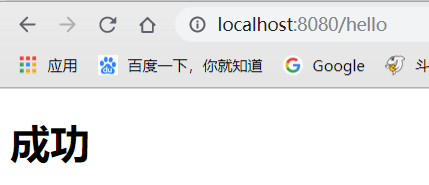

还有一种方式也是很常见的：

```java
@Configuration
public class MyMvcConfig{

    @Bean
    public WebMvcConfigurerAdapter webMvcConfigurerAdapter(){
        return new WebMvcConfigurerAdapter() {
            @Override
            public void addViewControllers(ViewControllerRegistry registry) {
                registry.addViewController("/").setViewName("login");
                registry.addViewController("/index.html").setViewName("login");
            }
        };
    }
}
```

这样可以在这个Config类中配置多个Configuration配置了

### 扩展原理

1）在`WebMvcAutoConfiguration`中有一个内部类`WebMvcAutoConfigurationAdapter`

```java
@Import(EnableWebMvcConfiguration.class)
@EnableConfigurationProperties({ WebMvcProperties.class, ResourceProperties.class })
public static class WebMvcAutoConfigurationAdapter extends WebMvcConfigurerAdapter {
```

他import了一个`EnableWebMvcConfiguration`，即启动mvc配置

2）查看`EnableWebMvcConfiguration`，会发现继承自`DelegatingWebMvcConfiguration`

```jav
@Configuration
public static class EnableWebMvcConfiguration extends DelegatingWebMvcConfiguration {
```

3）在这个类中可以发现一个`setConfigurers()`的方法，用来设置mvc的配置

```
@Configuration
public class DelegatingWebMvcConfiguration extends WebMvcConfigurationSupport {

   private final WebMvcConfigurerComposite configurers = new WebMvcConfigurerComposite();

   @Autowired(required = false)
   public void setConfigurers(List<WebMvcConfigurer> configurers) {
      if (!CollectionUtils.isEmpty(configurers)) {
         this.configurers.addWebMvcConfigurers(configurers);
      }
   }
```

4）进入`addWebMvcConfigurers()`，会发现是从容器中获取全部的`WebMvcConfigurer`，并一起生效

```java
public void addWebMvcConfigurers(List<WebMvcConfigurer> configurers) {
   if (!CollectionUtils.isEmpty(configurers)) {
      this.delegates.addAll(configurers);
   }
}
```

5）这样的话我们设置的配置类因为继承了`WebMvcConfigurerAdapter`，而这个父类又实现了`WebMvcConfigurer`，所以会被当做MVC的配置类之一加载生效，就如同SSM开发时的xml被读取到容器中生效一样。

### 关于@EnableWebMvc

为啥文档说扩展mvc不要添加这个注解呢？因为添加了这个注解便不是拓展，是全面接管了，SpringBoot对MVC进行的默认配置会全部失效。

比如上面说到的静态资源映射，对于"/"会自定映射index作为主页，我们试一下如果添加了@EnableWebMvc注解，还会不会映射index。

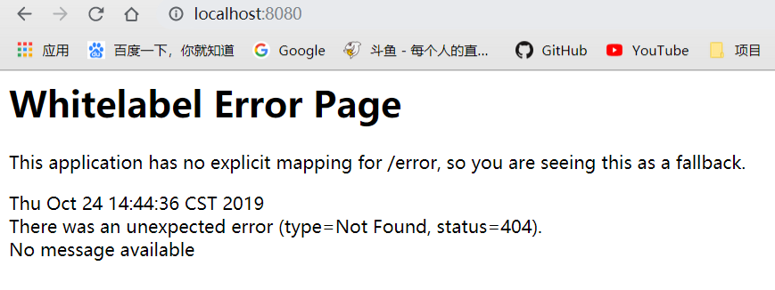

发现报出404错误，说明Springboot的默认配置未生效。

源码分析：

1）先看下**@EnableWebMvc**

```java
@Import(DelegatingWebMvcConfiguration.class)
public @interface EnableWebMvc {
}
//public class DelegatingWebMvcConfiguration extends WebMvcConfigurationSupport {
```

会发现这个注解间接导入了`WebMvcConfigurationSupport`类

2）再看一下`WebMVCAutoConfiguration`的约束注解

```java
@Configuration
@ConditionalOnWebApplication
@ConditionalOnClass({ Servlet.class, DispatcherServlet.class,
      WebMvcConfigurerAdapter.class })
@ConditionalOnMissingBean(WebMvcConfigurationSupport.class)
@AutoConfigureOrder(Ordered.HIGHEST_PRECEDENCE + 10)
@AutoConfigureAfter({ DispatcherServletAutoConfiguration.class,
      ValidationAutoConfiguration.class })
public class WebMvcAutoConfiguration {
```

**@ConditionalOnMissingBean(WebMvcConfigurationSupport.class)**，会发现只有不存在`WebMvcConfigurationSupport`这个类，才会生效，而从第一步可知，因为添加**@EnableWebMvc**注解，导致**Import**了这个类，所以SpringBoot对Mvc的默认配置便不生效了

## 五、CRUD项目

**我们通过一个简单的crud项目，进一步学习理解SpringBoot的Web开发**

### 5.1.初始化

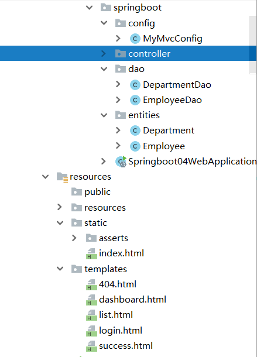

对应的文件放入对应的位置

修改默认访问主页，改为login.html，通过扩展SpringMVC

```java
@Configuration
public class MyMvcConfig extends WebMvcConfigurerAdapter {
    @Override
    public void addViewControllers(ViewControllerRegistry registry) {
        // super.addViewControllers(registry);
        registry.addViewController("/").setViewName("login");
        registry.addViewController("/index.html").setViewName("login");
    }
}
```

### 5.2.国际化

1）创建配置文件


2）在配置文件中配置

想要在配置文件中配置，可以百度搜下如何配置，也可以根据源码，我们看下源码，SpringBoot对于国际化也有一个自动配置类MessageSourceAutoConfiguration：

```java
@ConfigurationProperties(prefix = "spring.messages")
public class MessageSourceAutoConfiguration {
    
private String basename = "messages"; // 默认对源路径下文件名为messages进行国际化

@Bean
public MessageSource messageSource() {
   ResourceBundleMessageSource messageSource = new ResourceBundleMessageSource();
   if (StringUtils.hasText(this.basename)) {
      messageSource.setBasenames(StringUtils.commaDelimitedListToStringArray(
          // 设置国际化的文件名，所以我们应该要改成login
            StringUtils.trimAllWhitespace(this.basename)));
   }
   if (this.encoding != null) {
      messageSource.setDefaultEncoding(this.encoding.name());
   }
   messageSource.setFallbackToSystemLocale(this.fallbackToSystemLocale);
   messageSource.setCacheSeconds(this.cacheSeconds);
   messageSource.setAlwaysUseMessageFormat(this.alwaysUseMessageFormat);
   return messageSource;
}
```

application.properties:

```properties
spring.messages.basename=i18n.login
```

3）配置对应的html文件

```html
<form class="form-signin" action="dashboard.html">
   
   <h1 class="h3 mb-3 font-weight-normal" th:text="#{login.tip}">Please sign in</h1>
   <label class="sr-only" >Username</label>
   <input type="text" class="form-control" placeholder="Username" th:placeholder="#{login.username}" required="" autofocus="">
   <label class="sr-only" >Password</label>
   <input type="password" class="form-control" placeholder="Password" th:placeholder="#{login.password}" required="">
   <div class="checkbox mb-3">
      <label>
        <input type="checkbox" value="remember-me">[[#{login.remember}]]
      </label>
   </div>
   <button class="btn btn-lg btn-primary btn-block" type="submit" th:text="#{login.btn}">Sign in</button>
   <p class="mt-5 mb-3 text-muted">© 2019-2020</p>
   <a class="btn btn-sm">中文</a>
   <a class="btn btn-sm">English</a>
</form>
```

4）测试查看

发现根据浏览器语言进行了国际化切换

#### 原理

在WebMVCAutoConfiguration中，具有一个区域信息解析器LocaleResolver，由他根据区域信息Locale进行一些操作。

```java
@Bean
@ConditionalOnMissingBean
@ConditionalOnProperty(prefix = "spring.mvc", name = "locale")
public LocaleResolver localeResolver() {
   if (this.mvcProperties
         .getLocaleResolver() == WebMvcProperties.LocaleResolver.FIXED) {
      return new FixedLocaleResolver(this.mvcProperties.getLocale());
   }
   AcceptHeaderLocaleResolver localeResolver = new AcceptHeaderLocaleResolver();
   localeResolver.setDefaultLocale(this.mvcProperties.getLocale());
   return localeResolver;
}
```

通过AcceptHeaderLocaleResolver中的resolveLocale()方法进行解析

```java
@Override
public Locale resolveLocale(HttpServletRequest request) {
   Locale defaultLocale = getDefaultLocale();
   if (defaultLocale != null && request.getHeader("Accept-Language") == null) {
      return defaultLocale;
   }
   Locale requestLocale = request.getLocale();
   if (isSupportedLocale(requestLocale)) {
      return requestLocale;
   }
   Locale supportedLocale = findSupportedLocale(request);
   if (supportedLocale != null) {
      return supportedLocale;
   }
   return (defaultLocale != null ? defaultLocale : requestLocale);
}
```

根据源码可知，是由浏览器请求的request中拿去请求头，来进行国际化切换

5）通过按钮实现国际化

我们了解到了原理，便可自定义一个区域信息解析器，来制作我们自定义的国际化标准。

1. 自定义解析器

```java
public class MyLocaleResolver implements LocaleResolver {
    @Override
    public Locale resolveLocale(HttpServletRequest request) {
        // 判断请求中是否有leg参数，有便按参数进行国际化
        String leg = request.getParameter("leg");
        Locale locale = Locale.getDefault(); // 默认为操作系统语言
        if(!StringUtils.isEmpty(leg)){
            String[] split = leg.split("_");
            locale = new Locale(split[0],split[1]);
        }
        return locale;
    }

    @Override
    public void setLocale(HttpServletRequest request, HttpServletResponse response, Locale locale) {

    }
}
```

2. 添加到容器中

```java
@Configuration
public class MyMvcConfig{

    @Bean
    public WebMvcConfigurerAdapter webMvcConfigurerAdapter(){
       ······
    }

    @Bean
    public LocaleResolver localeResolver(){
        return new MyLocaleResolver();
    }

}
```

3. 设置html对应按钮操作

```html
<a class="btn btn-sm" th:href="@{/index.html(leg='zh_CN')}">中文</a>
<a class="btn btn-sm" th:href="@{/index.html(leg='en_US')}">English</a>
```

4. 测试

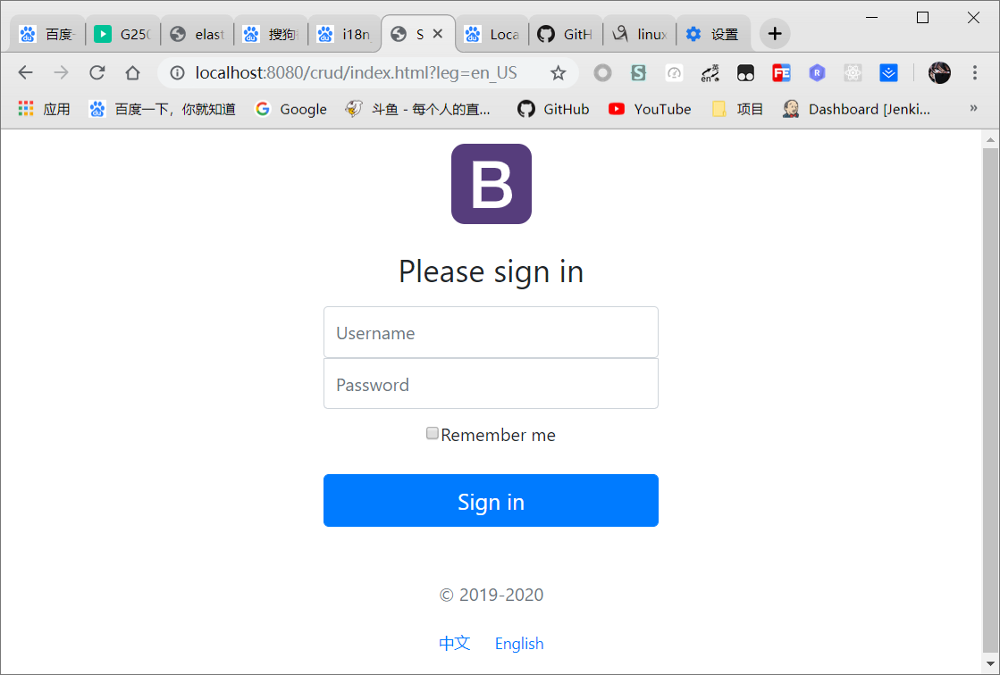

### 5.3.拦截器

我们写一下登录操作，表单提交到`/user/login`，简单判断下，注意，**为了防止转发后表单重复提交，应使用重定向**

```java
@Controller
public class LoginController {

    @PostMapping(value = "/user/login")
    public String login(@RequestParam String username,
                        @RequestParam String password,
                        Map<String,Object> map){
        if(!StringUtils.isEmpty(username) && password.equals("123456")){
            // 防止表单重复提交，重定向到主页
            return "redirect:/main.html";
        }
        map.put("msg","登录失败");
        return "login";
    }
}
```

```html
<form class="form-signin" action="dashboard.html" th:action="@{/user/login}" method="post">
```

```java
@Bean
public WebMvcConfigurerAdapter webMvcConfigurerAdapter(){
    return new WebMvcConfigurerAdapter() {
        @Override
        public void addViewControllers(ViewControllerRegistry registry) {
            registry.addViewController("/").setViewName("login");
            registry.addViewController("/index.html").setViewName("login");
            registry.addViewController("/main.html").setViewName("dashboard");
        }
    };
}
```

这时候我们发现，如果没有登录，直接请求`http://localhost:8080/crud/main.html`，也是成功的，所以就需要添加一个拦截器。

自定义拦截器和添加其他组件一样，写一个类实现HandlerInterceptor，然后重写方法，注册到容器中，因为这个是WebMVCAutoConfiguration中的组件，所以应在WebMvc自动配置中addInterceptor，代码如下：

1）新建一个拦截器类MyHandlerInterceptor

```java
// 实现HandlerInterceptor，即这是一个拦截器
public class MyHandlerInterceptor implements HandlerInterceptor {

    // 目标执行方法前，先进行判断
    @Override
    public boolean preHandle(HttpServletRequest request, HttpServletResponse response, Object handler) throws Exception {
        Object userName = (String) request.getSession().getAttribute("userName");
        if(userName == null){
            // 错误，返回登录页
            request.setAttribute("msg","请先登录");
            request.getRequestDispatcher("/index.html").forward(request,response);
            return false;
        }else {
            return true;
        }
    }
```

2）注册到容器中

```java
@Configuration
public class MyMvcConfig{

    @Bean
    public WebMvcConfigurerAdapter webMvcConfigurerAdapter(){
        return new WebMvcConfigurerAdapter() {
            @Override
            public void addViewControllers(ViewControllerRegistry registry) {
                registry.addViewController("/").setViewName("login");
                registry.addViewController("/index.html").setViewName("login");
                registry.addViewController("/main.html").setViewName("dashboard");
            }

            // 添加拦截器组件，属于WebMvc的一个组件
            @Override
            public void addInterceptors(InterceptorRegistry registry) {
                registry.addInterceptor(new MyHandlerInterceptor()).addPathPatterns("/**")
                            .excludePathPatterns("/index.html","/","/user/login");
            }
        };
    }

```

### 5.4.CRUD

接下来进行crud的编写，因没什么干货，就不贴代码了，可以到项目中看，主要使用RESTful

| 实验功能                   | 请求URI | 请求方式 |
| -------------------------- | ------- | -------- |
| 查询所有员工               | emps    | GET      |
| 来到添加页面               | emp     | GET      |
| 添加员工                   | emp     | POST     |
| 查询某个员工(来到修改页面) | emp/1   | GET      |
| 修改员工                   | emp     | PUT      |
| 删除员工                   | emp/1   | DELETE   |

说一下主要的几个问题

#### 5.4.1.常用的thymeleaf语法

```js
th:class="${activeUri=='dashboard'?'nav-link active':'nav-link'}" -- 设置class，如果activeUri这个参数为dashboard，即这个标签高亮
th:replace="commons/bar::#fluid(activeUri='list')" -- 导入bar中的公共元素，id为fluid的元素

th:href="@{/emps}" -- 转跳某个页面，与controller绑定
th:action="@{/emp}" -- 提交form表单

th:value="${emp!=null}?${emp.lastName}" -- 设置标签value，emp存在的情况下
th:each="dept:${depts}" -- 循环集合
th:value="${#dates.format(emp.birth,'yyyy-MM-dd')}" -- 使用自带的#dates进行日期格式化
th:selected="${emp.department.id==dept.id}" -- 设置select标签的默认选择option
th:checked="${emp.gender==1}" -- 设置radio或checkbox的选中状态
```

#### 5.4.2.日期格式化

当提交form表单时，时期写为`yyyy-MM-dd`，出现400参数绑定异常，通过查找源码，发现默认日期格式为`yyyy/mm/dd`，如下

```java
public class WebMvcAutoConfiguration {
	···
	@Bean
    @ConditionalOnProperty(prefix = "spring.mvc", name = "date-format")
        public Formatter<Date> dateFormatter() {
        return new DateFormatter(this.mvcProperties.getDateFormat());
    }
    
    /**
	 * Date format to use (e.g. dd/MM/yyyy).
	 */
	//private String dateFormat;
```

所以我们想要使用`yyyy-mm-dd`需要在配置文件中修改才可以

```properties
#application.properties
spring.mvc.date-format=yyyy-MM-dd
```

#### 5.4.3.PUT与DELETE提交表单

当提交表单时，因为只有get和post方法，所以应该做特殊处理

```html
<!--修改需要使用put方法
    1.使用隐藏input，设置_method为put
    2.SpringMvc中的HiddenHttpMethodFilter组件会拦截请求
    3.对于_method进行实际请求方式请求
-->
<input name="_method" value="put" type="hidden" th:if="${emp!=null}">
```

```java
public class HiddenHttpMethodFilter extends OncePerRequestFilter {

   /** Default method parameter: {@code _method}
   		对于_method的进行特殊处理
   */
   public static final String DEFAULT_METHOD_PARAM = "_method";

   @Override
   protected void doFilterInternal(HttpServletRequest request, HttpServletResponse response, FilterChain filterChain)
         throws ServletException, IOException {
      HttpServletRequest requestToUse = request;
      if ("POST".equals(request.getMethod()) && request.getAttribute(WebUtils.ERROR_EXCEPTION_ATTRIBUTE) == null) {
          // 提取出这个_method的value，即put
         String paramValue = request.getParameter(this.methodParam);
         if (StringUtils.hasLength(paramValue)) {
            // 如果存在，使用put发送请求
            requestToUse = new HttpMethodRequestWrapper(request, paramValue);
         }
      }
      filterChain.doFilter(requestToUse, response);
   }
```

## 六、错误处理

当我们请求的请求发出错误是，SpringBoot会自动进行错误处理，如404错误

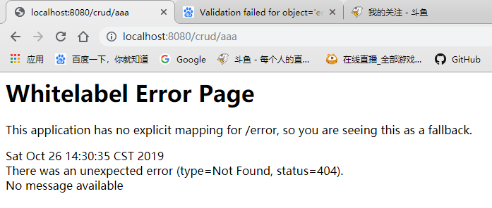、

### 6.1.SpringBoot错误处理原理

这种错误处理机制，是由**ErrorMvcAutoConfiguration**配置类进行处理的：

```java
public class ErrorMvcAutoConfiguration {
@Bean
	@ConditionalOnMissingBean(value = ErrorAttributes.class, search = SearchStrategy.CURRENT)
	public DefaultErrorAttributes errorAttributes() {
		return new DefaultErrorAttributes();
	}
	@Bean
	@ConditionalOnMissingBean(value = ErrorController.class, search = SearchStrategy.CURRENT)
	public BasicErrorController basicErrorController(ErrorAttributes errorAttributes) {
		return new BasicErrorController(errorAttributes, this.serverProperties.getError(),
				this.errorViewResolvers);
	}
	@Bean
	public ErrorPageCustomizer errorPageCustomizer() {
		return new ErrorPageCustomizer(this.serverProperties);
	}
	@Bean
    @ConditionalOnBean(DispatcherServlet.class)
    @ConditionalOnMissingBean
    public DefaultErrorViewResolver conventionErrorViewResolver() {
        return new DefaultErrorViewResolver(this.applicationContext,
                                            this.resourceProperties);
    }
```

再其中有四个重要的组件：

1. ErrorPageCustomizer：如果系统发生错误，获取配置文件错误路径，如果没有配置，默认请求`/error`

```java
@Override
public void registerErrorPages(ErrorPageRegistry errorPageRegistry) {
    // 最重要的为getPath。即 发生错误 会生成错误页面，从getPath()中获取
    ErrorPage errorPage = new ErrorPage(this.properties.getServletPrefix()
                                        + this.properties.getError().getPath());
    //@Value("${error.path:/error}")
	//private String path = "/error";
    errorPageRegistry.addErrorPages(errorPage);
}
```

2. BasicErrorController：处理错误请求，如果没有配置默认处理`/error`请求

```java
@RequestMapping("${server.error.path:${error.path:/error}}")
public class BasicErrorController extends AbstractErrorController {
	@RequestMapping(produces = "text/html") // 处理浏览器错误
	public ModelAndView errorHtml(HttpServletRequest request,
			HttpServletResponse response) {
		HttpStatus status = getStatus(request);
		Map<String, Object> model = Collections.unmodifiableMap(getErrorAttributes(
				request, isIncludeStackTrace(request, MediaType.TEXT_HTML)));
		response.setStatus(status.value());
         // 重要方法resolveErrorView()，选择哪个页面作为错误页面
		ModelAndView modelAndView = resolveErrorView(request, response, status, model);
        /*protected ModelAndView resolveErrorView(HttpServletRequest request,
			HttpServletResponse response, HttpStatus status, Map<String, Object> model) {
//循环了ErrorViewResolver，获取容器中所有错误处理器，主要就是我们下面要说的DefaultErrorViewResolve
			for (ErrorViewResolver resolver : this.errorViewResolvers) {
				ModelAndView modelAndView = resolver.resolveErrorView(request, status, model);
				if (modelAndView != null) {
				return modelAndView;
			}
		}*/
		return null;
	}
		return (modelAndView == null ? new ModelAndView("error", model) : modelAndView);
	}

	@RequestMapping
	@ResponseBody  // 处理客户端请求错误
	public ResponseEntity<Map<String, Object>> error(HttpServletRequest request) {
		Map<String, Object> body = getErrorAttributes(request,
				isIncludeStackTrace(request, MediaType.ALL));
		HttpStatus status = getStatus(request);
		return new ResponseEntity<Map<String, Object>>(body, status);
	}
```

3. DefaultErrorViewResolver：决定请求哪个文件，默认对4xx与5xx与状态码.html做映射

```java
static {
    Map<Series, String> views = new HashMap<Series, String>();
    views.put(Series.CLIENT_ERROR, "4xx");
    views.put(Series.SERVER_ERROR, "5xx");
    SERIES_VIEWS = Collections.unmodifiableMap(views);
}
private ModelAndView resolve(String viewName, Map<String, Object> model) {
    // SpringBoot默认去寻找的error页面，由状态码决定，例如error/404.html
   String errorViewName = "error/" + viewName;
   TemplateAvailabilityProvider provider = this.templateAvailabilityProviders
         .getProvider(errorViewName, this.applicationContext);
   if (provider != null) {
       // 如果有模板引擎，会返回指定errorViewName，即template/error/404.html
      return new ModelAndView(errorViewName, model);
   }
    // 如果没有，就在静态资源文件夹下寻找 状态码.html 的页面
   return resolveResource(errorViewName, model);
}
```

4. DefaultErrorAttributes：默认的一些错误信息，存到域中

```java
errorAttributes.put("timestamp", new Date());
errorAttributes.put("status", 999);
errorAttributes.put("error", "None");
errorAttributes.put("exception", error.getClass().getName());
errorAttributes.put("message",
					StringUtils.isEmpty(message) ? "No message available" : message);
```

即：

**ErrorPageCustomizer》BasicErrorController》DefaultErrorViewResolver》DefaultErrorAttributes**

**系统错误发出请求    》接受并进行客户端或浏览器请求处理  》决定返回哪个错误页面  》将错误信息存放域中**

### 6.2.定制错误页面

经过上面的源码阅读，我们知道：

1）当有使用模板引擎时，我们可以将错误页面存放到`/template/error/xxx.html`，xxx为错误状态码

注意，DefaultErrorViewResolver也提供了4xx.html，5xx.html。即对于不确定的错误如果以4开头，5开头可以编写4xx.html来作为这些不确定状态码的错误页面

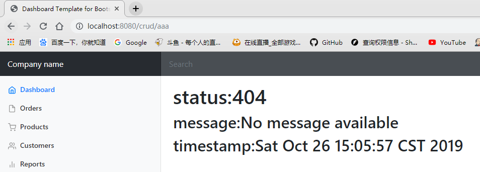


可以看到，对于400错误和404错误，都返回了自定义的页面，即验证了我们的想法

2）如果没有模板引擎，应该吧错误页面存放到静态资源下，会自动寻找

3）如果静态资源下也没找到自定义错误页面，Springboot会使用它自己默认的错误页面

### 6.3.定制错误数据

为了方便测试，我们先创一个自定义异常处理类：

```java
public class UserNotExistException extends RuntimeException {

    public UserNotExistException() {
        super("用户不存在");
    }
}
```

并在controller中抛出异常：

```java
@RequestMapping("hello")
public String hello(Map<String,Object> map){
    throw new UserNotExistException();
}
```


可以看到json数据是SpringBoot默认定制的，我想自己定制应该怎么做呢？

1）首先需要定制一个ExceptionHandler异常处理类，重写handleException方法，需要转发到`/error`中，让SpringBoot来进行异常处理

```java
@ControllerAdvice
public class MyExceptionHandler {

	//标注处理我们的自定义异常
    @ExceptionHandler(UserNotExistException.class)
    public String handleException(Exception e, HttpServletRequest request){
        Map<String,Object> map = new HashMap<>();
        
        //传入我们自己的错误状态码  4xx 5xx
        request.setAttribute("javax.servlet.error.status_code",500);
        // 定制一下个性化信息，是属于我们的异常信息
        map.put("code","user.notexist");
        map.put("message","用户出错啦");
		// 存放到域中
        request.setAttribute("ext",map);
        //转发到/error，因为SpringBoot默认设定/error来处理异常
        return "forward:/error";
    }
}
```

2）由上面**BasicErrorController**的源码知，不管是客户端还是浏览器请求，对返回信息的处理都是由`getErrorAttributes()`方法获取，即**DefaultErrorAttributes**存放默认的返回异常信息，如果我们想添加我们自己的一些信息，便需要重写他

```java
//给容器中加入我们自己定义的ErrorAttributes
@Component
public class MyErrorAttributes extends DefaultErrorAttributes {

    //返回值的map就是页面和json能获取的所有字段
    @Override
    public Map<String, Object> getErrorAttributes(RequestAttributes requestAttributes, boolean includeStackTrace) {
        Map<String, Object> map = super.getErrorAttributes(requestAttributes, includeStackTrace);
        map.put("company","enbuys");

        //我们的异常处理器携带的数据
        Map<String,Object> ext = (Map<String, Object>) requestAttributes.getAttribute("ext", 0);
        map.put("ext",ext);
        return map;
    }
}
```

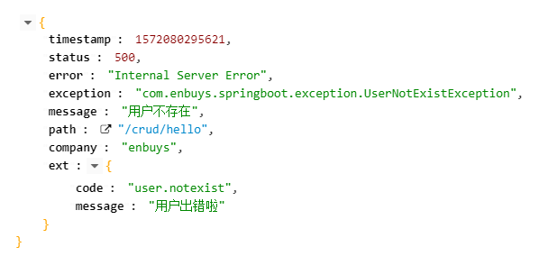


浏览器或客户端请求都可以正确响应出我们所需的信息

## 七、SpringBoot与Servlet

我们知道，SpringBoot使用jar包的方式运行，还能再浏览器访问，就是因为它使用了嵌入式的tomcat，而我们可以通过一些方法来修改默认的配置

### 7.1.修改Servlet配置

```java
@ConfigurationProperties(prefix = "server", ignoreUnknownFields = true)
public class ServerProperties
      implements EmbeddedServletContainerCustomizer, EnvironmentAware, Ordered {
   private Integer port;
   private InetAddress address;
    
   public static class Tomcat {
		private Charset uriEncoding;
```

1.通过查看源码，可以发现Server配置有一个**ServerProperties**配置类，可以根据它来配一些属性

```properties
server.port=8081
server.context-path=/crud
server.tomcat.uri-encoding=UTF-8

//通用的Servlet容器设置
server.xxx
//Tomcat的设置
server.tomcat.xxx
```

2.还可以发现，**ServerProperties**实现了一个**EmbeddedServletContainerCustomizer**，即Servlet个性化类，我们也可以通过写一个类实现它，来进行一些配置

```java
@Bean
public EmbeddedServletContainerCustomizer embeddedServletContainerFactory(){
    return new EmbeddedServletContainerCustomizer() {
        @Override
        public void customize(ConfigurableEmbeddedServletContainer container) {
            container.setPort(8081);
        }
    };
}
```

### 7.2.注册三大组件

由于SpringBoot默认是以jar包的方式启动嵌入式的Servlet容器来启动SpringBoot的web应用，没有web.xml文件。

注册三大组件用以下方式

ServletRegistrationBean

```java
//注册三大组件
@Bean
public ServletRegistrationBean myServlet(){
    ServletRegistrationBean registrationBean = new ServletRegistrationBean(new MyServlet(),"/myServlet");
    return registrationBean;
}

```

FilterRegistrationBean

```java
@Bean
public FilterRegistrationBean myFilter(){
    FilterRegistrationBean registrationBean = new FilterRegistrationBean();
    registrationBean.setFilter(new MyFilter());
    registrationBean.setUrlPatterns(Arrays.asList("/hello","/myServlet"));
    return registrationBean;
}
```

ServletListenerRegistrationBean

```java
@Bean
public ServletListenerRegistrationBean myListener(){
    ServletListenerRegistrationBean<MyListener> registrationBean = new ServletListenerRegistrationBean<>(new MyListener());
    return registrationBean;
}
```

SpringBoot帮我们自动SpringMVC的时候，自动的注册SpringMVC的前端控制器；DIspatcherServlet；

DispatcherServletAutoConfiguration中：

```java
@Bean(name = DEFAULT_DISPATCHER_SERVLET_REGISTRATION_BEAN_NAME)
@ConditionalOnBean(value = DispatcherServlet.class, name = DEFAULT_DISPATCHER_SERVLET_BEAN_NAME)
public ServletRegistrationBean dispatcherServletRegistration(
      DispatcherServlet dispatcherServlet) {
   ServletRegistrationBean registration = new ServletRegistrationBean(
         dispatcherServlet, this.serverProperties.getServletMapping());
    //默认拦截： /  所有请求；包静态资源，但是不拦截jsp请求；   /*会拦截jsp
    //可以通过server.servletPath来修改SpringMVC前端控制器默认拦截的请求路径
    
   registration.setName(DEFAULT_DISPATCHER_SERVLET_BEAN_NAME);
   registration.setLoadOnStartup(
         this.webMvcProperties.getServlet().getLoadOnStartup());
   if (this.multipartConfig != null) {
      registration.setMultipartConfig(this.multipartConfig);
   }
   return registration;
}

```

### 7.3.替换其他嵌入式Servlet容器


可以看到，除了tomcat，还具有undertow和jetty两个容器，默认为tomcat，可以通过修改pom文件的方式来引入其他两个

Tomcat：

```xml
<dependency>
   <groupId>org.springframework.boot</groupId>
   <artifactId>spring-boot-starter-web</artifactId>
   引入web模块默认就是使用嵌入式的Tomcat作为Servlet容器；
</dependency>
```

Jetty:

```xml
<!-- 引入web模块 -->
<dependency>
   <groupId>org.springframework.boot</groupId>
   <artifactId>spring-boot-starter-web</artifactId>
   <exclusions>
      <exclusion>
         <artifactId>spring-boot-starter-tomcat</artifactId>
         <groupId>org.springframework.boot</groupId>
      </exclusion>
   </exclusions>
</dependency>

<!--引入其他的Servlet容器-->
<dependency>
   <artifactId>spring-boot-starter-jetty</artifactId>
   <groupId>org.springframework.boot</groupId>
</dependency>
```

Undertow:

```xml
<!-- 引入web模块 -->
<dependency>
   <groupId>org.springframework.boot</groupId>
   <artifactId>spring-boot-starter-web</artifactId>
   <exclusions>
      <exclusion>
         <artifactId>spring-boot-starter-tomcat</artifactId>
         <groupId>org.springframework.boot</groupId>
      </exclusion>
   </exclusions>
</dependency>

<!--引入其他的Servlet容器-->
<dependency>
   <artifactId>spring-boot-starter-undertow</artifactId>
   <groupId>org.springframework.boot</groupId>
</dependency>
```

### 7.4.容器自动配置原理

SpringBoot具有一个为Servlet容器自动配置的配置类**EmbeddedServletContainerAutoConfiguration**：

```java
@AutoConfigureOrder(Ordered.HIGHEST_PRECEDENCE)
@Configuration
@ConditionalOnWebApplication
@Import(BeanPostProcessorsRegistrar.class) // 3.对容器初始化前后进行属性设置
public class EmbeddedServletContainerAutoConfiguration {

   @Configuration
   @ConditionalOnClass({ Servlet.class, Tomcat.class }) // 1.判断是否有Tomcat的class，如果有则启用
   @ConditionalOnMissingBean(value = EmbeddedServletContainerFactory.class, search = SearchStrategy.CURRENT) // 判断当前容器没有用户自己定义EmbeddedServletContainerFactory
   public static class EmbeddedTomcat {
      @Bean
      public TomcatEmbeddedServletContainerFactory tomcatEmbeddedServletContainerFactory() {
         return new TomcatEmbeddedServletContainerFactory(); // 2.通过工厂创建容器
      }

   }

   @Configuration
   @ConditionalOnClass({ Servlet.class, Server.class, Loader.class,
         WebAppContext.class })
   @ConditionalOnMissingBean(value = EmbeddedServletContainerFactory.class, search = SearchStrategy.CURRENT)
   public static class EmbeddedJetty {
      @Bean
      public JettyEmbeddedServletContainerFactory jettyEmbeddedServletContainerFactory() {
         return new JettyEmbeddedServletContainerFactory();
      }

   }

   @Configuration
   @ConditionalOnClass({ Servlet.class, Undertow.class, SslClientAuthMode.class })
   @ConditionalOnMissingBean(value = EmbeddedServletContainerFactory.class, search = SearchStrategy.CURRENT)
   public static class EmbeddedUndertow {
      @Bean
      public UndertowEmbeddedServletContainerFactory undertowEmbeddedServletContainerFactory() {
         return new UndertowEmbeddedServletContainerFactory();
      }

   }
```

1）` @ConditionalOnClass({ Servlet.class, Tomcat.class })`：Springboot通过判断是否存在三个容器的class来决定启用哪个容器

2）`new TomcatEmbeddedServletContainerFactory()`：通过嵌入式容器工厂创建相应的Servlet容器


```java
@Override
public EmbeddedServletContainer getEmbeddedServletContainer(
      ServletContextInitializer... initializers) {
   Tomcat tomcat = new Tomcat(); // 创建一个Tomcat
   // 对Tomca进行基本设置
   File baseDir = (this.baseDirectory != null ? this.baseDirectory
         : createTempDir("tomcat"));
   tomcat.setBaseDir(baseDir.getAbsolutePath());
   Connector connector = new Connector(this.protocol);
   tomcat.getService().addConnector(connector);
   customizeConnector(connector);
   tomcat.setConnector(connector);
   tomcat.getHost().setAutoDeploy(false);
   configureEngine(tomcat.getEngine());
   for (Connector additionalConnector : this.additionalTomcatConnectors) {
      tomcat.getService().addConnector(additionalConnector);
   }
   prepareContext(tomcat.getHost(), initializers);
   // 传入Tomcat进容器中，并启动
   return getTomcatEmbeddedServletContainer(tomcat);
}
```

通过`TomcatEmbeddedServletContainerFactory`的源码，更能印证了对Tomcat的初始化启动

3）`@Import(BeanPostProcessorsRegistrar.class)`：对容器初始化前后进行属性设置

`BeanPostProcessorsRegistrar`，进行了Bean的赋值，通过`EmbeddedServletContainerCustomizerBeanPostProcessor`的postProcessBeforeInitialization()方法对初始化前进行个性化配置

```java
@Override // 初始化前
public Object postProcessBeforeInitialization(Object bean, String beanName)
      throws BeansException {
   if (bean instanceof ConfigurableEmbeddedServletContainer) {
       // 调用方法对Tomcat进行初始化配置
      postProcessBeforeInitialization((ConfigurableEmbeddedServletContainer) bean);
   }
   return bean;
}
```

其中调用了postProcessBeforeInitialization()来进行初始化配置

```java
private void postProcessBeforeInitialization(
			ConfigurableEmbeddedServletContainer bean) {
    //获取所有的定制器，调用每一个定制器的customize方法来给Servlet容器进行属性赋值；
    for (EmbeddedServletContainerCustomizer customizer : getCustomizers()) {
        customizer.customize(bean);
    }
}
```

可以看到，对每个容器进行了customize(bean)，这个方法就是配置容器属性的，默认配置或个性化配置

```java
@Override
public void customize(ConfigurableEmbeddedServletContainer container) {
   if (getPort() != null) {
      container.setPort(getPort());
   }
   if (getAddress() != null) {
      container.setAddress(getAddress());
   }
   if (getContextPath() != null) {
      container.setContextPath(getContextPath());
   }
   ···
```

步骤：

1. SpringBoot根据导入的依赖情况，给容器中添加相应的EmbeddedServletContainerFactory【TomcatEmbeddedServletContainerFactory】
2. 容器中某个组件要创建对象就会惊动后置处理器；EmbeddedServletContainerCustomizerBeanPostProcessor；

3. 后置处理器，从容器中获取所有的**EmbeddedServletContainerCustomizer**，调用定制器的定制方法

### 7.5.容器启动原理

1. SpringBoot启动运行run

2. SpringApplication会执行AbstractApplicationContext的refresh方法，refresh是一个重要的注解开发方法，后面研究Spring注解时再详细研究，主要是刷新SpringIOC容器（创建IOC容器，初始化容器，进行属性配置，创建每个容器中的必要组件）

   ```java
   public void refresh() throws BeansException, IllegalStateException {
   
     synchronized (this.startupShutdownMonitor) {
   
     // Prepare this context for refreshing.
   
     prepareRefresh();
     // Tell the subclass to refresh the internal bean factory.
     ConfigurableListableBeanFactory beanFactory = obtainFreshBeanFactory();
   
     // Prepare the bean factory for use in this context.
     prepareBeanFactory(beanFactory);
   
     try {
        // Allows post-processing of the bean factory in context subclasses.
        postProcessBeanFactory(beanFactory);
   
        // Invoke factory processors registered as beans in the context.
        invokeBeanFactoryPostProcessors(beanFactory);
   
        // Register bean processors that intercept bean creation.
        registerBeanPostProcessors(beanFactory);
   
        // Initialize message source for this context.
        initMessageSource();
   
        // Initialize event multicaster for this context.
        initApplicationEventMulticaster();
   
        // Initialize other special beans in specific context subclasses.
        onRefresh();
   
        // Check for listener beans and register them.
        registerListeners();
   
        // Instantiate all remaining (non-lazy-init) singletons.
        finishBeanFactoryInitialization(beanFactory);
   
        // Last step: publish corresponding event.
        finishRefresh();
     }
   
     catch (BeansException ex) {
        if (logger.isWarnEnabled()) {
           logger.warn("Exception encountered during context initialization - " +
                 "cancelling refresh attempt: " + ex);
        }
   
        // Destroy already created singletons to avoid dangling resources.
        destroyBeans();
   
        // Reset 'active' flag.
        cancelRefresh(ex);
   
        // Propagate exception to caller.
        throw ex;
     }
   
     finally {
        // Reset common introspection caches in Spring's core, since we
        // might not ever need metadata for singleton beans anymore...
        resetCommonCaches();
     }
     }
   }
   ```

3. refresh方法中onRefresh()：web情况下的IOC重写了这个方法，会创建**createEmbeddedServletContainer**，Servlet容器

4. 接下来就是我们上面7.4说的容器自动配置了，根据容器的时候创建**TomcatEmbeddedServletContainerFactory**或其他，然后惊动后置处理器，进行初始化前后的属性修改