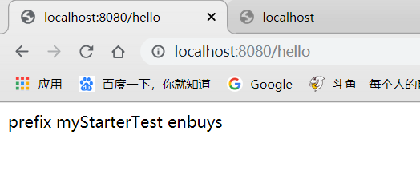

## 自定义Starter

一般来说，一个starter会伴随着自动配置类，这样启动的时候就会自动加载到容器中

```
@Configuration  //指定这个类是一个配置类
@ConditionalOnXXX  //在指定条件成立的情况下自动配置类生效
@AutoConfigureAfter  //指定自动配置类的顺序
@Bean  //给容器中添加组件

@ConfigurationPropertie结合相关xxxProperties类来绑定相关的配置
@EnableConfigurationProperties //让xxxProperties生效加入到容器中

自动配置类要能加载
将需要启动就加载的自动配置类，配置在META-INF/spring.factories
org.springframework.boot.autoconfigure.EnableAutoConfiguration=\
org.springframework.boot.autoconfigure.admin.SpringApplicationAdminJmxAutoConfiguration,\
org.springframework.boot.autoconfigure.aop.AopAutoConfiguration,\
```

格式：

启动器只做依赖导入，底层会再包含一个自动配置模块，别人只需要引入启动器（starter）

官方启动器：spring-boot-starter-xxx

自定义启动器：xxx-spring-boot-starter


### 启动器创建步骤：

1）创建一个空工程，并创建一个maven启动器模块，一个springboot的自动配置模块


2）在启动器模块引入自动配置模块

```xml
<dependencies>
    <dependency>
        <groupId>com.enbuys.starter</groupId>
        <artifactId>enbuys-spring-boot-starter-autoconfigurer</artifactId>
        <version>0.0.1-SNAPSHOT</version>
    </dependency>
</dependencies>
```

3）将自动配置模块中不需要的一些东西删除

如test依赖，maven依赖，只需要springboot-starter依赖即可，并把测试类和主程序配置文件删除


并添加springboot启动器依赖，这里我还添加了web依赖是因为方便一会测试

```xml
<dependencies>
    <dependency>
        <groupId>org.springframework.boot</groupId>
        <artifactId>spring-boot-starter</artifactId>
    </dependency>

    <dependency>
        <groupId>org.springframework.boot</groupId>
        <artifactId>spring-boot-starter-web</artifactId>
    </dependency>
</dependencies>
```

4）编写配置文件类，存放可以在配置文件中配置的一些属性

```java
@ConfigurationProperties("enbuys.hello")
public class HelloProperties {

    private String prefix;
    private String suffix;

    public String getPrefix() {
        return prefix;
    }

    public void setPrefix(String prefix) {
        this.prefix = prefix;
    }

    public String getSuffix() {
        return suffix;
    }

    public void setSuffix(String suffix) {
        this.suffix = suffix;
    }
}
```

这里我写了一个前缀一个后缀，名称以`enbuys.hello`开头

5）编写Service类

```java
public class HelloService {

    private HelloProperties helloProperties;

    public HelloProperties getHelloProperties() {
        return helloProperties;
    }

    public void setHelloProperties(HelloProperties helloProperties) {
        this.helloProperties = helloProperties;
    }

    public String hello(String name){
        return helloProperties.getPrefix()+" "+name+" "+helloProperties.getSuffix();
    }
}
```

这个类在别人引入我们starter后，可以直接通过**@Autowired**注入并使用方法，比如调用`hello()`方法，对其加上前后缀

6）编写自动配置类（重要）

```java
@Configuration
@ConditionalOnWebApplication
@EnableConfigurationProperties(HelloProperties.class)
public class HelloServiceAutoConfiguration {

    @Autowired
    private HelloProperties helloProperties;

    @Bean
    public HelloService helloService(){
        HelloService helloService = new HelloService();
        helloService.setHelloProperties(helloProperties);
        return helloService;
    }
}
```

需要加上几个重要的注解，标志他是配置类，在web应用下启动，自动配置属性

并将我们写的HelloService注入到容器中

7）编写META-INF/spring.fatories

```properties
org.springframework.boot.autoconfigure.EnableAutoConfiguration=\
com.enbuys.starter.HelloServiceAutoConfiguration
```

这样springboot启动时，才会扫描这个文件来进行自动装配Hello组件到容器中

8）将自动配置模块和启动器模块打包到maven库中

注意先后顺序，需要先打包自动配置模块才行

### 测试启动器

1）在测试模块加入我们enbuys启动器依赖

```xml
<dependencies>
    <dependency>
        <groupId>com.enbuys.starter</groupId>
        <artifactId>enbuys-spring-boot-starter</artifactId>
        <version>1.0-SNAPSHOT</version>
    </dependency>
</dependencies>
```

因为enbuys启动器已经添加了web依赖，就不用再添加了

2）创建controller类

```java
@RestController
public class HelloController {

    @Autowired
    private HelloService helloService;

    @GetMapping("hello")
    public String hello(){
        return helloService.hello("myStarterTest");
    }
}
```

3）配置文件配置属性

```properties
enbuys.hello.prefix=prefix
enbuys.hello.suffix=enbuys
```

4）启动测试



说明我们的自定义启动器已经创建成功