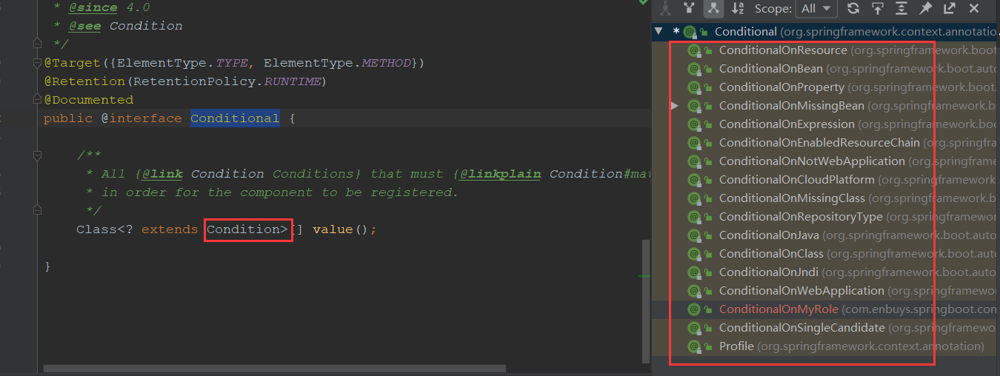

这一节比较简单，我们主要分析一下starter的使用，说到starter，一定离不开@Condition这个注解，可以看到每个自动化配置类上，几乎都加了这个注解，所以我们从这个注解开始了解

## @Conditional解析

### @Conditional源码查看



通过此注解的源码可以看到，具有大量实现接口，比如常见的

- `ConditionalOnBean`：Bean存在时生效
- `ConditionalOnProperty`：某个配置存在时生效

那么他们都是如何进行匹配的呢？这时我们就需要进入到`Condition`接口中

```java
@FunctionalInterface
public interface Condition {

	/**
	 * Determine if the condition matches.
	 * @param context the condition context
	 * @param metadata metadata of the {@link org.springframework.core.type.AnnotationMetadata class}
	 * or {@link org.springframework.core.type.MethodMetadata method} being checked
	 * @return {@code true} if the condition matches and the component can be registered,
	 * or {@code false} to veto the annotated component's registration
	 */
	boolean matches(ConditionContext context, AnnotatedTypeMetadata metadata);

}
```

可以看到此接口最重要的方法就是`matches`方法，那么我们就知道了，对于生效不生效，都是具体的`matches`方法实现的，所以我们就可以拿一个接口查看

**比如`@ConditionalOnProperty`**


```java
@Order(Ordered.HIGHEST_PRECEDENCE + 40)
class OnPropertyCondition extends SpringBootCondition {
}

public abstract class SpringBootCondition implements Condition {

    @Override
    public final boolean matches(ConditionContext context, AnnotatedTypeMetadata metadata) {
        String classOrMethodName = getClassOrMethodName(metadata);
        try {
            // 调用getMatchOutcome，来判断是否满足生效条件
            ConditionOutcome outcome = getMatchOutcome(context, metadata);
            logOutcome(classOrMethodName, outcome);
            recordEvaluation(context, classOrMethodName, outcome);
            return outcome.isMatch();
        }
    }
}
```

进入类中，没发现`matches`方法实现，所以去父类查看，发现其实对生效条件的校验，是在子类的`getMatchOutcome`方法实现的，所以我们再回到`OnPropertyCondition`中查看此方法

```java
@Override
public ConditionOutcome getMatchOutcome(ConditionContext context, AnnotatedTypeMetadata metadata) {
    // 首先获取注解上的属性，比如value，havingvalue，name等等
    List<AnnotationAttributes> allAnnotationAttributes = annotationAttributesFromMultiValueMap(
        metadata.getAllAnnotationAttributes(ConditionalOnProperty.class.getName()));
    // 构造两个集合，存放匹配的与不匹配的集合
    List<ConditionMessage> noMatch = new ArrayList<>();
    List<ConditionMessage> match = new ArrayList<>();
    // 循环处理Property
    for (AnnotationAttributes annotationAttributes : allAnnotationAttributes) {
        // 主要方法为determineOutcome，来判断环境中是否有配置的Property
        ConditionOutcome outcome = determineOutcome(annotationAttributes, context.getEnvironment());
        (outcome.isMatch() ? match : noMatch).add(outcome.getConditionMessage());
    }
    // 如果不匹配集合中有数据，返回false
    if (!noMatch.isEmpty()) {
        return ConditionOutcome.noMatch(ConditionMessage.of(noMatch));
    }
    return ConditionOutcome.match(ConditionMessage.of(match));
}

private ConditionOutcome determineOutcome(AnnotationAttributes annotationAttributes, PropertyResolver resolver) {
    Spec spec = new Spec(annotationAttributes);
    // 创建两个集合，和之前一样，存放不匹配的配置和不存在的配置
    List<String> missingProperties = new ArrayList<>();
    List<String> nonMatchingProperties = new ArrayList<>();
    // 从环境中查找配置，存放到miss或匹配集合
    spec.collectProperties(resolver, missingProperties, nonMatchingProperties);
    // 判断miss集合不为空，返回noMatch
    if (!missingProperties.isEmpty()) {
        return ConditionOutcome.noMatch(ConditionMessage.forCondition(ConditionalOnProperty.class, spec)
                                        .didNotFind("property", "properties").items(Style.QUOTE, missingProperties));
    }
    // 判断不匹配集合是否为空，返回noMatch
    if (!nonMatchingProperties.isEmpty()) {
        return ConditionOutcome.noMatch(ConditionMessage.forCondition(ConditionalOnProperty.class, spec)
                                        .found("different value in property", "different value in properties")
                                        .items(Style.QUOTE, nonMatchingProperties));
    }
    // 两个集合都为空，返回match
    return ConditionOutcome
        .match(ConditionMessage.forCondition(ConditionalOnProperty.class, spec).because("matched"));
}

// 从环境中查找具体配置
private void collectProperties(PropertyResolver resolver, List<String> missing, List<String> nonMatching) {
    // 
    for (String name : this.names) {
        String key = this.prefix + name;
        // 这里resolve就是Environment对象，判断环境中是否有此配置
        if (resolver.containsProperty(key)) {
            // 有的话，再判断值是否匹配，不匹配放到不集合中
            if (!isMatch(resolver.getProperty(key), this.havingValue)) {
                nonMatching.add(name);
            }
        }
        else {
            // 没找到，放到miss集合中
            if (!this.matchIfMissing) {
                missing.add(name);
            }
        }
    }
}
```

到此`@ConditionalOnProperty`就解析完毕了，不是很复杂，就是从环境中获取配置，判断是否存在

### 自定义@Conditional

接着我们模仿`@ConditionalOnProperty`，创建一个自定义的`@Conditional`注解

1）创建MyCondition对象，实现`Condition`接口，重写`matches`方法

```java
public class MyCondition implements Condition {
    @Override
    public boolean matches(ConditionContext context, AnnotatedTypeMetadata metadata) {
        // 判断注解类型，为我们创建的注解
        String[] value = (String[]) metadata.getAnnotationAttributes("com.enbuys.springboot.condition.ConditionalOnMyRole")
                .get("value");
        // 循环判断环境中是否有配置的属性
        for (String s : value) {
            if(context.getEnvironment().getProperty(s) == null){
                return false;
            }
        }
        return true;
    }
}
```

2）创建`ConditionalOnMyRole`注解，并绑定刚刚实现的Condition

```java
@Target({ElementType.TYPE, ElementType.METHOD})
@Retention(RetentionPolicy.RUNTIME)
@Documented
@Conditional(MyCondition.class)
public @interface ConditionalOnMyRole {

    String[] value() default {};

}
```

3）编写一个类，使用`ConditionOnMyRole`注解

```java
@Component
//@ConditionalOnProperty("com.enbuys.condition")
@ConditionalOnMyRole({"com.enbuys.condition","com.enbuys.condition2"})
public class AAA {
}
```

这样，就简单实现了一个自定义的判断是否生效的注解