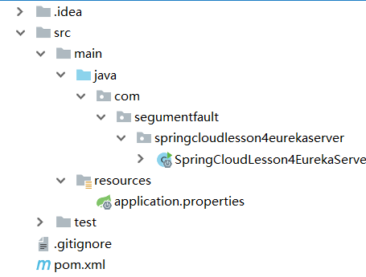

==注意：使用的SpringCloud的版本为Dalston.SR4，对于Finchley可能会有不同！==

## 一、SpringCloud简介

SpringCloud是基于SpringBoot实现的云应用开发工具，对微服务提供解决方案，主要的功能有：配置管理，服务发现，断路器，智能路由，微代理，控制总线，全局锁，决策竞选，分布式会话和集群状态管理等操作，提供了简单的开发方式。

SpringCloud包含多个子项目：Spring Cloud Config、Spring Cloud Netflix、Spring Cloud CloudFoundry、Spring Cloud AWS、Spring Cloud Security、Spring Cloud Commons、Spring Cloud Zookeeper、Spring Cloud CLI等项目。

## 二、SpringCloud与Dubbo

SpringCloud和Dubbo没有什么可比性，因为不属于同类的东西

SpringCloud主要致力于云应用，微服务这方面，比如网关等等功能Dubbo都是没有的，有的功能实现方式也是不同的；但是**缺点是用于RPC时较慢，性能较低，因为使用的http传输，并且安全性也较低**

Dubbo主要是远程RPC调用，其性能效率更高，稳定性也更好，安全性也更好，**因为使用的是二进制传输，速度安全等方面都不是http可以比较的**；而缺点也比较明显，使用复杂，没有SpringCloud那么多的组件等等

## 三、创建一个SpringCloud项目

其项目结构还是和SpringBoot一样，不过pom文件中添加SpringCloud的依赖

### pom

```xml
<-- SpringBoot parent -->
<parent>
   <groupId>org.springframework.boot</groupId>
   <artifactId>spring-boot-starter-parent</artifactId>
   <version>1.5.8.RELEASE</version>
   <relativePath/> <!-- lookup parent from repository -->
</parent>

<-- 版本信息 -->
<properties>
   <project.build.sourceEncoding>UTF-8</project.build.sourceEncoding>
   <project.reporting.outputEncoding>UTF-8</project.reporting.outputEncoding>
   <java.version>1.8</java.version>
    <-- SpringCloud版本信息 -->
   <spring-cloud.version>Dalston.SR4</spring-cloud.version>
</properties>

<dependencies>
    <-- Actuator传动器，用来查看SpringCloud应用状态 -->
   <dependency>
      <groupId>org.springframework.boot</groupId>
      <artifactId>spring-boot-starter-actuator</artifactId>
   </dependency>
   <-- Web组件 -->
   <dependency>
      <groupId>org.springframework.boot</groupId>
      <artifactId>spring-boot-starter-web</artifactId>
   </dependency>
	<-- 测试组件 -->
   <dependency>
      <groupId>org.springframework.boot</groupId>
      <artifactId>spring-boot-starter-test</artifactId>
      <scope>test</scope>
   </dependency>
</dependencies>
<-- SpringCloud -->
<dependencyManagement>
   <dependencies>
      <dependency>
         <groupId>org.springframework.cloud</groupId>
         <artifactId>spring-cloud-dependencies</artifactId>
         <version>${spring-cloud.version}</version>
         <type>pom</type>
         <scope>import</scope>
      </dependency>
   </dependencies>
</dependencyManagement>
```

### 项目结构



## 四、BootStrapContext

BootStrapContext是SpringCloud新引入的上下文，与传统Spring 上下文一样，是`ConfigurableApplicationContext`实例，由`BootStrapApplicationListener`监听`ApplicationEnvironmentPreparedEvent`时创建，即应用环境准备完毕时创建。

BootStrapContext是用户ApplicationContext的父级上下文，所以非常重要，也在SpringCloud官方文档中第一个被提及。

### 1.事件/监听模式

这里需要了解下 事件/监听器模式：`ApplicationEvent/ApplicationListener`

SpringBoot以及SpringCloud大量使用了事件监听模式来构造一些上下文等组件。这里我们写一个小Demo来使用事件监听模式创建一个属于我们的上下文组件：

先放代码：

```java
public class SpringEventListener {

    public static void main(String[] args) {
        // 创建注解型的上下午配置类
        AnnotationConfigApplicationContext context = new AnnotationConfigApplicationContext();

        // 添加监听器
        context.addApplicationListener(new MyApplicationListener());
        // 注册Configuration
        //context.register(MyApplicationListener.class);
        // 启动上下文
        context.refresh();

        // 发布事件，当事件发布时，监听器会监听到，再控制台打印信息
        context.publishEvent(new MyApplicationEvent("hello event listener"));
    }

    /**
     * 实现我们的监听器类，需要实现ApplicationListener
     * 和事件一样，对于Spring来说的根监听器类为ApplicationListener
     * 对于Java的根事件类为EventListener
     */
    private static class MyApplicationListener implements ApplicationListener<MyApplicationEvent>{

        @Override
        public void onApplicationEvent(MyApplicationEvent event) {
            // 打印源
            System.out.printf("MyApplicationListener receives event source : %s \n", event.getSource());
        }
    }

    /**
     * 继承一个根的Event类
     * 实际Java的根事件类为Object Event
     * 而对于Spring来说，根事件类为ApplicationEvent
     */
    private static class MyApplicationEvent extends ApplicationEvent {

        /**
         * Create a new ApplicationEvent.
         *
         * @param source the object on which the event initially occurred (never {@code null})
         */
        public MyApplicationEvent(Object source) {
            super(source);
        }
    }
}
```

简单介绍一下：

对于Spring来说，具有大量的组件是基于事件/监听机制来初始化的，而对于事件和监听分别有两个根类：

- ApplicationEvent
- ApplicationListener

比如我们自己写的这个类，先写一个`MyApplicationEvent`事件类，而`MyApplicationListener`监听此事件，在`main`方法中，首先我把监听器添加到上下文，当`MyApplicationEvent`事件发布时，监听器监听到，然后会把发布的源信息打印到控制台，如下


而对于BootStrapContext也是使用的事件/监听机制创建，就如我们上面介绍的，当`ApplicationEnvironmentPreparedEvent`这个应用环境准备就绪事件发生时，由`BootStrapApplicationListener`监听到，然后便会创建BootStrapContext对象

### 2.BootStrap上下文

之前学习过SpringBoot，我们知道对于SpringBoot的ApplicationContext的准备与加载是在`SpringApplication.run()`的时候启动的，也是基于我们上面说的事件监听模式，包括但不限于监听器启动，环境准备，上下文的准备事件等等，具体不在细说；而对于Web与非Web创建的上下文对象也是不同的，

- 非Web应用：`AnnotationConfigApplicationContext`
- Web应用：`AnnotationConfigEmbeddedWebApplicationContext`，即多了一个嵌入式Web应用


==\> 进入源码查看BootStrapContext的创建过程，以及如何成为ApplicationContext的父级对象的：==

```java
public class BootstrapApplicationListener
		implements ApplicationListener<ApplicationEnvironmentPreparedEvent>, Ordered {
```

**首先可以看到，BootStrap的监听器监听Application环境准备事件，这也可以证明了BootStrap的加载是在ApplicationContext之前的，一个小细节**

```java
@Override
public void onApplicationEvent(ApplicationEnvironmentPreparedEvent event) {
    ConfigurableEnvironment environment = event.getEnvironment();
    if (!environment.getProperty("spring.cloud.bootstrap.enabled", Boolean.class,
                                 true)) {
        return;
    }
    // don't listen to events in a bootstrap context
    if (environment.getPropertySources().contains(BOOTSTRAP_PROPERTY_SOURCE_NAME)) {
        return;
    }
    ConfigurableApplicationContext context = null;
    String configName = environment
        .resolvePlaceholders("${spring.cloud.bootstrap.name:bootstrap}");
    for (ApplicationContextInitializer<?> initializer : event.getSpringApplication()
         .getInitializers()) {
        if (initializer instanceof ParentContextApplicationContextInitializer) {
            context = findBootstrapContext(
                (ParentContextApplicationContextInitializer) initializer,
                configName);
        }
    }
    if (context == null) {
        context = bootstrapServiceContext(environment, event.getSpringApplication(),
                                          configName);
    }
    apply(context, event.getSpringApplication(), environment);
}
```

BootStrap主要重新了onApplicatonEvent()方法，在这时进行上下文的创建于初始化，与24行可以看到

`context = bootstrapServiceContext(····);`创建上下文对象


==\> 紧接着我们看下BootStrap是如何成为ApplicationContext的父级的==

通过`ConfigurableApplicationContext`进行设置，这个类在很多地方都有用到，是比较重要的类，因为在ApplicationContext前加了一个Configurable，就说明他有很多add或者set方法，可以设置上下文的一些对象，比如添加监听器，而我们所要找的成为父类也是在这里实现的

```java
	/**
	 * Set the parent of this application context.
	 * <p>Note that the parent shouldn't be changed: It should only be set outside
	 * a constructor if it isn't available when an object of this class is created,
	 * for example in case of WebApplicationContext setup.
	 * @param parent the parent context
	 * @see org.springframework.web.context.ConfigurableWebApplicationContext
	 */
	void setParent(ApplicationContext parent);
```

> Tips：Spring与ClassLoader类似，都是使用了子承父业（双亲委派）的方法，如果在父方法里已经创建的对象子方法便不再创建，即BootStrap中有初始化过的对象组件，ApplicationContext便不再初始化


## 五、Actuator Endpoints

传动器端点，这个其实是SpringBoot中的东西，但是之前没有了解，这里简单学习下，因为SpringCloud会大量使用到，来进行监控及健康检查。

Actuator Endpoints主要是SpringBoot为“生产环境准备的特性“，通过http访问，对相关人员管理监控应用，分为监控类与管理类：

- 监控类：env（环境属性），health（健康检查），mappings（URL路径），端点信息，应用信息，指标信息，beans（Bean管理）等
- 管理类：dump（活动线程），外部化配置，日志配置，关闭应用

> Tips：在SpringBoot1.5以后，提高了Actuator的安全性，需要在配置文件中开启才可以访问
>
> `management.security.enabled=false`

### SpringCloud对Endpoints的拓展

主要使用的有三个

重启：/restart，需要设置敏感性与启动

```properties
# 全局安全控制
#management.security.enabled=false
# 设置endpoint的启动
endpoints.restart.enabled=true
# sensitive = false 安全不明感，细粒度的安全控制
endpoints.restart.sensitive = false
```

暂停：/pause

恢复：/resume

