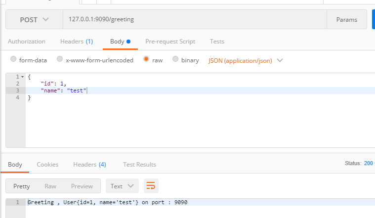
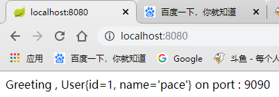
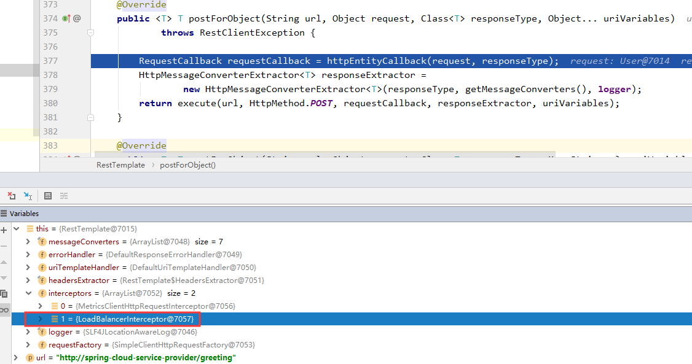
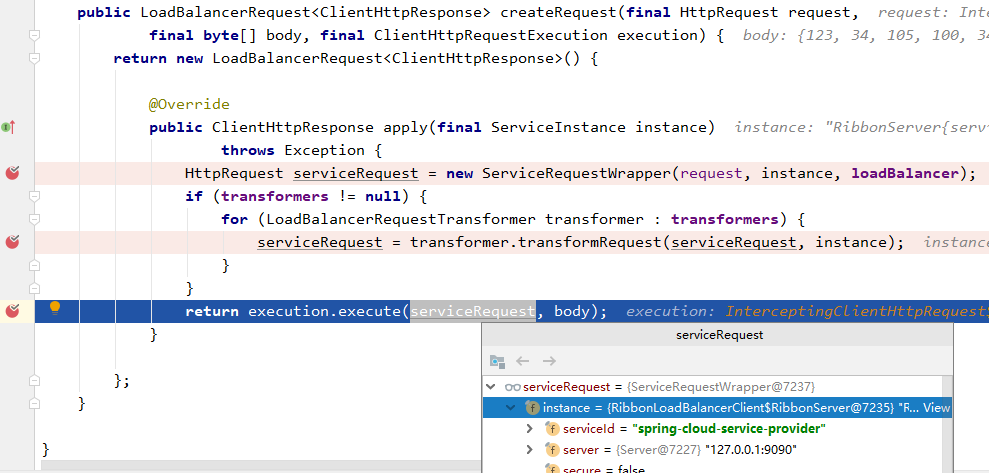
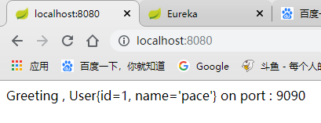
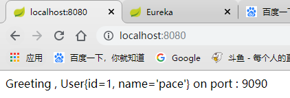
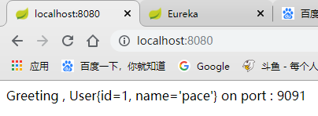
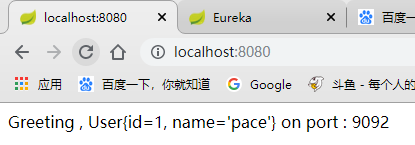

## 一、理论基础

### 1.客户端负载均衡（Ribbon）

客户端实现负载均衡，在SpringCloud中使用NetFlix的Ribbon


如图，**负载均衡器和Client实例是在一起的**，即一个完整的应用

**好处**：是比较**稳定**的，如果负载均衡器出问题的话，只会一个应用出问题，而不是整个应用都出问题。如果多个Client实例绑定到一台负载均衡器时，负载均衡器宕机就会导致全部出问题。

**不足**：升级的成本高，

### 2.服务端负载均衡（Zuul）

服务端实现负载均衡，在SpringCloud中使用Zuul实现


可以清楚的看到，**多个Client实例是绑定到一台负载均衡器**上的。有一个单独的负载均衡层，而不是和Client在一个层次。

**好处**：统一维护，成本低

**不足**：一旦故障，影响大，不够稳定

### 3.调度算法

调度算法有多种，每个负载均衡器的实现也不同，主要有：

- 先来先服务：类似队列
- 最早截止时间优先
- 最短保留时间优先
- 固定优先级：类似有一个权重，固定请求，比如0.5，即50%的概率请求某个
- 轮询
- 多级别队列

## 二、NetFlix Ribbon

下面我们先了解下SpringCloud Ribbon，先从固定ip请求服务开始

### 1.服务提供与消费

在之前笔记有说到，一个基础微服务架构中，具有注册中心，服务提供方与消费方，在之前Eureka学习时，只针对注册中心和服务提供方进行了说明，因为消费方是需要基于Ribbon的。

### 2.不使用Ribbon的消费

需要初始化两个应用，一个提供方，一个消费方

#### 提供方

需要的依赖有`springboot,cloud,web,actuator`

配置文件`application.properties`：

```properties
## 服务提供方
spring.application.name = spring-cloud-service-provider

### 服务端口
server.port = 9090

### 管理安全失效
management.security.enabled = false
```

写一个`Controller`，用来提供服务：

```java
@RestController
public class ServiceProviderController {

    @Value("${server.port}")
    private Integer port;

    @PostMapping("/greeting")
    public String greeting(@RequestBody User user) {
        return "Greeting , " + user + " on port : " + port;
    }

}
```

很简单的服务，传入`User`的参数并打印出来，`User`具有`id`和`name`字段

这里我们启动服务后用`postman`测试一下：



成功请求，然后编写服务消费方

#### 消费方

需要的依赖有`springboot,cloud,web,actuator`

编写`application.properties`:

```properties
## 服务消费方
spring.application.name = spring-cloud-ribbon-client
### 服务端口
server.port = 8080
### 管理安全失效
management.security.enabled = false
```

编写Controller：

```java
@RestController
public class ClientController {

    @Autowired
    private RestTemplate restTemplate;

    @GetMapping("")
    public String index() {
        User user = new User();
        user.setId(1L);
        user.setName("pace");
        return restTemplate.postForObject("http://localhost:9090/greeting",user, String.class);
    }

}
```

需要注意的是，这里我们使用`RestTemplate`作为服务请求方式，即`RESTful`，`postForObject`方法即使用post请求提供方

在启动器类上初始化`RestTemplate`：

```java
@SpringBootApplication
public class SpringCloudLesson6Application {

	public static void main(String[] args) {
		SpringApplication.run(SpringCloudLesson6Application.class, args);
	}

    @Bean
    public RestTemplate restTemplate(){
        return new RestTemplate();
    }
}
```

这样我们访问 http://localhost:8080/ 



成功打印信息

### 3.使用Ribbon

提供方不变，需要是消费方有所变化

**启动器类**：

```java
@SpringBootApplication
@RibbonClients({
        @RibbonClient(name = "spring-cloud-service-provider")
})
public class SpringCloudLesson6Application {

	public static void main(String[] args) {
		SpringApplication.run(SpringCloudLesson6Application.class, args);
	}

	@LoadBalanced // 开启Ribbon
    @Bean
    public RestTemplate restTemplate(){
        return new RestTemplate();
    }
}
```

在之前的基础上添加了三个注解，其中`@RibbonClients`可以不写，这里只是展示如果需要配置多个`RibbonClient`时的使用方式，而`@LoadBalanced`是告诉`RestTemplate`开启了负载均衡。

配置文件`application.properties`：

```properties
## 服务消费方
spring.application.name = spring-cloud-ribbon-client
### 服务端口
server.port = 8080
### 管理安全失效
management.security.enabled = false

# 请求映射地址
spring-cloud-service-provider.ribbon.listOfServers=http://127.0.0.1:9090
```

多配置了一个请求映射地址，编写格式为：启动器类上的`name.ribbon.listOfServers=xxx`

注意这里`listOfServers`不能写成`list-of-servers`

**Controller**：

```java
@GetMapping("")
public String index() {
    User user = new User();
    user.setId(1L);
    user.setName("pace");
    return restTemplate.postForObject("http://spring-cloud-service-provider/greeting",user, String.class);
}
```

请求路径由ip+端口改为了应用名称

#### 原理

这里简单探寻下原理，具体的源码分析放到后面来说：

可以简单的思考下，关于Ribbon的配置只是做了应用名与ip端口的映射，而最主要的讲请求路径的转换还是由RestTemplate来做的，并且多加了一个@LoadBalanced注解，也可以理解为是开启了负载均衡。

这里我们断点进入 restTemplate.postForObject()请求



由上图可以明显的看到，有一个负载均衡拦截器`LoadBalancerInterceptor`，这是一个很重要的拦截器，在负载均衡中使用颇多：


进入这个类就能看到我们所写的应用名称了，F7再次进入return的这个方法



这里就会进行负载均衡，将我们的应用名称映射成ip+端口，更深层次的转义等之后在研究。

#### 问题

这里有一个问题，在我们使用RestTemplate发送post请求时，请求的路径**虽然为应用名称**，但是在配置文件中还是需要配置服务提供方的**IP+端口**，所以**我们必须要明确知道提供方的IP端口**，才能这样使用，当服务一多，维护起来也不是很方便

## 三、Ribbon整合Eureka

### Eureka Server

先创建一个单机版的注册中心

添加Maven依赖：

```xml
<dependency>
    <groupId>org.springframework.cloud</groupId>
    <artifactId>spring-cloud-starter-eureka-server</artifactId>
</dependency>
```

也是非常简单，配置文件：

```properties
## Eureka Serer
spring.application.name = spring-cloud-eureka-server
## 服务端口
server.port = 10001

### 取消向注册中心注册
eureka.client.register-with-eureka=false
# 取消拉去注册中心信息
eureka.client.fetch-registry=false

# 取消Peer 8761节点添加
eureka.instance.hostname=localhost
```

启动器类添加注解：

```java
@SpringBootApplication
@EnableEurekaServer
public class SpringCloudLesson6EurekaServerApplication {

	public static void main(String[] args) {
		SpringApplication.run(SpringCloudLesson6EurekaServerApplication.class, args);
	}
}
```

### 调整服务提供方

之前我们提供方没有采用Eureka的方式，而是简单的REST服务

添加Maven依赖：

```xml
<dependency>
    <groupId>org.springframework.cloud</groupId>
    <artifactId>spring-cloud-starter-eureka</artifactId>
</dependency>
```

添加配置文件：

```properties
# 注册Eureka
eureka.client.service-url.defaultZone=http://localhost:10001/eureka
```

添加注解：

```java
@SpringBootApplication
@EnableDiscoveryClient
public class SpringCloudLesson6ServiceProviderApplication {

	public static void main(String[] args) {
		SpringApplication.run(SpringCloudLesson6ServiceProviderApplication.class, args);
	}
}
```

### 调整Ribbon消费者

和提供者一样，添加Eureka依赖，配置文件与注解。

配置文件：

```properties
## 服务消费方
spring.application.name = spring-cloud-ribbon-client
### 服务端口
server.port = 8080
### 管理安全失效
management.security.enabled = false

eureka.client.service-url.defaultZone=http://127.0.0.1:10001/eureka

#spring-cloud-service-provider.ribbon.listOfServers=http://127.0.0.1:9090
```

可以看到，这时我们没有在配置listOfServers了，即关于应用名称与ip端口的映射是从注册中心取的，再次请求



正确请求，再查看注册中心


正确装载两个节点

### 启动多服务提供方

这时我们再启动两个服务提供方，用启动参数修改端口为9091与9092，来查看是否能正确负载均衡到各个节点，并查看他的调度算法


启动了三个服务提供方







在请求三次后，可以发现，依次请求9090,9091,9092，说明使用的是轮询算法。

## 四、自定义IRule，IPing

### IRule

#### 创建Bean继承`AbstractLoadBalancerRule` 

扩展 `AbstractLoadBalancerRule` ： `MyRule`

```java
public class MyRule extends AbstractLoadBalancerRule {

    @Override
    public void initWithNiwsConfig(IClientConfig clientConfig) {

    }

    @Override
    public Server choose(Object key) {

        ILoadBalancer loadBalancer = getLoadBalancer();

        //获取所有可达服务器列表
        List<Server> servers = loadBalancer.getReachableServers();
        if (servers.isEmpty()) {
            return null;
        }

        // 永远选择最后一台可达服务器
        Server targetServer = servers.get(servers.size() - 1);
        return targetServer;
    }

}
```

#### 将 `MyRule` 暴露成 `Bean`

> 通过`RibbonClientConfiguration`学习源码：
>
> ```java
> @Bean
> @ConditionalOnMissingBean
> public IRule ribbonRule(IClientConfig config) {
>    if (this.propertiesFactory.isSet(IRule.class, name)) {
>       return this.propertiesFactory.get(IRule.class, config, name);
>    }
>    ZoneAvoidanceRule rule = new ZoneAvoidanceRule();
>    rule.initWithNiwsConfig(config);
>    return rule;
> }
> ```


```java
/**
 * 将 {@link MyRule} 暴露成 {@link Bean}
 *
 * @return {@link MyRule}
 */
@Bean
public IRule myRule() {
    return new MyRule();
}
```

这样，我们就成功自定义了轮询规则

### IPing

`IPing`和`IRule`差不多，是用作`ping`服务的，判断是否连接中断

#### 创建Bean实现IPing接口

```java
public class MyPing implements IPing {

    @Override
    public boolean isAlive(Server server) {

        String host = server.getHost();
        int port = server.getPort();
        // /health endpoint
        // 通过 Spring 组件来实现URL 拼装
        UriComponentsBuilder builder = UriComponentsBuilder.newInstance();
        builder.scheme("http");
        builder.host(host);
        builder.port(port);
        builder.path("/health");
        URI uri = builder.build().toUri();

        RestTemplate restTemplate = new RestTemplate();

        ResponseEntity responseEntity = restTemplate.getForEntity(uri, String.class);
        // 当响应状态等于 200 时，返回 true ，否则 false
        return HttpStatus.OK.equals(responseEntity.getStatusCode());
    }
    
}
```

#### 添加Bean到配置文件中

通过学习`PropertiesFactory` 源码：

```java
	public PropertiesFactory() {
		classToProperty.put(ILoadBalancer.class, "NFLoadBalancerClassName");
		classToProperty.put(IPing.class, "NFLoadBalancerPingClassName");
		classToProperty.put(IRule.class, "NFLoadBalancerRuleClassName");
		classToProperty.put(ServerList.class, "NIWSServerListClassName");
		classToProperty.put(ServerListFilter.class, "NIWSServerListFilterClassName");
	}
```

可知`NFLoadBalancerClassName` 等是可以配置的，所以我们在配置文件中配置我们自己的`Ping`规则

```properties
## 扩展 IPing 实现 全限定类名，修改成自己的
user-service-provider.ribbon.NFLoadBalancerPingClassName = \
  com.enbuys.spring.cloud.user.ribbon.client.ping.MyPing 
```


## 五、负载均衡 核心接口

实际请求客户端

* LoadBalancerClient
  * RibbonLoadBalancerClient

负载均衡上下文

* LoadBalancerContext
  * RibbonLoadBalancerContext

负载均衡器

* ILoadBalancer
  * BaseLoadBalancer
  * DynamicServerListLoadBalancer
  * ZoneAwareLoadBalancer
  * NoOpLoadBalancer

负载均衡规则

核心规则接口

* IRule
  * 随机规则：RandomRule
  * 最可用规则：BestAvailableRule
  * 轮训规则：RoundRobinRule
  * 重试实现：RetryRule
  * 客户端配置：ClientConfigEnabledRoundRobinRule
  * 可用性过滤规则：AvailabilityFilteringRule
  * RT权重规则：WeightedResponseTimeRule
  * 规避区域规则：ZoneAvoidanceRule

PING 策略

核心策略接口

* IPingStrategy

PING 接口

* IPing
  * NoOpPing
  * DummyPing
  * PingConstant
  * PingUrl

Discovery Client 实现

* NIWSDiscoveryPing

对于这些接口的详细介绍以及Ribbon源码分析我们放到下一个笔记中讲解