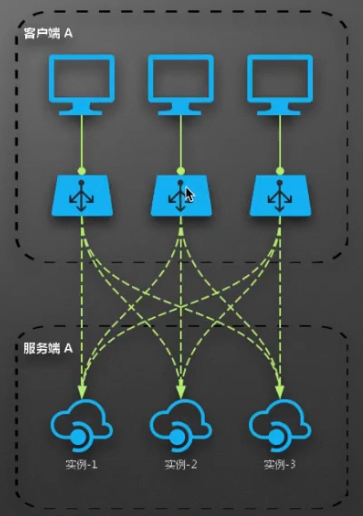
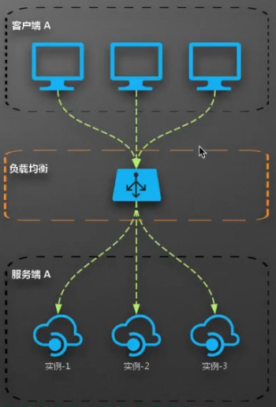

## 一、理论基础

### 1.客户端负载均衡（Ribbon）

客户端实现负载均衡，在SpringCloud中使用NetFlix的Ribbon

如图，**负载均衡器和Client实例是在一起的**，即一个完整的应用

**好处**：是比较**稳定**的，如果负载均衡器出问题的话，只会一个应用出问题，而不是整个应用都出问题。如果多个Client实例绑定到一台负载均衡器时，负载均衡器宕机就会导致全部出问题。

**不足**：升级的成本高，

### 2.服务端负载均衡（Zuul）

服务端实现负载均衡，在SpringCloud中使用Zuul实现

可以清楚的看到，**多个Client实例是绑定到一台负载均衡器**上的。有一个单独的负载均衡层，而不是和Client在一个层次。

**好处**：统一维护，成本低

**不足**：一旦故障，影响大，不够稳定

### 3.调度算法

调度算法有多种，每个负载均衡器的实现也不同，主要有：

- 先来先服务：类似队列
- 最早截止时间优先
- 最短保留时间优先
- 固定优先级：类似有一个权重，固定请求，比如0.5，即50%的概率请求某个
- 轮询
- 多级别队列