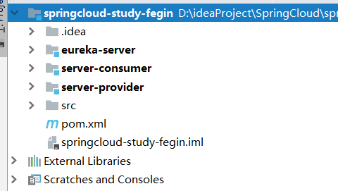
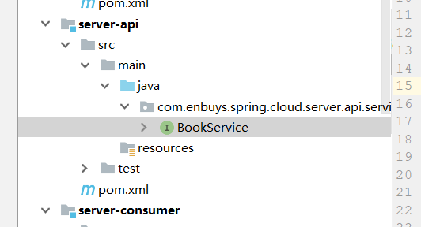

## 一、简介

在之前，我们学习了Ribbon和Hystrix。微服务的负载均衡器以及服务熔断措施，大大稳定了微服务应用。

在使用Spring Cloud Ribbon的时候，是配合RestTemplate与@LoadBalanced使用的，RestTemplate封装了http请求，提供了一套模板化调用方法。这时我们会发现，在实际开发中，对于更多的应用以及接口的调用，要写大量的RestTemplate模板化内容。

这时SpringCloud为了方便开发，实现了Feign这一组件，它简化了Ribbon，我们只需要创建接口并使用注解配置，即可完成对服务提供方的接口绑定。它具备可插拔的注解支持，包括Feign注解、JAX-RS注解。它也支持可插拔的编码器和解码器。Spring Cloud Feign还扩展了对Spring MVC注解的支持，同时还整合了Hystrix来提供服务熔断。

## 二、Spring Cloud Feign 入门

接着，我们从头开始使用Feign来充当服务消费方的角色。

### 1.初始化项目

首先我们创建一个Maven Project，`springcloud-study-Feign`

然后创建三个Module，分别是

- `eureka-server`：注册中心
- `server-provider`：服务提供方
- `server-consumer`：服务消费方



### 2.添加依赖

这里为了方便，我们将所有依赖都加在父类的pom文件里，因为eureka，ribbon依赖之前都讲过，这里只展示出Feign的依赖。

```xml
<!-- 依赖 Feign -->
<dependency>
    <groupId>org.springframework.cloud</groupId>
    <artifactId>spring-cloud-starter-feign</artifactId>
</dependency>
```

### 3.配置Eureka 注册中心

创建一个启动类，添加Eureka Server注解

```java
@SpringBootApplication
@EnableEurekaServer
public class MainApplication {
    public static void main(String[] args) {
        SpringApplication.run(MainApplication.class,args);
    }
}
```

配置`application.properties`

```properties
spring.application.name=eureka-server
server.port=10000

# 取消向注册中心注册
eureka.client.register-with-eureka=false
eureka.client.fetch-registry=false
# 取消多节点启动
eureka.instance.hostname=localhost
```

### 4.配置服务提供方

创建一个启动类，添加Eureka Client注解

```java
@SpringBootApplication
@EnableEurekaClient
public class ProviderApplication {
    public static void main(String[] args) {
        SpringApplication.run(ProviderApplication.class,args);
    }
}
```

配置`application.properties`

```properties
spring.application.name=server-provider
server.port=9090

# 向注册中心注册
eureka.client.service-url.defaultZone=http://127.0.0.1:10001/eureka
```

编写Controller类

```java
@RequestMapping("/book")
@RestController
public class BookController {

    @Value("${server.port}")
    private Integer port;

    @GetMapping("/get")
    public String get(){
        return "get book success port : " + port;
    }

    @GetMapping("/get/name")
    public String get(@RequestParam("name") String name){
        return "name : "+ name + " port : " + port;
    }

    @PostMapping("/get/book")
    public String get(@RequestBody Book book){
        return book + " port : " + port;
    }
}
```

这里的Book类很简单，就不贴出来了，就只有`name`和`id`属性

### 5.配置服务消费方（Feign）

这时我们的重头戏就来了，首先是老套路，编写主程序类和配置。

```java
@SpringBootApplication
@EnableEurekaClient
@EnableFeignClients
public class ConsumerApplication {
    public static void main(String[] args) {
        SpringApplication.run(ConsumerApplication.class,args);
    }
}
```

```properties
spring.application.name=server-consumer
server.port=8080

# 向注册中心注册
eureka.client.service-url.defaultZone=http://127.0.0.1:10001/eureka
# 服务提供方名称
provider.service.name=server-provider
```

配置完这两项之后，我们需要写一个Sevice接口，用来消费服务，注意，**这里的接口，就相当于之前使用Ribbon时编写的RestTemplate发送请求**。

```java
@FeignClient(name = "${provider.service.name}")
public interface BookFeignService {

    @GetMapping("/book/get")
    String get();

    @GetMapping("/book/get/name")
    String get(@RequestParam("name") String name);

    @GetMapping("/book/get/book")
    String get(@RequestBody Book book);
}
```

#### 使用Feign实现服务消费接口

- 创建一个接口

- 添加`@FeignClient`注解，具有一些属性
  - `name`：服务提供方的应用名称，这里我动态的配置
  - `fallback`：使用服务熔断后，可以配置这个，来进行服务熔断后的请求类，我们之后再细说
- 使用SpringMVC注解，配置提供方的请求路径，并且入参和返回值要相同

编写Controller，注入Service接口，并调用服务。

```java
@RestController
@RequestMapping("/book")
public class BookController {

    @Autowired
    private BookFeignService bookFeignService;

    @GetMapping("/get")
    public String get(){
        return bookService.get();
    }

    @GetMapping("/get/name")
    public String get(@RequestParam("name") String name){
        return bookService.get(name);
    }

    @PostMapping("/get/book")
    public String get(@RequestBody Book book){
        return bookService.get(book);
    }
}
```

### 6.测试

这里先开启eureka-server

然后开启两个服务提供方，9090和9091

最后开启服务消费方


正确启动后访问我们的消费方接口


可以看到，正确负载均衡访问服务提供方，证明我们的Feign使用成功。

## 三、Spring Cloud Feign 改造

在上面的例子中，我们写了至少三次的api方法，即，服务提供方一次，服务调用方一次，Feign接口一次，如果接口越来越多，大量的复制粘贴是不可取的；并且，我们可以发现，对于Book这个pojo类我们也实现了两次，一次在消费方一次在提供方，因为两个工程没有互相引用，这时，我们就需要改造一下我们的工程。

将接口与POJO类抽象出来，以供提供方与消费方引用实现。

### 1.新建api工程

新建一个api工程，将所有的service-api类存放在这里，以便公共调用实现



创建BookService接口

```java
@RequestMapping("/book")
public interface BookService {
    @GetMapping("/get")
    String get();

    @GetMapping("/get/name")
    String get(@RequestParam("name") String name);

    @GetMapping("/get/book")
    String get(@RequestBody Book book);
}
```

创建Book，Pojo类

```java
public class Book {

    private String name;
    private Integer id;

    public String getName() {
        return name;
    }

    public void setName(String name) {
        this.name = name;
    }

    public Integer getId() {
        return id;
    }

    public void setId(Integer id) {
        this.id = id;
    }

    @Override
    public String toString() {
        return "Book{" +
                "name='" + name + '\'' +
                ", id=" + id +
                '}';
    }
}
```

### 2.重构服务提供方

首先需要在pom中添加api工程的引用

```xml
<dependencies>
    <dependency>
        <groupId>com.enbuys</groupId>
        <version>1.0-SNAPSHOT</version>
        <artifactId>server-api</artifactId>
    </dependency>
</dependencies>
```

其次就是修改Controller了

```java
@RequestMapping("/book")
@RestController
public class BookController implements BookService {

    @Value("${server.port}")
    private Integer port;

    @GetMapping("/get")
    public String get(){
        return "get book success port : " + port;
    }

    @GetMapping("/get/name")
    public String get(@RequestParam("name") String name){
        return "name : "+ name + " port : " + port;
    }

    @PostMapping("/get/book")
    public String get(@RequestBody Book book){
        return book + " port : " + port;
    }
}
```

在之前的基础上，添加一个BookService的实现即可，这样我们只需重新接口中的方法即可，不用大量的复制粘贴

### 3.重构服务消费方

对于服务消费方，**我们可以将之前写的BookFeignService接口删除**

然后重构Controller，只需使用BookService即可

```java
@RestController
@RequestMapping("/book")
public class BookController implements BookService {

   @Autowired
    private BookService bookService;

    @GetMapping("/get")
    public String get(){
        return bookService.get();
    }

    @GetMapping("/get/name")
    public String get(@RequestParam("name") String name){
        return bookService.get(name);
    }

    @PostMapping("/get/book")
    public String get(@RequestBody Book book){
        return bookService.get(book);
    }
}
```

对于Controller来说也非常简单，实现BookService接口即可，会把@GetMapping，@RequestParam等注解都会带过来

此时，我们的Feign工程就改造完毕了，利用继承的特性，更好的实现接口定义与依赖共享

## 四、Spring Cloud Feign 与 Hystrix

之前说过Feign是将Ribbon与Hystrix整合起来，让用户更方便的实现负载均衡和服务熔断，通过刚刚的代码，可以看到Feign与Ribbon客户端有很大区别，HystrixCommand被封装了起来，那么便不能使用@HystrixCommand注解方式来使用熔断，它提供了一种更好的方式来进行熔断。

我们通过改造我们上面的代码，来进行实现

新建FallBack类实现