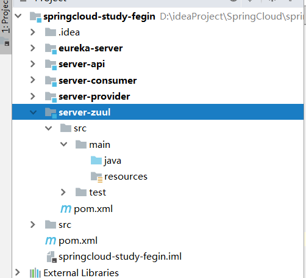
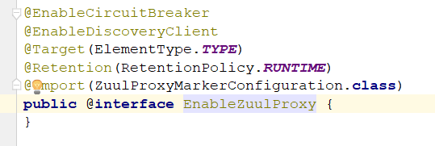
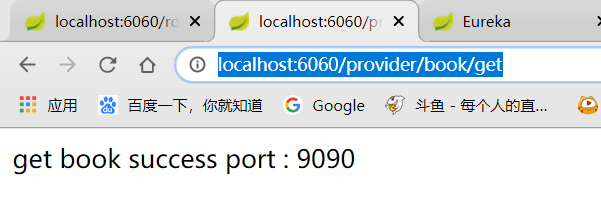
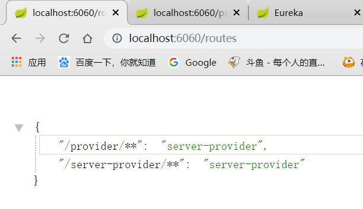

## 一、SpringCloud Zuul入门

服务网关是微服务架构中一个不可或缺的部分。通过服务网关统一向外系统提供REST API的过程中，除了具备服务路由、均衡负载功能之外，它还具备了权限控制等功能。Spring Cloud Netflix中的Zuul就担任了这样的一个角色，为微服务架构提供了前门保护的作用，同时将权限控制这些较重的非业务逻辑内容迁移到服务路由层面，使得服务集群主体能够具备更高的可复用性和可测试性。

Zuul在微服务中，便处于一个网关的地位，他自身整合了Ribbon和Hystrix，用作转发时的负载均衡和熔断。

我们接着上一节学习Feign的项目，来进行Zuul的学习。

### 1.创建server-zuul模块

首先我们为zuul，单独创建一个模块



### 2.添加Zuul依赖

在父pom文件中添加依赖，当然也可以直接添加子模块里，我这里为了方便直接放在父pom中了

```xml
<!-- 依赖 Zuul -->
<dependency>
    <groupId>org.springframework.cloud</groupId>
    <artifactId>spring-cloud-starter-zuul</artifactId>
</dependency>
```

### 3.创建启动类

启动类上主要要添加@EnableZuulProxy注解来开启Zuul的使用

```java
@SpringBootApplication
@EnableZuulProxy
public class ZuulApplication {
    public static void main(String[] args) {
        SpringApplication.run(ZuulApplication.class,args);
    }
}
```



这里可以看到，这个注解上带有了服务发现和服务熔断的注解，我们就不用再写一遍了。

### 4.添加配置

首先我们需要添加通用配置：

```properties
spring.application.name=server-zuul
server.port=6060
management.security.enabled=false
```

Zuul这时便不需要配置其他东西了，如果配合Eureka使用，会自动拉取注册中心上的服务进行映射

#### 单独使用Zuul时的配置

上面说的情况是配合Eureka使用时，那么如果没有Eureka，我们单独启动provider应用和Zuul应用应该如何配置呢？

```properties
# zuul映射规则
# zuul.routes.${service-id} = ${url-pattern}
# /** 代表匹配全路径
zuul.routes.server-provider=/provider/**
# ribbon应用名称与地址映射
server-provider.ribbon.listOfServers=http://127.0.0.1:9090
```

便使用这种方式，创建应用名与路径映射规则

然后再使用ribbon进行应用名与路径映射

##### 映射规则

如同上面设置的，对于访问`127.0.0.1:6060/provider/** `的路径会映射到`127.0.0.1:9090/**`

127.0.0.1:6060/provider/book/get  ====> 127.0.0.1:9090/book/get 

##### 启动测试

启动provider与Zuul，注意要把Eureka给关闭掉`eureka.client.enabled=false`

访问<http://localhost:6060/provider/book/get>

正常来说，会请求provider的<http://localhost:9090/book/get>



正确请求

#### 整合Eureka时

配置：

```properties
spring.application.name=server-zuul
server.port=6060
management.security.enabled=false

#eureka.client.enabled=false

# zuul映射规则
# zuul.routes.${service-id} = ${url-pattern}
# /** 代表匹配全路径
zuul.routes.server-provider=/provider/**
# ribbon应用名称与地址映射
server-provider.ribbon.listOfServers=http://127.0.0.1:9090

eureka.client.service-url.defaultZone=http://127.0.0.1:10001/eureka
```

需要添加eureka的注册信息，这里我们**不删除刚刚配置的路径映射**

##### 启动测试

分别启动eureka，provider，zuul

访问<http://localhost:6060/provider/book/get>

可以发现还是正常访问的

这时我们可以打开zuul的endpoint，routes端点，看看所有的路由规则

##### routes端点



可以看到除了我们刚刚配的`/provider/**`外，还自动配置了一个`/server-provider/**`

就是从eureka上拉取的，默认使用应用名称/**的路径，来映射应用名称

这时我们访问<http://localhost:6060/server-provider/book/get>


也是正确访问的

