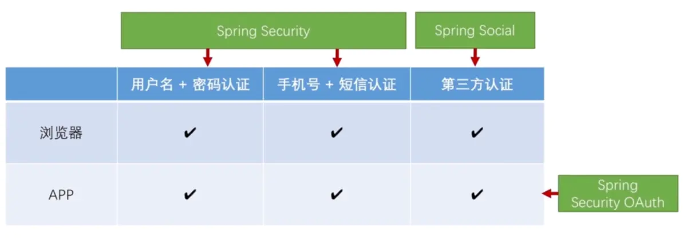
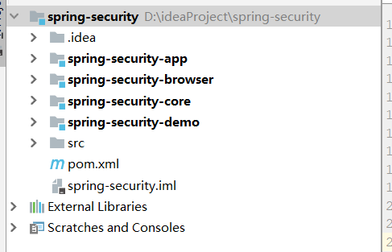
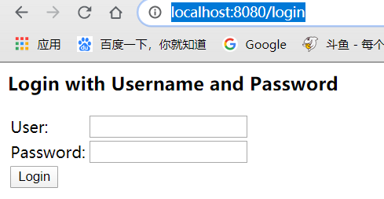
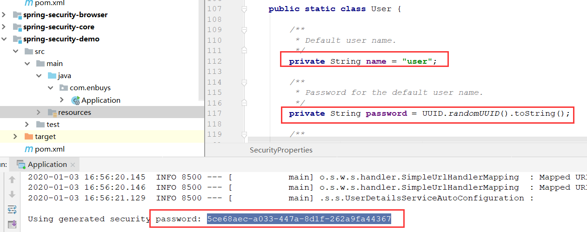
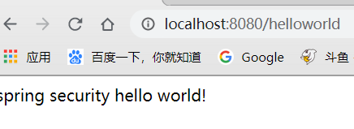
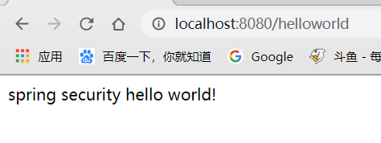

## 授权与认证

说到授权认证，可能会第一时间想到登录，那么登录不就是账号密码输入，然后加密到数据库里匹配是否正确吗？有什么难的，其实登录很重要：

- 登录认证模式多样
  - QQ登录
  - 短信登录
  - 微信登录
- 支持的前端渠道多样
  - 网页端
  - APP端
- 支持集群环境，跨应用工作，Session控制，控制用户权限，说防护与身份认证相关的攻击

认证和授权如此复杂，因此也诞生了作者对`SpringSecurity`系列的学习。本系列将主要从`SpringSecurity`，`Spring Social`，`Spring Security OAuth`来给大家进行讲解。

- `SpringSecurity`：`Spring Social`和`Spring Security OAuth`的底层实现是它，我们主要研究它实现用户名+密码认证和手机号+短信认证的，和底层代码实现。
- `Spring Social`主要用于第三方认证，比如QQ，微信的接入。
- `Spring Security OAuth`来创建、分发、管理Token信息，因为APP和后端服务器通讯的时候无法存储Session的问题，所以我们采用Token的方式来存储登录用户的认证信息，就需要用到OAuth



如上图，也可以清除看出来三个安全组件的职责

## 开发架构搭建

既然要学习SpringSecurity，肯定需要例子进行学习，这里我们会创建一个主模块用来管理依赖，4个从模块用来写业务代码，使用**SpringBoot2.x**进行整合，如下：



- `spring-security`：主模块，主要用于依赖管理
- `spring-security-app`：app相关代码
- `spring-security-browser`：浏览器安全相关代码
- `spring-security-core`：核心业务逻辑代码
- `spring-security-demo`：样例代码

下面我们开始搭建，这里我们主要是将所需依赖进行引入，即修改pom文件

### spring-security

这里引入spring.io是因为他集成了非常多的依赖，比如SpringBoot，SpringSecurity，oauth2等等，这里`Cairo-SR7`版本使用了`SpringBoot2.0.8`版本，用作依赖管理，之后在子模块引入依赖时就不需要添加版本了

引入Cloud也只是用作依赖管理，没有进行使用

```xml
<dependencyManagement>
    <dependencies>
        <dependency>
            <groupId>io.spring.platform</groupId>
            <artifactId>platform-bom</artifactId>
            <version>Cairo-SR7</version>
            <type>pom</type>
            <scope>import</scope>
        </dependency>
        <dependency>
            <groupId>org.springframework.cloud</groupId>
            <artifactId>spring-cloud-dependencies</artifactId>
            <version>Finchley.RELEASE</version>
            <type>pom</type>
            <scope>import</scope>
        </dependency>
    </dependencies>
</dependencyManagement>
<build>
    <plugins>
        <plugin>
            <groupId>org.apache.maven.plugins</groupId>
            <artifactId>maven-compiler-plugin</artifactId>
            <version>2.3.2</version>
            <configuration>
                <source>1.8</source>
                <target>1.8</target>
                <encoding>UTF-8</encoding>
            </configuration>
        </plugin>
    </plugins>
</build>
```


### spring-security-core

对于核心代码，这里引入了最关键的`oauth2`以及`social`相关的依赖

并且引入了redis和jdbc依赖，因为到时候业务需要存储Session或token时，需要保存到redis或mysql

```xml
<dependencies>
        <dependency>
            <groupId>org.springframework.cloud</groupId>
            <artifactId>spring-cloud-starter-oauth2</artifactId>
        </dependency>
        <dependency>
            <groupId>org.springframework.boot</groupId>
            <artifactId>spring-boot-starter-data-redis</artifactId>
        </dependency>
        <dependency>
            <groupId>org.springframework.boot</groupId>
            <artifactId>spring-boot-starter-jdbc</artifactId>
        </dependency>
        <dependency>
            <groupId>mysql</groupId>
            <artifactId>mysql-connector-java</artifactId>
        </dependency>
        <dependency>
            <groupId>org.springframework.social</groupId>
            <artifactId>spring-social-config</artifactId>
        </dependency>
        <dependency>
            <groupId>org.springframework.social</groupId>
            <artifactId>spring-social-core</artifactId>
        </dependency>
        <dependency>
            <groupId>org.springframework.social</groupId>
            <artifactId>spring-social-security</artifactId>
        </dependency>
        <dependency>
            <groupId>org.springframework.social</groupId>
            <artifactId>spring-social-web</artifactId>
        </dependency>
        <dependency>
            <groupId>commons-lang</groupId>
            <artifactId>commons-lang</artifactId>
        </dependency>
        <dependency>
            <groupId>commons-collections</groupId>
            <artifactId>commons-collections</artifactId>
        </dependency>
        <dependency>
            <groupId>commons-beanutils</groupId>
            <artifactId>commons-beanutils</artifactId>
        </dependency>
        <dependency>
            <groupId>org.springframework.boot</groupId>
            <artifactId>spring-boot-configuration-processor</artifactId>
        </dependency>
    </dependencies>
```

### spring-security-app

对于app模块，只需引用核心模块即可，因为引用都包含在core中了，所以它的`pom.xml`很简单

```xml
<dependencies>
    <dependency>
        <groupId>com.enbuys</groupId>
        <artifactId>spring-security-core</artifactId>
        <version>1.0-SNAPSHOT</version>
    </dependency>
</dependencies>
```

### spring-security-browser

browser也是引用核心模块，但是稍有不同的是因为它是浏览器，所以需要使用session，依赖需要添加一个session

```xml
<dependencies>
    <dependency>
        <groupId>com.enbuys</groupId>
        <artifactId>spring-security-core</artifactId>
        <version>1.0-SNAPSHOT</version>
    </dependency>
    <dependency>
        <groupId>org.springframework.session</groupId>
        <artifactId>spring-session-data-redis</artifactId>
    </dependency>
</dependencies>
```

### spring-security-demo

这里我们暂时先引入browser，后期在讲token方面的东西的时候会引入app，另外我们这里还加入了`spring-boot-maven-plugin`，让我们打包成可运行的jar包，如果说大家不加后面的build，可以看到你打出来的jar包是没有把相关的依赖放进去的，是没法直接执行的。

```xml
<dependencies>
    <dependency>
        <groupId>com.enbuys</groupId>
        <artifactId>spring-security-browser</artifactId>
        <version>1.0-SNAPSHOT</version>
    </dependency>
</dependencies>
<build>
    <plugins>
        <plugin>
            <groupId>org.springframework.boot</groupId>
            <artifactId>spring-boot-maven-plugin</artifactId>
            <version>1.3.3.RELEASE</version>
            <executions>
                <execution>
                    <goals>
                        <goal>repackage</goal>
                    </goals>
                </execution>
            </executions>
        </plugin>
    </plugins>
    <finalName>demo</finalName>
</build>
```

## Hello World

既然我们创建好了工程，那么肯定要先写一个helloworld运行一下

### 创建启动器类

```java
@SpringBootApplication
@RestController
public class Application {

    public static void main(String[] args) {
        SpringApplication.run(Application.class,args);
    }

    @GetMapping("/helloworld")
    public String helloworld(){
        return "spring security hello world!";
    }
}
```

这里如果我们直接启动，一定会报错，因为我们添加了数据库依赖，但没有配置数据库连接信息

### 添加配置文件

```properties
spring.datasource.driver-class-name=com.mysql.jdbc.Driver
spring.datasource.url=jdbc:mysql://127.0.0.1:3306/test?useUnicode=yes&characterEncoding=UTF-8&useSSL=false
spring.datasource.username=root
spring.datasource.password=root

# 关闭Session会话管理
spring.session.store-type=none
```

添加完配置文件后，可以重新启动，发现启动成功，这时访问<http://localhost:8080/helloworld>



会发现跳转到`login`页面，这是因为在springboot环境下，`spring security`会被自动装配，即默认开启

这里的用户名密码可以通过查看`SecurityProperties`类发现：



用户名默认为`user`，密码是`UUID`自动生成的，会打印在控制台，这里输入用户名密码即可看到打印的信息



### 关闭Security自动装配

在`springboot2.x`版本之前的关闭方法：

- 配置文件中添加：`security.basic.enabled=false`

在`springboot2.x`之后版本关闭方法：

- 在启动器类上添加注解，排除`Security`的自动装配

```java
@EnableAutoConfiguration(exclude = {
        SecurityAutoConfiguration.class
})
```

重新启动后访问



成功访问，并且控制台没有打印`UUID`生成的密码了


**本篇文章，我们主要是简单介绍Security和使用springboot2.0先把基本框架搭建好，后面的文章中，我们将深入Security进行研究**。