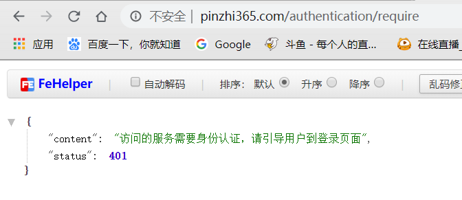
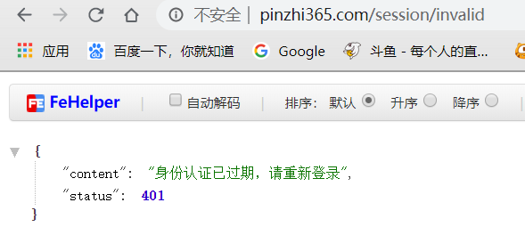
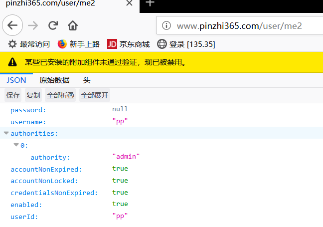
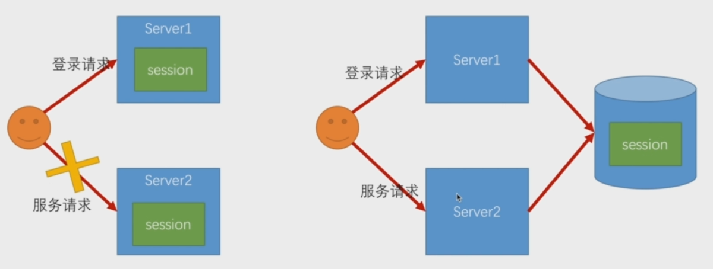
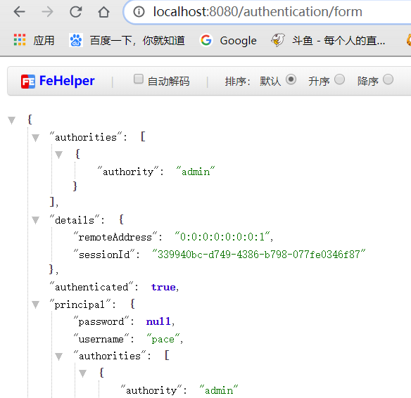
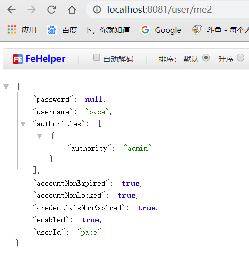
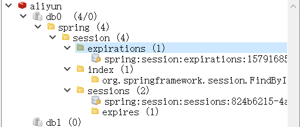
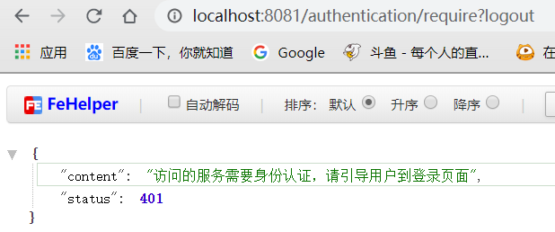
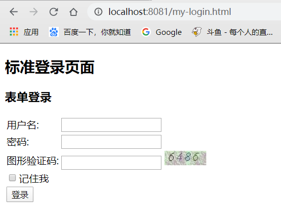
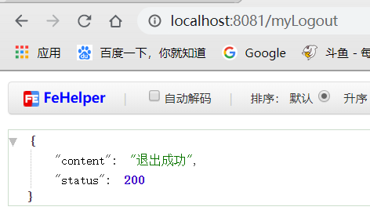

## 本篇内容概述

在前面的笔记中，我们学习了表单登录，短信验证码，图片验证码，以及Social实现的第三方QQ，微信登录，而这些的实现都依靠SpringSecurity

但是我们以前没有使用SpringSecurity，是如何实现登录的呢？是放在Session中保存用户信息的。其实SpringSecurity也是一样，底层也是依靠Session来保存它定义的用户信息。

这一章我们就要讲讲SpringSecurity中Session的管理，主要有三点

- Session超时处理
- Session并发控制
- 集群Session的管理

除了Session管理，我们还要讲一下退出登录，SpringSecurity会自动帮我们做很多退出后需要做的事

- 如何退出登录
- SpringSecurity默认的退出逻辑
- 退出登录的相关配置

## Session超时处理

### 超时时间处理

首先是设置Session超时时间，这个很常用了，因为是SpringBoot项目，所以直接在配置文件中设置

```properties
# 设置Session失效时间
#spring.session.timeout=60s # springboot1.x
server.servlet.session.timeout=60s
```

这里设置60秒的原因如果少于1分钟，SpringBoot也会默认给你设置为1分钟，即不能小于1分钟，可以在源码中看到：


然后我们启动项目，登录后等待一分钟，重新访问



Session已过期

### 设置过期提醒

这里可以发现，当Session过期后，转跳页面还是之前未认证页面，所以这里我们要对Session超时的情况，做出特殊处理，提示他们是因为Session超时而需要重新登录

首先在Security配置中添加超时URL，并配置授权

```java
http.
    .sessionManagement()
        .invalidSessionUrl("/session/invalid")
        .and()
    .authorizeRequests() // 下面是认证信息
        .antMatchers(
            ···
            "/session/invalid"
    	)
```

最后在写一个接口调用

```java
@RequestMapping("/session/invalid")
public SimpleResponse sessionInvalid(){
    return new SimpleResponse("身份认证已过期，请重新登录",401);
}
```

配置完成，去测试一下



正确显示

## Session并发控制

Session并发控制简单来说就是不让用户在多地点多平台登录，比如用户在电脑看视频，这时如果他用手机看了，那么电脑端就会被挤下线，需要重新登录

实现起来也非常简单，主要是进行SpringSecurity的配置和`SessionInformationExpiredStrategy `类的实现

### Security配置

```java
http 
	.sessionManagement() // Session管理
        .invalidSessionUrl("/session/invalid") // Session失效后转跳地址
        .maximumSessions(1) // 最大Session并发数量
        .expiredSessionStrategy(new MyExpiredSessionStrategy()) // 超过并发数量后的处理
```

### 实现SessionInformationExpiredStrategy 

```java
public class MyExpiredSessionStrategy implements SessionInformationExpiredStrategy {
    @Override
    public void onExpiredSessionDetected(SessionInformationExpiredEvent event) throws IOException, ServletException {
        //告诉前端并发登陆异常
        event.getResponse().setContentType("application/json;charset=UTF-8");
        event.getResponse().getWriter().write("账户异地登录，请重新登录！");
    }
}
```

### 启动测试

首先我们在谷歌浏览器登录，然后再使用火狐登录

火狐页面：



谷歌页面刷新后：


说明成功实现。

这里对于Session并发还有一个配置，就是禁止异地登录，只能在一个设备上登录，后面登录会被禁止

```java
http 
	.sessionManagement() // Session管理
        .invalidSessionUrl("/session/invalid") // Session失效后转跳地址
        .maximumSessions(1) // 最大Session并发数量
        .expiredSessionStrategy(new MyExpiredSessionStrategy()) // 超过并发数量后的处理
        .maxSessionsPreventsLogin(true) //当超过指定的最大session并发数量时，阻止后面的登陆（感觉貌似很少会用到这种策略）
```

## 集群Session的管理

### 集群Session简单介绍

现在公司的应用基本都是分布式的，那么服务器也是不同的Session就是跨服务的，一般使用负载均衡进行请求应用



如图，因为是不同服务器，所以用服务器保存单独Session肯定会出现问题，一个登陆了，另一个服务没有Session信息，这里就需要使用DB，将Session保存到数据库里，每次请求时查库看看是否存在Session，这样就能完美的实现集群下Session管理

### 集群Session管理实现

对于SpringBoot来说很简单，只需使用`Spring-Session`配合数据库即可。

这里我使用Spring-Session配合redis，在配置文件中配置redis地址和`spring-session`

```properties
# 配置redis
spring.redis.host=
spring.redis.port=
spring.redis.password= 

# 启用Session会话管理 redis
spring.session.store-type=redis
```

配置完后启动

#### 序列化问题


会发现图形验证码没有加载，并且后台报错


这是因为我们的Bean没有进行序列化，对于所有要存到Redis中的对象，都需要进行序列化

#### 解决方式

首先在之前写的`ValidateCode`上添加序列化

```java
public class ValidateCode implements Serializable {
```

然后再看图片验证码


因为我们的图片验证码使用`BufferedImage`，属于Java自己的类无法修改，所以这里解决方式是在生产图片，并保存图片验证码到Session的时候，不要将它放到Session里，只存放验证码即可，这里修改生成方法：

```java
@RestController
public class ValidateCodeController {

    public static final String SESSION_IMAGE_KEY = "SESSION_KEY_IMAGE_CODE";
    private SessionStrategy sessionStrategy = new HttpSessionSessionStrategy();

    @Autowired
    private ValidateCodeGenerator imageCodeGenerator;


    @GetMapping("/code/image")
    public void createCode(HttpServletRequest request, HttpServletResponse response) throws IOException{
        ServletWebRequest servletWebRequest = new ServletWebRequest(request);
        // 调用图片验证码生成接口
        ImageCode imageCode = (ImageCode) imageCodeGenerator.generate(servletWebRequest);
        // 序列化问题，这里只保存验证码
        ValidateCode code = new ValidateCode(imageCode.getCode(),imageCode.getExpireTime());
        sessionStrategy.setAttribute(servletWebRequest,SESSION_IMAGE_KEY,code);

        ImageIO.write(imageCode.getImage(),"JPEG",response.getOutputStream());
    }
    
    ···
}
```

主要就是17行，创建个`ValidateCode`对象保存，而不是保存`ImageCode`

### 启动测试

这里我们启动两个应用进行测试，8080和8081端口

首先在8080应用上登录



然后再8081端口直接访问接口



在不登陆的情况下直接访问8060服务器的接口 — 无需登陆可直接获得到数据，证明我们借助redis搭建的session集群管理已经生效

再看一下存到redis里的数据内容：



同时之前学习的session超时时间设置和并发控制功能都仍然有效。


## 退出登录

### 退出登录逻辑

Spring Security的退出登陆功能由`LogoutFilter`过滤器拦截处理，默认的退出登陆url为` /logout`。

在退出登陆时会做如下几件事：

- 使当前`session`失效
- 清除当前用户的`remember-me`记录
- 清空当前的`SecurityContext`
- 重定向到登录界面

这里默认重定向到`/authorization/require?logout`

### 实现退出登录

实现起来也非常简单，写一个`index`页面

```html
<!DOCTYPE html>
<html lang="en">
<head>
    <meta charset="UTF-8">
    <title>Title</title>
</head>
<body>
    index
<br/>
<a href="/logout">退出</a>
</body>
</html>
```

配置好后，便可以启动测试，这里我们先登录，登陆后进入`index`页面，然后点击退出按钮



这里我们就需要配置退出成功后的操作了，不使用它默认的跳转路径

### 退出配置

```java
http
	.logout() // 退出设置
		.logoutUrl("/myLogout") // 退出登录的URL，默认为logout
         .logoutSuccessUrl("/my-login.html") // 退出成功后转跳Url 与Handler互斥
		// .logoutSuccessHandler() // 退出成功后Handler，与Url互斥
		//.deleteCookies("JSESSIONID") // 退出成功后删除指定cookie
```

配置很简单，也易懂，这里就不过多说明了，Success后有两种实现方式，一是直接跳转Url，一是配置一个`Handler`进行处理，我们先使用Url跳转测试



退出成功后回到了登录页面

然后我们写一个`LogoutSuccessHandler`实现

```java
public class MyLogoutSuccessHandler implements LogoutSuccessHandler {
    @Override
    public void onLogoutSuccess(HttpServletRequest request, HttpServletResponse response, Authentication authentication) throws IOException, ServletException {
        response.setContentType("application/json;charset=UTF-8");
        response.getWriter().write(JSON.toJSONString(new SimpleResponse("退出成功",200)));

        //response.sendRedirect(signOutSuccessUrl);
    }
}
```

这里我只是简单的实现，也可以将退出成功跳转页面配置在配置文件中进行动态设置

修改Security配置

```java
http.logout() // 退出设置
    .logoutUrl("/myLogout") // 退出登录的URL，默认为logout
    //.logoutSuccessUrl("/my-login.html") // 退出成功后转跳Url 与Handler互斥
    .logoutSuccessHandler(new MyLogoutSuccessHandler()  ) // 退出成功后Handler，与Url互斥
```



成功实现