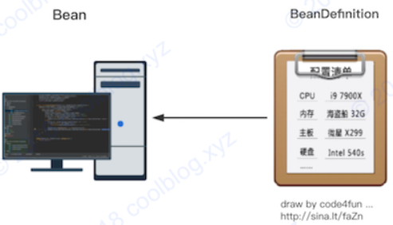
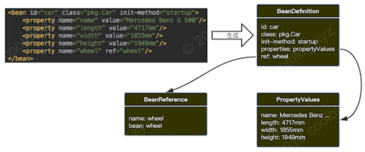
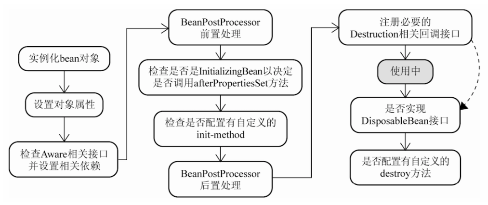
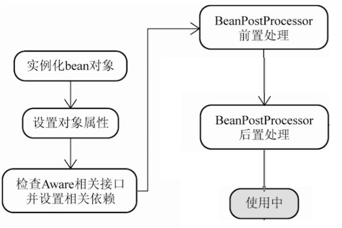

## 一、IOC的实现

### 1.1 BeanFactory的生命流程

1. `BeanFactory`加载配置文件，将读取到的Bean配置到`BeanDefintion`对象
2. 将`BeanDefintion`对象注册到`BeanDefintion`容器中（Map）
3. 实现`BeanPostProcess`的类注册到`BeanPostProcess`容器中
4. `BeanFactory`进入就绪状态
5. 外部调用`BeanFactory`的getBean(name)方法，`BeanFactory`进行实例化Bean

上面简单罗列了ioc的生命流程，下面就根据流程进行详细解读


### 1.2 BeanDefinition及其他一些类的介绍

**BeanDefinition**：根据翻译，为Bean的定义，其实就是Bean的配置单，用来记录这个Bean的信息

举例来说，Bean是一台电脑，而`BeanDefinition`是电脑的配置单，我们光看一台电脑看不出来他的好坏，但是如果看配置单就可以了解这台电脑的详细配置，并且根据这个配置单可以轻松搭建出一台这样的电脑（Bean）。



上面的例子比较贴切的展现出了Bean与`BeanDefinition`的关系，现在我们看看在具体实现中，`BeanDefinition`与xml是如何对应的呢？




`依据上图可以看到，`BeanDefinition`对应了xml中的<bean>标签，又包含了两个新名词`PropertyValues`和BeanReference`，下面我们来介绍一下他们。

**BeanReference**：保存了bean标签中ref属性对应的值，当对Bean进行实例化时，会根据`BeanReference`保存的值去实例化依赖的Bean。

**PropertyValues**：保存了bean标签包含的property标签的值集合，与PropertyValue是包含关系

这里为什么不直接使用一个List<PropertyValue>保存呢？看看下方代码，可知，如果使用一个`PropertyValues`类，可以在添加属性时进行一些处理

```java
public class PropertyValues {

    private final List<PropertyValue> propertyValueList = new ArrayList<PropertyValue>();

    public void addPropertyValue(PropertyValue pv) {
        // 在这里可以对参数值 pv 做一些处理，如果直接使用 List，则就不行了
        this.propertyValueList.add(pv);
    }

    public List<PropertyValue> getPropertyValues() {
        return this.propertyValueList;
    }

}
```

### 1.3 解析XML

`BeanFactory`初始化时，需要根据xml的路径进行读取并解析。

但是这种加载解析的烦琐事项`BeanFactory`可不会干，所以就交给专职小弟`BeanDefinitionReader`去干了，安排他去专门干这个事，小弟虽说是小弟，也是一方的管理人员（接口），实际实现还是由`XmlBeanDefinitionReader`来做的，具体干了以下几件事：

1. 读取xml，加载到内存中
2. 获取根标签beans下的所有子标签(<bean>标签)
3. 遍历bean标签，读取id与class属性值
4. 将id与class保存到`BeanDefinition`容器中
5. 遍历bean标签下的property标签，读取属性值，保存到`PropertyValues`中再保存到`BeanDefinition`中
6. 将<id，BeanDefinition>保存到Map中
7. 重复3,4,5,6,步

### 1.4 注册BeanPostProcessor

`BeanPostProcessor`接口是Spring对外拓展的接口，让开发人员可以使用这个接口来对**bean实例化前后进行一些所需的处理**，具有插手bean实例化的机会。比如我们所熟悉的aop就是在这里织入相关bean中的。**`正因为BeanPostProcessor`这个桥梁，aop和ioc才可以连接使用**。

那么，BeanFactory是怎样注册BeanPostProcessor的呢？

首先，在XmlBeanDefinitionReader解析完xml后，相应的Bean配置被保存到BeanDefinition容器中，BeanFactory将BeanDefinition注册到自己的BeanDefinitionMap容器中。注册完成后，便开始注册BeanPostProcessor，这个过程也是比较简单的：

1. BeanFactory根据Map中的Bean循环找实现了BeanPostProcessor接口的类
2. 实例化BeanPostProcessor接口
3. 将实例化加载到List容器中（这个容器只保存实例化后的BeanPostProcess）
4. 重复2,3步直到注册完成

这样，很简单的就注册好了BeanPostProcess，等到外部调用getBean()方法时，便会根据classname将BeanPostProcess的实例添加到bean中

### 1.5 getBean过程解析

经过了xml解析，BeanDefinition注册，BeanPostProcess注册后，BeanFactory的初始化工作基本完成了，这时BeanFactory就处于就绪状态，等待外部的调用，因为是懒加载，所以直到调用getBean()才会进行实例化对象。我们来看看Bean的实例化过程



1. 用户调用getBean()方法，开始实例化bean对象
2. 将配置文件中属性填充到bean中
3. 检查bean是否实现 Aware 一类的接口，如果实现了则把相应的依赖设置到 bean 对象中。
4. 调用BeanPostProcess的前置处理方法
5. 检查 bean 对象是否实现了 InitializingBean 接口，如果实现，则调用 afterPropertiesSet 方法。或者检查配置文件中是否配置了 init-method 属性，如果配置了，则去调用 init-method 属性配置的方法。
6. 调用 BeanPostProcessor 后置处理方法，即 postProcessAfterInitialization(Object bean, String beanName)。我们所熟知的 AOP 就是在这里将 Adivce 逻辑织入到 bean 中的。
7. 注册 Destruction 相关回调方法。
8. bean 对象处于就绪状态，可以使用了。
9. 应用上下文被销毁，调用注册的 Destruction 相关方法。如果 bean 实现了 DispostbleBean 接口，Spring 容器会调用 destroy 方法。
10. 如果在配置文件中配置了 destroy 属性，Spring 容器则会调用 destroy 属性对应的方法。

上述是完整的spring bean实例化的过程，在我们仿写项目中，此过程被简化



