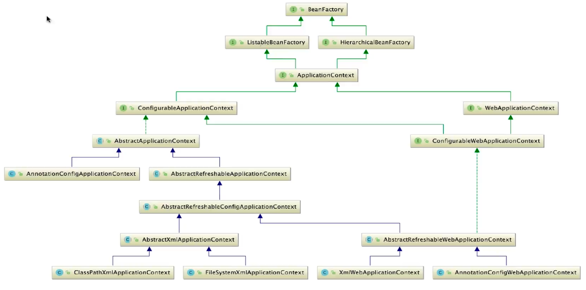

再进行Spring IOC流程解析前，我们需要对一些必要的类进行了解

## Bean

Bean我们太常见了，就是一个个的Java对象，那他和普通Java对象有什么不同呢？其实就是Bean是由Spring进行管理的。

## BeanDefinition

BeanDefinition是什么呢？看名字为Bean的定义，其实就是Bean在xml或者注解配置时，所添加的属性，都会被组装成一个个的BeanDefineition，放到容器中，以供后面使用。

常见的Bean定义属性有：

- lazy-init懒加载
- id
- class
- scope作用域
- 等等

## BeanFactory

BeanFactory是顶级的管理Bean的接口，为基类接口

其中getBean方法也是我们经常使用的方法，通过名称、类型或者构造函数来从容器中获取Bean

BeanFactory因为是顶级接口，所以肯定会派生出很多接口与实现类

比如`ListableBeanFactory`就可以获取List形式的Bean集合，以及`AutowireCapableBeanFactory`为注解形式的BeanFactory，`HierarchicalBeanFactory`中自定义方法最少，但也非常关键，因为它是重要容器`ApplicationContext`的父接口

### ApplicationContext

接下来看看ApplicationContext

这里可以发现，ApplicationContext也有很多具体的实现，其中用到了很多设计模式

相对重要的是`AbstractApplicationContext`，其中最重要的方法`refresh()`，就是SpringIOC容器启动的方法

其中就用到了**模板方法模式**，`refresh`中有很多方法，有的是模板方法，所有子类实现公用的，有的是钩子方法，可实现可不实现，有的是抽象方法，必须由子类实现的

除了`AbstractApplicationContext`外，可以看到最下层具有几个常用的ApplicationContext

- `ClassPathXmlApplicationContext`
- `FileSystemXmlApplicationContext`
- `XMLWebApplicationContext`
- `AnnotationConfigWebApplicationContext`

前三个是加载xml配置文件的，最后一个是注解时使用的上下文

## Resources

Resources是用来解析读取解析配置文件的，将配置文件中的Bean属性，装配到BeanDefinition中，保存到集合，以待后续使用，下面是Resources的结构图

可以看到Resources是基于io实现的配置文件读取，并且使用了**策略模式**，即Resources只是一个接口，具体实现以及使用是由下层实现类提供。

简单介绍一下相关接口和类：

- EncodedResource：主要是对资源文件进行解码编码
- AbstractResources：Resources接口的具体实现，实现了大部分基础功能，当用户需要自定义实现Resources加载功能时，应继承此类，而不是实现Resources接口。
  - 基于抽象Resources，衍生出很多不同情景下的Resources实现，比如Servlet上下文获取资源，类加载路径下的资源，本地文件绝对路径的资源等
- WritableResources：其他的Resources，基本都是对资源文件进行读操作，而此接口可以实现一些写操作