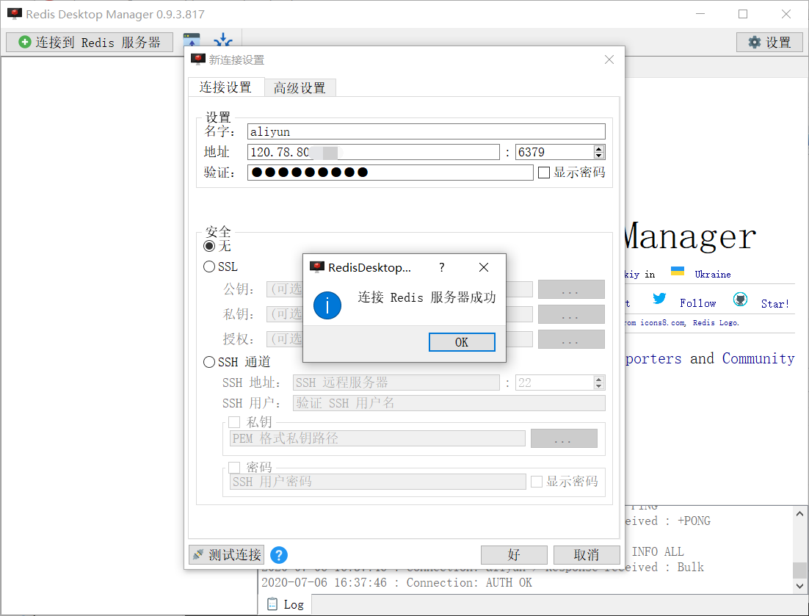
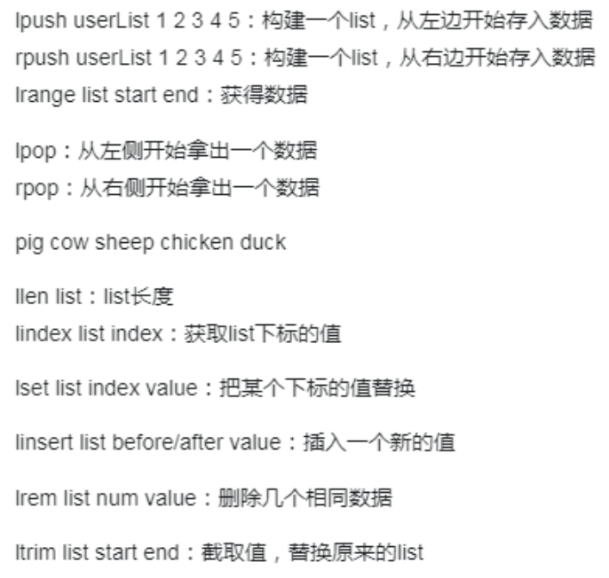

## 为什么要使用缓存


通过之前集群架构的升级，目前架构是这样

这样会发现一个问题，前面请求被分流，这样可以承载更高的并发请求，但是后面只有一个数据库，肯定会出现瓶颈，严重会导致数据库崩溃，运行所有sql都非常慢。

为了处理这个问题，我们必须引入缓存，如下图


当应用请求数据库之前，先查询缓存，如果缓存中有数据了，直接返回，不通过数据库，缓存最常用的就是Redis了，因为其nosql特性，导致性能很高，也是主流的缓存中间件。

## Redis简单介绍

Redis一般来说都比较熟悉了，这里再回顾一下

### 为什么选择Redis

常用的分布式缓存中间件有很多，为什么选择Redis呢？我们分别看看几种优缺点

Ehcache：

- 基于Java，再JVM使用速度很快，简单方便
- 不支持集群，不支持分布式

Memcache：和Redis一样式nosql，keyvalue存储

- 简单，内存使用率高，多核多线程
- 不支持持久化，无法容灾

Redis：功能强大

- 支持容灾持久化，主从同步集群，数据结构丰富，内存数据库
- 单线程处理

总结：大型项目使用Redis更好

### Redis安装配置使用

**Redis安装**

1.下载Redis安装包放到linux系统上

2.解压

```
tar -zxvf redis-5.0.5.tar.gz
```

3.安装gcc环境

```
yum install -y gcc-c++
```

4.进入目录安装

```
cd redis-5.0.5.tar.gz
make
make install
```

安装完成后开始配置Redis，一般情况下最简单的就是修改配置文件，然后使用redis-server启动

**但是我们这次配置成脚本启动，并实现开机自启动**

1.进入utils目录，将`redis_init_script`拷贝到`/etc/init.d`下

```
cp redis_init_script /etc/init.d/
```

2.配置redis配置文件，创建/usr/local/redis并存放配置文件

```
mkdir /usr/local/redis -p
cd /home/software/redis-5.0.5
cp redis.conf /usr/local/redis/
cd /usr/local/redis/
mkdir workspace # 用于保持redis工作目录
```

3.修改配置文件

```
vim redis.conf
```

绑定ip改为0.0.0.0，这样其他服务器才可以访问此服务器


daemonize改为yes，即后台启动


修改工作目录


设置redis密码


保存

4.修改redis_init_script


5.赋予文件权限

```
chmod 777 redis_init_script 
```

6.启动Redis

```
./redis_init_script start
chkconfig redis_init_script on
```

**使用Redis**

这里我使用客户端进行连接，redis-desktop-manager



当然也可以使用redis的命令行客户端

```
redis-cli
auth pwd #输入密码
set key value
get key
del key
```


### Redis多种数据类型

Redis有五大数据类型：String，zset，set，hash，list，这里我们简单介绍一下

#### String

String是最基本也是最常用的数据类型，由键值对组成

主要命令有：


#### hash

类似map，用来存储结构化数据，比如对象，但是不能嵌套


#### list

列表，比如：[1,2,a,b,c]



#### set

set也是列表，和list差不多，但是list可以保存重复数据，这个不可以，对于重复数据会自动去重

#### zset

排序的set，是有序的，可以去重可以排序，比如可以对用户积分排序

