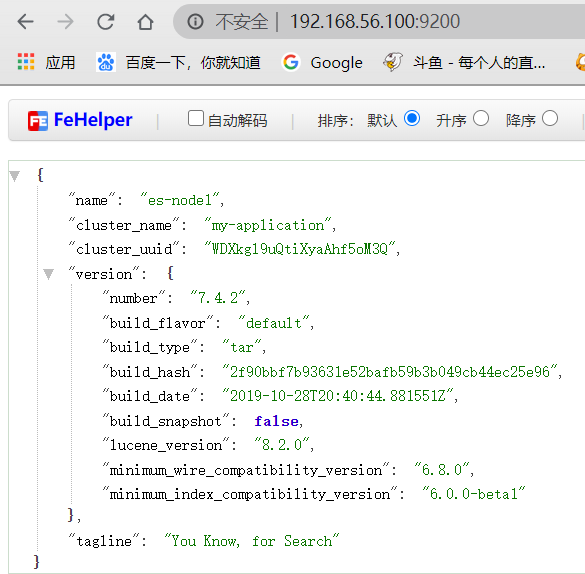
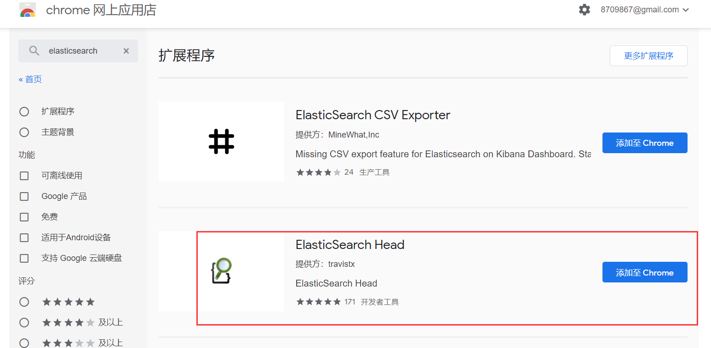
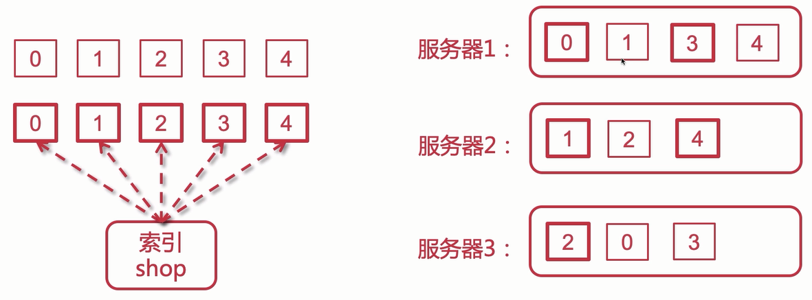
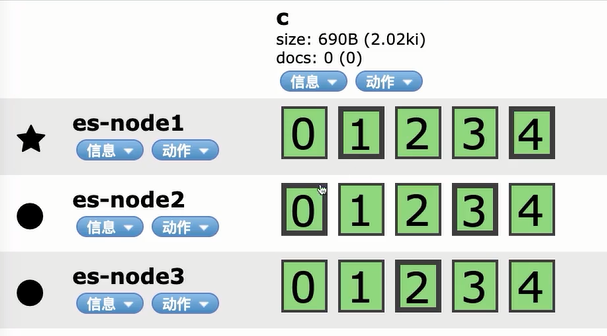

# 分布式搜索引擎

## 为什么使用ES

对于分布式搜索引擎来说，一般有三种，Lucene，Solr，ElasticSearch，那么为什么现在绝大部分都是使用ES呢？

- Lucene：是类库，就好像是一个jar包，引用它来进行使用，是搜索引擎的基础，但是它的api使用复杂，并且没有集群支持，必须自己纯手工搭建集群，需要考虑大量问题。
- Solr：基于Lucene实现的分布式搜索脚手架，和ES相似，也是非常成熟的一款搜索引擎中间件
- ElasticSearch：也是基于Lucene的分布式搜索引擎
  - 是一种更年轻的产品，其最大特点就是实时，在新建索引后，只需等待1秒就可以搜索到新加的索引信息
  - 并且对于超大的数据量搜索速度依旧高效
  - 上手简单
  - 对于数据分析，具有Elastic Stack全家桶

通过上面的介绍，我们可以发现ES更年轻，对于Solr有的它基本都可以实现，而对于它的实时分析搜索，是Solr不复存在的，在新建索引时，Solr会使用较长的时间进行同步后，才可以搜索到新增的数据。并且ES并不是只有实时分布式搜索这么简单，它完善的数据分析全家桶Elastic Stack也是加分项。

综上，ElasticSearch是一款好用，火爆，最流行的分布式搜索引擎，所以我们选择ES来充当分布式搜索引擎中间件的角色。

## ES的相关知识

对于ElasticSearch，我在之前已经详细介绍过，可以看这个专栏：http://www.pacee1.com/categories/elasticsearch/

我们这一篇，主要目的是从0到微服务，过程中的分布式搜索引擎，所以主要是在项目中整合ElasticSearch，而对于一些基础知识点，就不重复介绍了。

## ES安装

首先我们需要下载ES，这里我使用的版本是7.4.2，下载地址：https://www.elastic.co/cn/downloads/past-releases/elasticsearch-7-4-2

下载Linux版本。

下载完毕后将压缩包放到linux上，解压后保存到`/usr/local`下

```
mv elasticsearch-7.4.2 /usr/local
```

然后就可以开始修改配置文件了

### 配置ES

- 核心配置文件`elasticsearch.yml`

```yml
# 集群名称
cluster.name: my-application

# 节点名称
node.name: es-node1

# 数据保存路径
path.data: /usr/local/elasticsearch-7.4.2/data
# Path to log files:
# 日志保存路径
path.logs: /usr/local/elasticsearch-7.4.2/logs

# Set the bind address to a specific IP (IPv4 or IPv6):
# 可以访问的IP，所有都可以访问
network.host: 0.0.0.0

# 集群节点相关，基础主节点，改为当前节点
cluster.initial_master_nodes: ["es-node1"]
```

- jvm配置文件`jvm.options`

```
# 因为在虚拟机，内存没有这么大，所以改小
-Xms128m
-Xmx128m
```

到此，关于核心配置已经配置完毕了。

### 启动ES

因为ES的规定，不能使用root用户直接启动，所以我买需要创建用户并分配权限，使用这个用户启动。

```
useradd esuser
chown -R esuser /usr/local/elasticsearch-7.4.2
su esuser
cd bin
./elasticsearch -d
```


启动后会发现报错，这里我们需要切回root用户，并增大内存

```
vim /etc/security/limits.conf

* soft nofile 65536
* hard nofile 131072
* soft nproc 2048
* hard nproc 4096
```

```
vim /etc/sysctl.conf

# 最下方添加
vm.max_map_count=262145

# 保存后刷新
sysctl -p
```

然后就可以重新启动了，访问 ip:9200，查看是否成功启动



### 安装ES-HEAD

ES-HEAD是ES的可视化工具，其安装方法多种多样，常用的就是在Chrome上当插件安装，或者安装到linux上绑定ES。

这里我们使用在Chrome上安装插件（需科学上网）



安装完毕后打开输入es地址，即可


### 添加中文分词器

ES默认分词器只支持英文，如果需要中文分词，需要自己安装一些插件。

默认分词器：

- standard：标准分词器
- whitespace：按空格分词
- simple：简单分词，只分英文，对于数字不会进行分词
- stop：去除一些无意义单词的分词
- keyword：不分词

安装中文分词器，ik

首先下载ik分词器https://github.com/medcl/elasticsearch-analysis-ik/releases/tag/v7.4.2

然后放到服务器上

解压压缩包

```
unzip elasticsearch-analysis-ik-7.4.2.zip -d /usr/local/elasticsearch-7.4.2/plugins/ik
```

解压之后就可以重启es了

ik分词器有两种：

- ik_max_word：最细粒度拆分
- ik_smart：粗粒度拆分

## ES集群

集群概念就不再赘述了，最重要就是让服务实现高可用，在某个节点宕机后，其他节点仍然可以提供服务。

ES因为其分片和副本的概念，两个节点就可以实现集群，即主分片和副本分片存放在不同的节点上，某个节点宕机，另一个节点上的副本分片就会晋升成主分片提供服务。在启动多节点集群后，ES会自动将分片放到不同的服务器上。



### 集群搭建

首先准备三个装有es的服务器。

ES搭建集群相当简单，只需要修改`elasticsearch.yml`中的配置即可

```yml
# 集群名称，保证唯一
cluster.name: my-elasticsearch
# 节点名称，必须不一样
node.name: node-1

# 可以访问的ip，0.0.0.0代表所有ip的请求都接收
network.host: 0.0.0.0
# 服务端口号
http.port: 9200
# 集群间通信端口号
transport.tcp.port: 9300

# 主节点 作用主要是用于来管理整个集群，负责创建或删除索引，管理其他非master节点（相当于企业老总）
node.master: true
# 数据节点 用于对文档数据的增删改查
node.data: true

# 集群列表
discovery.seed_hosts: ["192.168.56.100:9300","192.168.56.101:9300","192.168.56.102:9300"]
# 启动时使用一个主节点
cluster.initial_master_nodes: ["node-1"]
```

启动三个节点后，创建一个索引查看



会发现均匀分布在各节点，主副分片不在同一个节点，说明搭建成功

> 注意：集群脑裂问题，在ES 7.X之后会由ES内部调节，而7.X之前的版本，需要使用discovery.zen.minimum_master_nodes参数进行控制

## ES整合SpringBoot

> 这里我们使用SpringBoot 2.2.2.RELEASE版本，对应ES 6.4.3版本，所以我们要安装6.4.3版本的ES进行操作
>
> 因为ES7中自带JDK，所以不需要再安装ES，ES6需要先安装JDK
>
> 对于6.X版本和7.X版本最主要就是type的问题，7.X取消了type概念，一概使用_doc，6.X还有type概念，创建索引时需要指定type，我们统一指定为 _doc即可

### 框架搭建

在原有Foodie工程中创建一个`foodie-search` Module

创建`application.yml`配置文件

```yml
spring:
  data:
    elasticsearch:
      cluster-nodes: 192.168.56.100:9300
      cluster-name: es6
  datasource: # 数据源的相关配置
    type: com.zaxxer.hikari.HikariDataSource # 数据源类型：HikariCP
    driver-class-name: com.mysql.jdbc.Driver # mysql驱动
    url: jdbc:mysql://localhost:3306/foodie?useUnicode=true&characterEncoding=UTF-8&autoReconnect
    username: root
    password:
```

创建启动器类

```java
@SpringBootApplication
public class MainApplication {
    public static void main(String[] args) {
        SpringApplication.run(MainApplication.class,args);
    }
}
```

ES6.X时，启动可能会报一个一个错`availableProcessors is already set to [8], rejecting [8]`

解决方案为，创建一个配置类，并设置一个参数为false，如下

```java
@Configuration
public class ESConfig {
    /**
     * 解决netty引起的issue
     */
    @PostConstruct
    void init() {
        System.setProperty("es.set.netty.runtime.available.processors", "false");
    }
}
```

到此就把架子搭起来了，可以使用ElasticSearchTemplate进行操作了

### CRUD以及DSL

**索引创建**

首先我们需要创建一个索引实体，用来映射索引，就和数据库表一样

```java
@Document(indexName = "stu",type = "_doc")
public class Stu {

    @Id
    private Long stuId;

    @Field(store = true)
    private String name;

    @Field(store = true)
    private Integer age;
    
    // ··· getset
}
```

然后创建Test类，使用`ElasticsearchTemplate`进行索引创建操作

```java
@SpringBootTest
@RunWith(SpringRunner.class)
public class ESTest {

    @Autowired
    private ElasticsearchTemplate esTemplate;

    @Test
    public void createIndex(){
        Stu stu = new Stu();
        stu.setStuId(1001L);
        stu.setName("pace");
        stu.setAge(20);

        IndexQuery indexQuery = new IndexQueryBuilder().withObject(stu).build();
        esTemplate.index(indexQuery);
    }
}
```

**修改索引**

修改索引和新增一模一样，只需添加新索引，使用相同的api即可。

**删除索引**

```java
@Test
public void deleteIndex(){
    esTemplate.deleteIndex(Stu.class);
}
```

> 注意，我们一般不会使用Java对索引进行创建修改删除的管理操作。
>
> 就和数据库一样，我们CRUD针对的都是数据库中数据，而不是表
>
> 所以我们使用ElasticsearchTemplate也是针对文档进行CRUD


**修改文档**

```java
@Test
public void updateDoc(){
    Map<String,Object> sourceMap = new HashMap<>();
    sourceMap.put("name","pacee1");
    sourceMap.put("age",23);

    IndexRequest indexRequest = new IndexRequest();
    indexRequest.source(sourceMap);

    UpdateQuery updateQuery = new UpdateQueryBuilder()
            .withClass(Stu.class)
            .withId("1001")
            .withIndexRequest(indexRequest)
            .build();
    esTemplate.update(updateQuery);
}
```

**查询文档**

```java
@Test
public void getDoc(){
    GetQuery getQuery = new GetQuery();
    getQuery.setId("1001");
    Stu stu = esTemplate.queryForObject(getQuery, Stu.class);
    System.out.println(stu);
}
```

**删除文档**

```java
@Test
public void deleteDoc(){
   esTemplate.delete(Stu.class,"1001");
}
```

