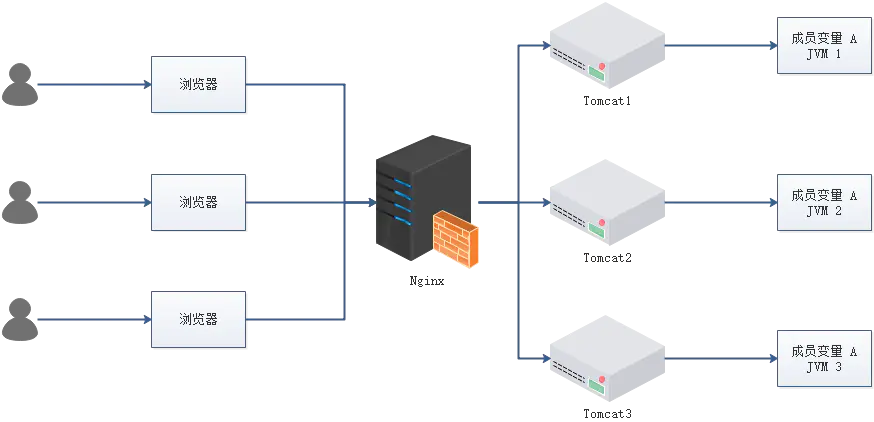
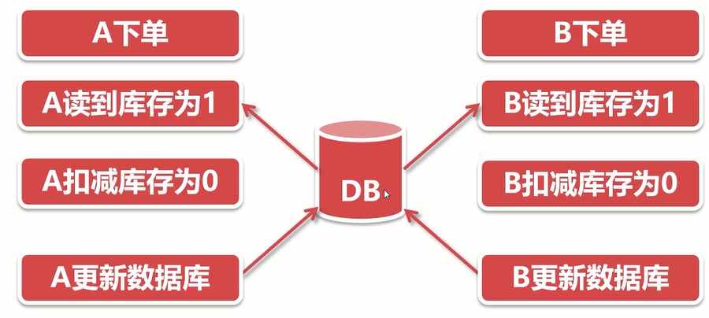

# 分布式锁

## 分布式锁介绍

锁的概念我们在之前的学习中都知道，为了**防止多个线程对同一个变量修改导致一系列问题**，对于这个问题，我们的解决方案都是**使用同步**，比如synchronize 关键字，或者Lock接口保证原子性。

那么既然这样可以解决，分布式锁又是干嘛的，请注意，我们刚刚说的解决方案是**单机环境**的，一个进程中的多个线程，实际是**JVM进行控制**的。

那么如果我们部署分布式项目，多个Tomcat搭建集群那么就有多个JVM，如下

- 成员变量 A 存在 JVM1、JVM2、JVM3 三个 JVM 内存中，成员变量 A 同时都会在 JVM 分配一块内存
- 当三个请求发送过来时，正好每个请求通过轮训请求到不同的三个变量A，因为所在内存不同，数据不共享，所以肯定会出现问题的，每个请求修改A后，下一个请求修改的还是原来的A数据
- 注：该成员变量 A 是一个有状态的对象

如果我们业务中确实存在这个场景的话，我们就需要一种方法解决这个问题！

为了**保证一个方法或属性在高并发情况下的同一时间只能被同一个线程执行**，在传统单体应用单机部署的情况下，可以使用并发处理相关的功能进行互斥控制。但是，随着业务发展的需要，原单体单机部署的系统被演化成分布式集群系统后，由于**分布式系统多线程、多进程并且分布在不同机器上**，这将使原单机部署情况下的并发控制锁策略失效，单纯的应用并不能提供分布式锁的能力。为了解决这个问题就需要一种**跨机器的互斥机制来控制共享资源的访问**，这就是分布式锁要解决的问题！

## 分布式锁应该具备哪些条件

- 在分布式系统环境下，一个方法在同一时间只能被一个机器的一个线程执行
- 高可用的获取锁与释放锁
- 高性能的获取锁与释放锁
- 具备可重入特性（可理解为重新进入，由多于一个任务并发使用，而不必担心数据错误）
- 具备锁失效机制，防止死锁
- 具备非阻塞锁特性，即没有获取到锁将直接返回获取锁失败

## 超卖问题

接下来，我们以最经典的超卖问题，一点点从单体锁实现方式到各种分布式锁实现方式的实现。

### 超卖现象一 数据库行锁

- 系统中库存为一，但是卖出了两笔订单

这种问题，就是经典的超卖现象，A和B两个买家同时拍下商品并提交订单。

**解决方案**

1. 不在程序中扣减库存，而是在数据库中
2. 数据库传递库存增量，为-1，库存数+增量数
3. 通过update语句计算库存，并使用行锁进行控制并发

### 超卖现象二 同步锁