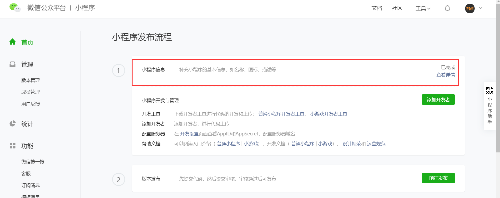
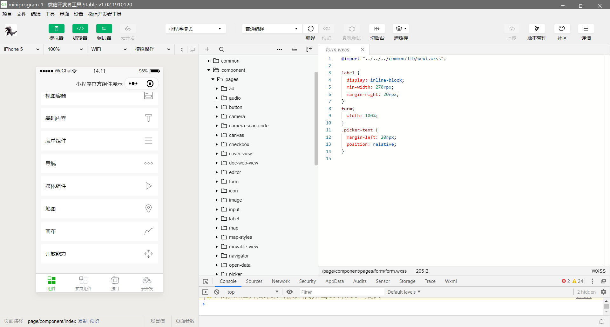
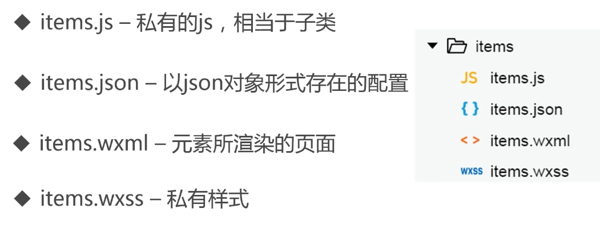

官方文档：<https://developers.weixin.qq.com/miniprogram/dev/framework/>

## 一、注册一个小程序

1.进入小程序官网<https://mp.weixin.qq.com/cgi-bin/wx>

2.下拉有个立即注册按钮


3.输入相关信息即可注册成功



4.注册成功后可以修改小程序的基本信息，如名称图标等等

5.修改完后就完成了小程序的注册

## 二、HelloWorld

我们需要下载安装小程序的开发工具

<https://developers.weixin.qq.com/miniprogram/dev/devtools/download.html>

安装完成后，可以运行创建一个helloworld项目进行测试学习。


这里我们先用游客模式进行体验


点击创建可以看到进入到开发页面，具有模拟器，编辑器，调试器三个模块，非常简单方便。

简单了解目录结构：

- app.js：唯一，一些小程序的js配置
- app.json：唯一，小程序的一些配置文件
- app.wxss：唯一，小程序的主css
- pages
  - index：主页的js，wxml，wxss，json
  - logs：日志的js，json，wxml，wxss
- utils：工具类js

## 三、微信官方Demo

<https://github.com/wechat-miniprogram/miniprogram-demo>，在github上可以下载微信官方demo，里面对所有的组件以及接口进行了介绍



这样我们在开发时就可以参照demo进行开发，具体的用法使用到时再说

## 四、目录结构

微信程序就和普通前端项目代码一样，分为公有部分与私有部分


处于主目录的app.js等文件属于公有部分，**全局都可以调用**，包括一些配置（json），样式（wxss）

而Page文件夹中的各个子文件夹属于私有目录，由文件夹内使用



对于页面的目录结构，固定由js,json,wxml,wxss组成，并命名统一，标志为一个页面

</br>

> 对于小程序框架来说，分为逻辑层（js），和视图层（wxml，wxss）

## 五、逻辑层

### 1.生命周期

#### 小程序生命周期

小程序生命周期方法：

```js
// app.js
App({
  onLaunch (options) {
    // Do something initial when launch.
  },
  onShow (options) {
    // Do something when show.
  },
  onHide () {
    // Do something when hide.
  },
  onError (msg) {
    console.log(msg)
  },
  globalData: 'I am global data'
})
```

- onLaunch：小程序首次加载时调用
- onShow：小程序由隐藏转为显示状态时调用，比如用户缩小小程序去聊天，然后聊完回来再看的时候
- onHide：小程序由显示转为隐藏时调用
- onError：出错时调用

这里可以看到全局js文件中写了一个globalData参数，可以在Page的js里调用：

```js
Page({
  data: {
    motto: 'hello数据绑定'
  },
  onLoad: function(){
    var appInstance = getApp(); // 获取App公共实例
    console.log(appInstance.globalData);
    this.setData({
        // 将数据值设置为公共参数globalData的值
        motto : appInstance.globalData
    }) 
  }
})
```

#### 页面私有生命周期

```js
Page({
  onLoad: function(){
    console.log("onLoad");
  },
  onReady: function () {
    // Do something when page ready.
    console.log("onReady");
  },
  onShow: function () {
    // Do something when page show.
    console.log("onShow");
  },
  onHide: function () {
    // Do something when page hide.
    console.log("onHide");
  },
  onUnload: function () {
    // Do something when page close.
    console.log("onUnload");
  }
})
```

Page生命周期具体如下：

- onLoad：页面第一次加载时执行，只会执行一次
- onShow：页面展示时执行，与onHide做对应
- onReady：页面加载完毕时执行，也只会执行一次
- onHide：页面隐藏/切入后台时触发，与onShow做对应， 如 [wx.navigateTo](https://developers.weixin.qq.com/miniprogram/dev/api/route/wx.navigateTo.html) 或底部 `tab` 切换到其他页面，小程序切入后台等。
- onUnload：页面卸载时触发。如[wx.redirectTo](https://developers.weixin.qq.com/miniprogram/dev/api/route/wx.redirectTo.html)或[wx.navigateBack](https://developers.weixin.qq.com/miniprogram/dev/api/route/wx.navigateBack.html)到其他页面时。

### 2.模块化

小程序的模块化非常简单，只需使用 `module.exports`或者 `exports` 对外暴露接口，然后使用`require`导入即可

代码：

```js
// common.js
function sayHello(name) {
  console.log('Hello '+ name +' !')
}
function sayGoodbye(name) {
  console.log(`Goodbye ${name} !`)
}

module.exports.sayHello = sayHello
exports.sayGoodbye = sayGoodbye
```

这里对于参数拼接使用有两种，一是普通的加号拼接法，另一个是==**``**配合${xxx}==进行参数值的获取

```js
var common = require('../utils/common.js');

Page({
  ···
  click: function(event){
    console.log(event);
    console.log(event.target.dataset.name);
    common.sayHello("hello");
    common.sayGoodbye("goodbye");
  }
})

```


测试没有问题，正确显示

## 六、视图层

### 1.数据绑定

#### 基础数据绑定

数据绑定主要依靠双大括号来完成：{{}}，这和vue或react类似

```html
<view> {{ message }} </view>
```

```js
Page({
  data: {
    message: 'Hello MINA!'
  }
})
```

当然，除了这个基础的数据绑定外，还有一些常用的方式，如下的html demo：

```html
<view class="container">
{{msg}}
<!-- 对于组件属性的绑定 -->
<text id="IDX{{id}}">索引</text> 
<!-- 运算 -->
{{a + b}}
<text>{{a > b ? "a大于b" : "a小于b"}}</text>
<!-- 字符串拼接 -->
<text>{{msg + " 拼接一下"}}</text>
</view>
```

```js
Page({
    data: {
      msg: "this is data bind",
      id: 1,
      a: 1,
      b: 2
   },
})
```


### 2.列表循环渲染

#### wx:for

`wx:for`：使用这个标签绑定数组，可以实现循环各项数据渲染组件

配合`<view>`使用每次循环都放在标签内，即3次循环便有3个`<view>`标签

配合`<block>`使用会将数据存放在同一行使用

`wx:for-item`：指定item名称默认{{item}}

`wx:for-index`：指定下标名称，默认{{index}}

```html
<view class="container" >
<!-- 列表循环渲染的基本用法 -->
<view wx:for="{{array}}"> 
序号：{{index}} 值：{{item.name}}
</view>
<!-- 列表循环，指定下标名称与item名称 -->
<block wx:for="{{array}}" wx:for-item="user" wx:for-index="num">
序号：{{num}} 值：{{user.name}}
</block>
</view>
```

```js
Page({
  data: {
      array:[
        {name:"aa"},
        {name:"bb"},
        {name:"cc"}
      ]
  },
})
```


#### wx:key

这个属性主要用来配合循环渲染处理动态绑定问题的。

如：5个switch开关（12345），如果开了1和2，然后对开关随机排序成了（32145），如果没有绑定`wx:key`这个属性就会导致3和2是打开状态的，如果绑定了，那么还会是1和2打开，例如下图：


两种绑定方式：

1）使用item的某个property进行唯一绑定

```html
<switch wx:for="{{objectArray}}" wx:key="unique" style="display: block;"> {{item.id}} </switch>
```

```js
 objectArray: [
     { id: 3, unique: 'unique_3' },
     { id: 2, unique: 'unique_2' },
     { id: 1, unique: 'unique_1' },
     { id: 0, unique: 'unique_0' },
 ],
```


2）使用`*this`关键字绑定

```html
<switch wx:for="{{objectArray}}" wx:key="*this" style="display: block;"> {{item.id}} </switch>
```

使用这种就不需要在数组上添加唯一绑定字段了

### 3.事件

小程序的事件主要处在视图层，常用的有以下几个

| 类型        | 触发条件                                                     |
| ----------- | ------------------------------------------------------------ |
| touchstart  | 手指触摸动作开始                                             |
| touchmove   | 手指触摸后移动                                               |
| touchcancel | 手指触摸动作被打断，如来电提醒，弹窗                         |
| touchend    | 手指触摸动作结束                                             |
| tap         | 手指触摸后马上离开，即点击事件                               |
| longpress   | 手指触摸后，超过350ms再离开，如果指定了事件回调函数并触发了这个事件，tap事件将不被触发 |

使用方法：

```html
<text class="txt_test" data-name="ensee" bindtap="click">{{motto}}</text>
```

```js
click: function(event){
    console.log(event);
    console.log(event.target.dataset.name);
}
```

效果：


## 