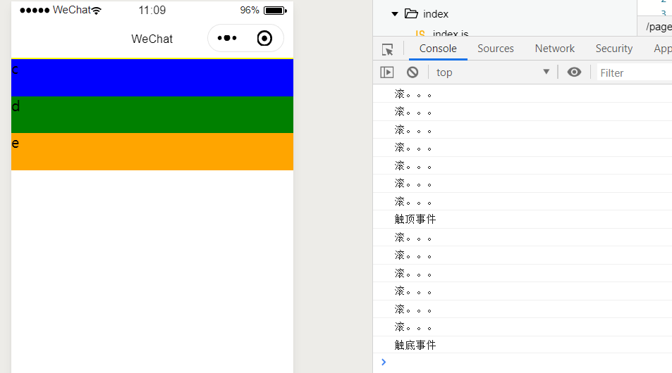
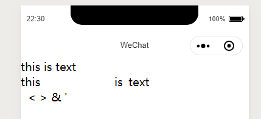
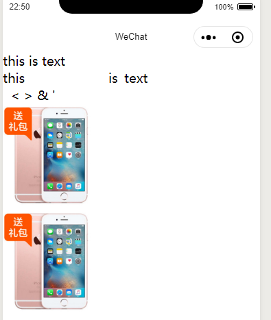

## 一、视图组件

### 1.view

所有组件都有公有属性如：id，name，class，data等等，不同的组件还具有特有的一些属性。

- `hover-class`：手指点击更改class样式，松开回到原先样式
- `hover-start-time`：按住多少毫秒后改变样式，如1000，即按住1秒后才改变样式
- `hover-stay-time`：手指松开后多少毫秒回到原来的样式
- `hover-stop-propagation`：阻止冒泡事件，即本节点点击后，父节点也跟着改变了点击样式

```html
<view class="a" hover-class="b" hover-start-time="1000"
  hover-stay-time="1000">
hover
</view>
```

### 2.scroll-view

可滚动视图组件，分为横向与纵向

#### 纵向

- `scroll-y`：true即允许纵向滚动
- `scroll-top`：设置滚动条初始位置高度
- `scroll-into-view`：使用id为参数，设置滚动条初始位置的子元素id，**文档说优先级大于`scroll-top`，实际测试小于**
- `enable-back-to-top`：ios点击顶部状态栏，滚动条回到顶部，默认false
- `scroll-with-animation`：开启过场动画
- `upper-threshold`：距离顶部多少距离时，触发事件，触顶事件
- `lower-threshold`：距离底部多少距离时，触发事件，触底事件
- `bindscroll`：滚动事件

```html
<scroll-view style="height:300rpx" scroll-y="true"
bindscrolltoupper="scrolltoupper" bindscrolltolower="scrolltolower"
upper-threshold="1" lower-threshold="1"
bindscroll="scroll" scroll-with-animation="true"
scroll-into-view="b" scroll-top="150rpx">
  <view id="a" class="a size">a</view>
  <view id="b" class="b size">b</view>
  <view class="c size">c</view>
  <view class="d size">d</view>
  <view class="e size">e</view>
</scroll-view>
```

```js
Page({
  scrolltoupper:function(){
    console.log("触顶事件")
  },

  scrolltolower:function(){
    console.log("触底事件");
  },

  scroll:function(){
    console.log("滚。。。");
  }
})
```

界面：



#### 横向

在官方文档中，横向滚动只需设置`scroll-x`为true即可，其实还需要设置其他的

1. 设置父元素

```scss
.container {
  display: flex;
  white-space: nowrap;
} 
```

2. 设置子元素

```scss
.xsize {
  width: 300rpx;
  height: 100rpx;
  display: inline-block;
}
```

设置完毕就可以测试了：

- `scroll-x`：使元素可以横向滚动，应用场景：顶部分类，可以滑动查看
- `scroll-left`：初始位置设置

wxml：

```html
<scroll-view class="container" style="margin-top:100rpx" scroll-x="true"
scroll-left="150">
  <view id="a" class="a xsize">a</view>
  <view id="b" class="b xsize">b</view>
  <view class="c xsize">c</view>
  <view class="d xsize">d</view>
  <view class="e xsize">e</view>
</scroll-view>
```

效果：


### 3.swiper轮播图

主要使用<swiper>配合<swiper-item>来使用，属性有：

- `indicator-dots`：是否显示面板知识点，默认false
- `indicator-color`：指示点颜色
- `indicator-active-color`：选中的指示点颜色
- `autoplay`：是否自动播放，默认false
- `interval`：自动切换时间间隔
- `duration`：滑动动画时长

wxml：

```html
<swiper indicator-dots="{{indicatorDots}}"
  autoplay="{{autoplay}}" interval="{{interval}}" duration="{{duration}}">
  <block wx:for="{{background}}" wx:key="*this">
    <swiper-item>
      <image src="{{item}}"></image>
    </swiper-item>
  </block>
</swiper>
```

js：

```js
Page({
  data: {
    background: ['../img/lunbo1.jpg', '../img/lunbo2.jpg', '../img/lunbo3.jpg'],
    indicatorDots: true,
    vertical: false,
    autoplay: true,
    interval: 2000,
    duration: 500
  }
})
```

效果：


### 4.movable

<movable-area>配合<movable-view>可以实现元素的拖拽。

实际应用场景：比如视频播放平台，上面是视频，下面是评论，如果用户往下滑到评论区，那么视频会小窗口播放在一旁，并可以拖动，如：


<movable-view>的属性：

- `direction`：可拖拽方向，默认为none不可拖拽，all所有方向，vertical纵向，horizontal横向
- `inertia`：是否带有惯性，默认false，如果为true，根据拖拽速度会进行方向上的飘移，即惯性
- `out-of-bounds`：超出area范围后，是否还可以拖拽，这里如果为true也不是说能拽出去，而且只能再往外伸展一点
- `x，y`：定义元素在area中的初始位置
- ` disabled `：是否禁用
- ` bindchange `：拖动过程中触发的事件

```html
<movable-area class="area">
  <movable-view class="view" direction="all" x="50" y="50"
  out-of-bounds="true" bindchange="onChange">
  </movable-view>
</movable-area>
```

```js
Page({
  onChange: function(){
    console.log("正在拖动");
  }
})
```

```scss
.area{
  width: 100%;
  height: 500rpx;
  background: gray
}

.view{
  width: 100rpx;
  height: 100rpx;
  background: red;
}
```


## 二、基础组件

### 1.icon

常用的一些图标

```html
<icon type="success" size="50" color="red"></icon>
<icon type="success_no_circle" size="50"></icon>
<icon type="info" size="50"></icon>
<icon type="warn" size="50"></icon>
<icon type="waiting" size="50"></icon>
<icon type="cancel" size="50"></icon>
<icon type="download" size="50"></icon>
<icon type="search" size="50"></icon>
<icon type="clear" size="50"></icon>
```


### 2.text

text指文本组件，所有组件只有text可以长按选中，并且text内部只支持text嵌套

属性：

- `selectable`：是否可以被选中
- `space`：显示连续的空格
  - `ensp`：中文字符空格一半大小
  - `emsp`：中文字符空格大小
  - `nbsp`：根据字体设置的空格大小
- `decode`：可以转义特殊字符

```html
<view><text selectable="true">this is text</text></view>
<view><text space="ensp">this             is text</text></view>
<view><text decode="true">&nbsp; &lt; &gt; &amp; &apos; &ensp; &emsp;</text></view>
```



### 3.rich-text

富文本框，里面可以写一些html的内容进行展示

<rich-text>中属性主要为nodes，nodes可以直接使用字符串，或集合的形式进行添加富文本：

- 字符串：''
- 集合形式
  - name：标签名
  - attrs：标签中的属性
  - children：子节点，结构和nodes一致

```html
<rich-text nodes="{{nodes}}"></rich-text>
<rich-text nodes="{{nodes2}}"></rich-text>
```

```js
Page({
  data:{
    nodes:'',
    nodes2 : [{
      name :"img",
      attrs:{
        height: "150rpx",
        witdth: "150rpx",
        src:"http://image.enbuys.com/241997c4-9e62-4824-b7f0-7425c3c28917.jpeg"
      }
    }]
  }
})
```



### 4.process

进度条，也是比较简单的，默认长度单位为px，属性：

- `percent `：百分比，0-100
- `show-info` ：在进度条右侧显示百分比，默认false即不显示
-  `border-radius` ：进度条圆角大小
- ` font-size `：进度条右侧百分比文字大小，默认10
- ` stroke-width `：进度条宽度，默认6
- ` activeColor `：已选择进度条颜色
- ` backgroundColor `：未选择进度条颜色
- ` active `：进度条从左往右动画效果
- ` active-mode `：进度条动画效果
  - ` backwards `：从头播放
  - `forwards`：从上次结束点播放
- ` bindactiveend `：进度完成事件

```html
<progress percent="{{per}}" stroke-width="10"
show-info="true" activeColor="red" backgroundColor="blue"
active="true" active-mode="forwards">
</progress>
<view bindtap="addPer">add per</view>
```

```js
Page({
  data:{
    per:10
  },
  addPer : function(){
    var newPer = this.data.per + 10;
    this.setData({
      per : newPer
    })
  }
})
```


