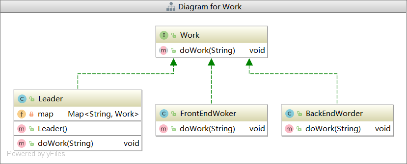

# 委派模式

## 委派模式介绍

首先，委派模式不属于23种设计模式的一种，可以说他是**代理模式和策略模式的组合**，为什么这么说，后面再讲。

委派模式就是客户端请求委派类，委派类根据需求需要委派给具体的类去处理。对于客户端，只认为是委派类处理了请求，并不知道背后的波涛汹涌，即只**注重结果**。

举个例子来说，我是Boss，即用户，我想开发一个商场，我把这个任务交给项目组长去做，项目组长根据功能分类，交给下属程序员去做，全部做完后，Boss看到商场完成，很高兴，就会夸奖组长，认为是组长完成了任务，并不会去找到程序员去单独夸奖他们。

通过上面的例子，我们可以看到，委派模式只注重结果，不注重过程。也可以看出，Boss让组长干活，但是组长不想干，让手下干，这就是**代理模式的体现**；根据功能选择分配给不同手下干活，这就是**策略模式**。也就是我们之前说代理模式和策略模式的组合。

委派模式与代理模式不同：

- 代理模式**注重过程**
- 委派模式**注重结果**

委派模式与策略模式的不同：

- 委派模式**注重重用和灵活**
- 策略模式**注重扩展**

了解完委派模式后，我们进入代码，让我们更好的理解这些概念

## 委派模式代码实现

这里我们就拿上面的例子来实现代码，老板委派经理去干活，经理把活分配给下属

类图：

1）工作接口Work

```java
public interface Work {
    void doWork(String workName);
}
```

2）前后端程序员，被委派者

```java
public class FrontEndWoker implements Work{
    public void doWork(String workName) {
        System.out.println("我是前端程序员，开始做" + workName + "工作");
    }
}
public class BackEndWorder implements Work {
    public void doWork(String workName) {
        System.out.println("我是后端程序员，开始做" + workName + "工作");
    }
}
```

3）领导Leader，即委派者

```java
public class Leader implements Work {

    private Map<String,Work> map = new HashMap<String, Work>();

    public Leader(){
        map.put("front",new FrontEndWoker());
        map.put("back",new BackEndWorder());
    }

    // 委派工作
    public void doWork(String workName) {
        map.get(workName).doWork(workName);
    }
}
```

这里可以看到，会根据工作类型，非法给实际程序员进行工作，可以体现静态代理模式，和策略模式

4）Boss，测试类

```java
public class Boss {
    public static void main(String[] args) {
        // 创建组长
        Leader leader = new Leader();
        // 让组长开发前端页面
        leader.doWork("front");
        // 让组长开发后端服务
        leader.doWork("back");
    }
}
```


## SpringMVC中的委派模式

委派模式在Spring中被广泛使用，**对于类名称以`Delegate`结尾的，和带有`Dispatch`的都属于委派模式**，比如我们最熟悉的`DispatchServlet`请求分派器。

在没接触到SpringMVC之前，我们需要写一个个的`Servlet`，并在`web.xml`中配置，才可以将请求接收过来处理，有了`DispatchServlet`之后，便不需要配置`xml`了，它会**根据请求路径，分发给具体的`Controller`**，这就是委派模式，也可以看到他的好处，减少代码量，更加隐蔽，简化使用。

### 简单实现DispatchServlet

1）创建一个Controller

```java
public class HelloController {
    public void hello(){
        System.out.println("hello");
    }
}
```

2）创建Handler实际处理类

```java
public class ServletHandler {

    //controller对象
    private Object controller;
    //controller对象映射的方法
    private  String url;
    //ulr对应的方法
    private Method method;

    ··· // getset
}
```

3）创建DispatchServlet，分派器，即委派对象

```java
public class DispatchServlet {

    private List<ServletHandler> handlerList = new ArrayList<>();

    public DispatchServlet(){
        // 模拟添加一个Controller Handler
        Class<HelloController> clazz = HelloController.class;
        ServletHandler helloHandler = new ServletHandler();
        helloHandler.setController(clazz);
        try {
            helloHandler.setMethod(clazz.getMethod("hello",null));
        } catch (NoSuchMethodException e) {
            e.printStackTrace();
        }
        helloHandler.setUrl("/hello");

        handlerList.add(helloHandler);
    }

    public void doService(HttpServletRequest request, HttpServletResponse response){
        doDispatch(request,response);
    }

    /**
     * 请求分发
     * @param request
     * @param response
     */
    public void doDispatch(HttpServletRequest request,HttpServletResponse response){
        // 1.获取请求路径
        String requestURI = request.getRequestURI();

        // 2.根据uri，找到对应的Controller处理类
        ServletHandler servletHandler = null;
        for (ServletHandler handler : handlerList){
            if(requestURI.equals(servletHandler.getUrl())){
                servletHandler = handler;
                break;
            }
        }

        // 3.将请求分发(通过反射执行目标类方法)
        Object obj = null;
        try {
            obj = servletHandler.getMethod().invoke(servletHandler.getController(), null);
        } catch (IllegalAccessException e) {
            e.printStackTrace();
        } catch (InvocationTargetException e) {
            e.printStackTrace();
        }

        // 4.将结果返回
    }
}
```

主要看`doDispatch()`方法，就是根据请求委派的具体实现，即使用委派模式的地方。


## 总结

- 委派模式就是客户端将请求给委派类，委派类根据请求不同委派给具体类进行实现。

- 委派模式是静态代理模式和策略模式的组合，但又和他们不同
  - 委派注重结果，客户端将任务交给委派类后，不关心委派类将任务交给谁怎么完成，只关心结果
  - 委派注重重用和灵活
- 委派模式好处：
  - 对外隐藏具体实现
  - 简化使用，简化代码

- 委派模式的缺点：
  - 违反开闭原则
- 委派模式的使用
  - Spring，Mybatis中大量使用
  - Spring所有以`Delegate`结尾的类，类名包含`Dispatch`的类
  - `DispatchServlet`，根据请求路径，委派给具体的实现类