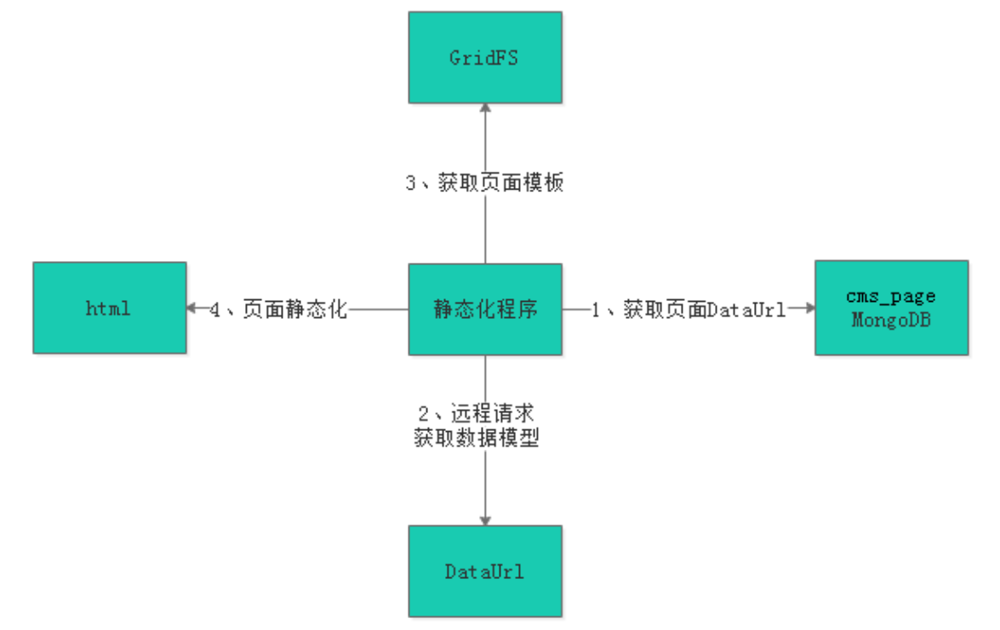
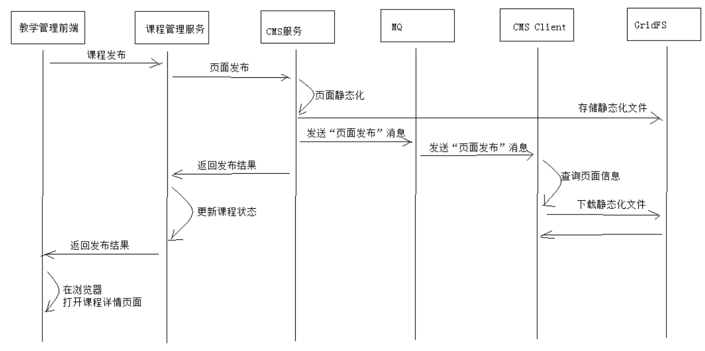

## CMS工程

CMS工程用来静态页面的管理，比如：首页轮播图，课程详情页面等，主要就是结合Freemarker生成静态页面保存到服务器路径，由于nginx的存在，可以很快速的进行页面的发布。

其使用的数据库是MongoDB

前端项目：xc-ui-pc-sysmanage

后端项目：

- xc-service-manage-cms
- xc-service-manage-cms-client：RabbitMQ的消费方，用来接收消息，进行页面保存到服务器路径

### 页面管理

页面的增删改查，比较简单

### 页面预览

页面预览功能其实就是页面静态化的功能，使用Freemarker和MongoDB中的数据生成静态html，具体实现如下图

1. 前端请求CMS管理服务，调用页面静态化接口，传入页面ID
2. CMS首先根据页面ID查询MongoDB的页面
3. 获取页面中DataUrl的信息，这个字段保存了数据模型获取的接口（新增页面时需要配置好）
4. 使用RestTemplate请求此接口获取模型
5. 然后根据页面中的templateId获取模板信息
6. 获取完模板信息根据保存的文件id向GridFS获取文件，并通过文件下载流下载出文件的String格式
7. 最后通过SpringMVC的ServletOutputStream将页面输出

### 页面发布

页面发布其实就是页面预览（静态化）的升级版，多加了RabbitMQ进行页面保存到服务器

1. 前端请求页面发布接口
2. CMS管理服务首先根据页面id对页面执行静态化，步骤如上方
3. 静态化完毕将html文件保存到GridFS中
4. 然后需要告诉服务器，让服务器到GridFS中下载此文件，然后报存到相应位置，这里就需要RabbitMQ
5. CMS端发送消息给Broker，CMS Client消费方监听消息
6. 然后根据传来的pageId向GridFS中下载页面，然后拼接`服务器路径 = 站点物理路径 + 文件路径 + 文件名`
7. 保存完毕后，因为有nginx的代理，所以即刻便可以访问主页查看是否成功

## 课程管理工程

课程管理就相当于电商系统的商品管理，其属性比较多，比如课程图片，课程基本信息，课程营销，课程计划等等，这些信息都需要我们进行管理，而且对于课程详情页面我们还需要使用静态化进行动态发布，其逻辑和前面的页面发布类似。

其使用的数据库是Mysql

前端项目：xc-ui-pc-teach

后端项目：

- xc-service-manage-course

### 课程计划管理

- 查询课程计划：相较其他的查询来说稍微复杂一点，因为他是按级别分类的，一级二级三级，这里我们就要动态编写sql语句了，具体看代码或文档
- 添加课程计划：需要注意一点，就是如果没有选择父节点，说明此节点为二级节点，父节点为根节点即一级节点。还有一点就是如果是新课，那么课程计划表里此课是没有根节点的，需要先插入根节点，再插入新添加的节点。
- 修改删除

### 课程管理

- 新增课程：
  - 这里课程的分类需要动态查询，类似课程计划
  - 课程等级和模式使用的是数据字典，需要查询MongoDB，所以这里放到cms工程查询
- 课程管理：课程管理就是课程修改，它分为很多项，课程基本信息，图片等等
  - 课程基本信息修改

  - 课程计划修改，就和上面课程计划管理一样

  - 课程营销修改，相对简单

  - 课程图片：这里需要运用FastDFS来保存图片，需要先根据第六篇笔记搭建环境；课程图片修改和保存时一样的，逻辑就是上传到FDFS后，保存图片信息到数据库；每个课程只能有一个课程图片，所以如果新增会覆盖之前的。删除很简单

    > 因为上传图片到FDFS不止课程图片需要用到，所以这里又创建了一个服务来提供上传图片的功能，为`xc-service-base-filesystem`

### 课程预览

因为课程也是做成静态化的，所以其类似于CMS中的页面预览

#### 前提

执行静态化之前，需要将静态文件保存到GridFS中，可以使用`xc-service-manage-cms`工程的单笔测试`GridFsTemplateTest`，将静态模板存到GridFS中，然后到MongoDB中`xc_cms`库，`cms_template`表中添加新的模板，并保存GridFS返回的ID

这里我们使用的模板是`course.ftl`，保存在`xcEduService\xc-resources\templates`中

分析：因为之前已经做了页面预览，大致流程都清楚，所以课程预览相对简单，只需将课程转化为CmsPage对象，然后保存到MongoDB中即可，根据pageId调用之前页面预览的接口，即可实现页面预览

1. 用户到管理课程界面，发布课程子节点，点击课程预览
2. 课程服务根据课程id查询课程信息，转换为对应的CmsPage
3. 使用SpringCloud的Feign调用CMS服务的添加页面接口，将CmsPage保存到MongoDB中
4. 课程服务获取调用后页面ID拼接课程预览的URL返回给前端
5. 用户在前端页面请求课程预览Url，打开新窗口显示课程详情内容（这里请求的课程预览的接口是之前已经实现的CMS中页面预览接口，所以不需要其他操作，CMS接口会根据页面id进行页面静态化输出到页面）

> 注意，对于课程详情页面的静态化，需要进行nginx代理，比较繁琐，详细请看第九天讲义和nginx配置文件，这里我将静态文件保存在xc-ui-pc-static-resources\static下

### 课程发布

课程发布就和之前页面发布逻辑一样，但是多了一些步骤

#### 前提

首先根据自己文件存放的位置，到MongoDB的cms_page和cms_site修改文件存放路径，拼接规则为：

`页面URL = 站点域名 + 站点WebPath + 页面WebPath + 页面名称`，根据拼接规则自行修改，注意CMS Client保存到服务器的位置不是xc-ui-pc-static-portal工程，而是xc-ui-pc-static-resources中，因为是静态页面，所以应该保存到静态工程中，并且配合之前我们配置的nginx.conf，可以实现反向代理到工程中。

逻辑也不是很复杂：

0. 思考下，课程发布时传来的是课程id，所以我们需要转成页面信息保存到MongoDB中，这里需要先调用保存接口，再调用课程发布接口，这样比较繁琐，所以我们在CMS服务中新增一个一键发布接口，即在CMS Service中就实现号保存和课程发布，直接返回给调用方pageUrl
1. 前端点击课程发布，传入课程ID
2. 课程管理服务通过Feign请求CMS一键发布接口进行页面发布，参数是CmsPage
3. CMS进行先进行页面保存或修改，然后进行页面发布，发布逻辑和之前的一模一样，直接调用即可，最后拼接URL为站点域名 + 站点WebPath + 页面WebPath + 页面名称，返回给课程服务
4. 课程服务调用成功后修改课程状态为已发布，然后返回给前端URL
5. 前端提供标签跳转到课程发布成功后的页面