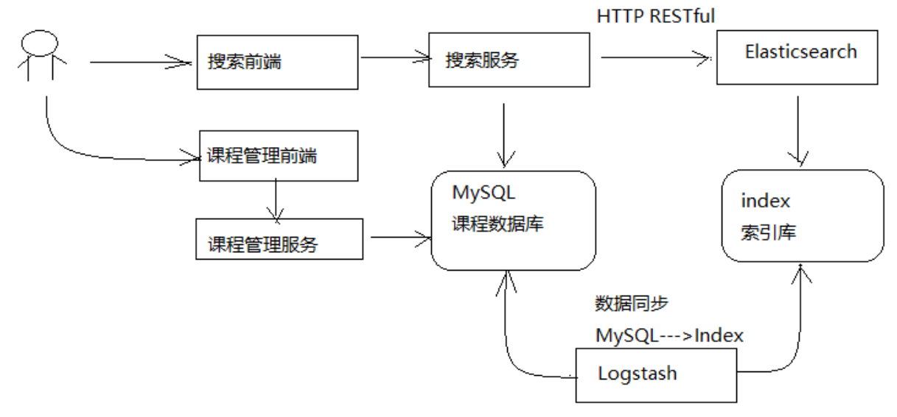

对于ES的介绍这里就不过多说了，可以看下我之前ES的笔记，详细介绍了ES从入门到集群搭建

## 搜索服务

每个系统应用都离不开搜索，这里我们使用ES来充当搜索中间件，一是为了学习ES的实战使用，二是ES的性能速度以及搭建简单。



具体流程如上图

1. 首先前端调用搜索服务，搜索服务这里请求ES根据需求查询索引库
2. ES返回数据给搜索服务，搜索服务封装后给前端
3. 这里就有一个问题，索引库维护的问题，因为是课程搜索，所以维护的肯定是课程信息，需要mysql的数据同步，这里使用到Logstash同步，也是配合es使用的经典技术（再加上kibana就能搭建elk了~）
4. 经过之前的学习以及代码编写，我们知道课程数据库的课程信息分成了多张表，那么同步起来就很复杂，所以这里我们将使用course_pub表将所有数据整合起来，以供ES索引库维护
5. 这里又出现问题了，既然需要将所有数据整合，那么这项工作在哪里完成呢，我们之前编写了课程发布，按逻辑来说，课程发布完，就可以维护此表了，所以我们在课程发布后进行数据插入

总结：

1、当课程向MySQL添加后同时将课程信息添加到索引库。

采用Logstach实现，Logstach会从MySQL中将数据采集到ES索引库。

2、当课程在MySQL更新信息后同时更新该课程在索引库的信息。

采用Logstach实现。

3、当课程在MySQL删除后同时将该课程从索引库删除。

手工写程序实现，在删除课程后将索引库中该课程信息删除。

## 课程索引

### 环境搭建

#### ES环境

版本：6.2.1

平台：windows

这里我们下载好es后，修改conf文件：`xcEduService\xc-resources\elasticsearch\esconfig`

复制配置文件 修改个人配置，并按照ik分词器插件，6.2.1版本

然后安装es-headmaster即可

（这些软件安装包后期整合到百度云中）

#### Logstash环境

首先解压Logstash

然后替换配置文件，`xcEduService\xc-resources\elasticsearch\logstashconfig`

根据个人环境修改配置


### 创建索引与映射

开启es和head插件后，访问<http://localhost:9100/>

首先在head插件中创建索引

```
名称：xc_course
分片：1，副本：0
```

然后根据`xcEduService\xc-resources\elasticsearch\索引创建.txt` 创建映射


### LogStash同步mysql数据

进入logstash/bin目录，打开cmd命令行，输入：

`logstash.bat -f ../config/mysql.conf`即可


## 课程搜索

具体看第0个笔记

服务端：调用ES，配置搜索条件（关键词搜索，分类和难度过滤，分页高亮），然后将结果封装返回

前端：使用Nuxt.js，请看下一个笔记
